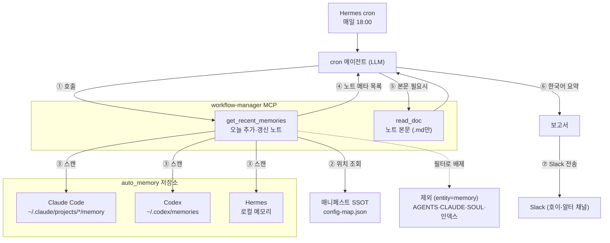

이번 주 집중 주제는 **AI 업무 환경 만들기**였다. Claude Code·Codex·MCP·개인 에이전트 Hermes(이하 알터)를 *쓰고는* 있었지만, 업무 흐름 자체는 여전히 수작업이었다 — 업무 읽기, 맥락 정리, 프롬프트 투입, 결과 확인을 매번 직접. 목표는 개별 업무를 하나씩 자동화하는 게 아니라, **업무 자동화를 만들고 운영하는 상위 계층**을 세우는 것이었다.

## 관점 전환 — 한 단계 더 추상화된 코딩

- 기존 코딩 = 서비스를 직접 만드는 코딩
- 앞으로의 코딩 = AI 엔진이 서비스 개발 업무를 *대신 수행*하도록 만드는, 한 단계 더 추상화된 코딩

즉 AI가 일하고 검증하고 보고하는 흐름 자체를 코드와 명세로 작성한다. 최종 목표는, 모든 업무를 직접 처리하는 사람이 아니라 **알터가 준비한 실행안과 승인 큐를 보고 판단만 하는 사람**이 되는 것.

처음 그린 흐름은 이랬다:

```text
업무 발생
 → 업무 유형 분류
 → 필요한 컨텍스트 수집
 → Claude Code 또는 Codex에 작업 위임
 → MCP·Hermes로 도구 연결
 → 스크립트 기반 검증
 → 위험 작업은 승인 큐로 분리
 → 결과를 PR·issue·문서·리포트로 남김
```

흐름만 그린 게 아니라 **누가 무엇을 맡는지**도 함께 정했다.

- **사람** — 문제 정의·우선순위, 위험도 판단, 최종 승인, 방향 결정.
- **알터** — 업무 수집·유형 분류, 컨텍스트 정리, 작업 분배, 결과 요약, 승인 큐 생성.
- **Claude Code·Codex** — 코드 수정·테스트 작성, 문서 갱신, CI 실패 분석, PR 초안.
- **MCP·Hermes** — GitHub·DB 스키마·문서·로그·Slack 등 외부 도구를 컨텍스트로 연결.
- **스크립트·가드레일** — 검증 실행, 권한 제한, 위험 작업 차단, 실패 보고.

판단과 승인은 사람 몫으로 남기고, 수집·분배·실행·검증을 기계 쪽에 넘기는 구도였다.

## 왜 그동안 자동화가 잘 안 됐나

- **개별 작업 중심.** 전체 흐름을 하나의 루프로 안 보고 중간 작업만 AI에 위임 → 자동화가 단발성 호출에 머묾.
- **수동 컨텍스트 주입.** 관련 issue·PR diff·실패 로그·DB 스키마·테스트 명령·프로젝트 규칙을 매번 직접 찾아 붙임.
- **특정 상황 과적합.** 입력·맥락이 조금만 바뀌어도 새 프롬프트를 다시 작성. 재사용 가능한 워크플로 수준으로 추상화하지 못함.
- **낮은 신뢰도 → 잦은 개입.** 자동화 구조가 부실 → 불신 → 재확인의 악순환. 심하면 자동화가 *오히려 추가 업무*로 전락.

> 문제의 본질은 AI 도구 자체의 부족이 아니라, 도구를 안전하게 운용할 **명세·검증·가드레일·승인 구조의 부재**였다.

## 일괄 구축의 실패와 '설정 병목'의 발견

방향은 지금도 옳다고 본다. 문제는 실행이었다. 거버넌스·자동화·운영·역할 에이전트·워크로그 파이프라인까지 **한 번에** 구축하려다, 1인 동시 작업의 결과로 폴더 구조가 비대해졌다 — 활성 파일 80개 초과. 만들고 보니 *자동화 운영 계층을 운영하는 일 자체가 새로운 부담*이었다.

여기서 멈추고 물었다. **"내가 진짜 불편했던 게 뭐였나?"**

답은 자동화 흐름이 아니라 **설정**이었다. 에이전트 자체가 흩어지고(Codex·Claude Code·Hermes), 한 에이전트 안에서도 글로벌·프로젝트별·로컬 설정으로 또 분산된다. 관리도, 초기 세팅도 어렵고, 한번 적용하면 굳어 유연한 변경이 곤란하다. 자동화 운영 계층은 설정 위에 얹는 상위 계층인데, 정작 그 토대인 설정이 불안정했다.

## 문제 재정의 — 복사가 아니라 가리키기

자동화 흐름을 만들기 전에, 분산된 설정을 모아 보고 관리하는 **도구**부터 만들기로 했다. 야심 찬 운영 레이어는 archive로 보류, 활성 파일 80여 개 → 20개로 축소. 대신 단순한 매니저 하나를 만들었다.

핵심은 매니페스트 파일 하나, `config-map.json`. 성격은 **위치 목록** — "어떤 도구의 / 어떤 스코프(enterprise·user·project·local)의 / 어떤 설정이 / 어느 경로에 있는지"만 기록한다. 수집 스크립트가 이 목록을 읽어 현황(존재 여부·최종 수정 시각·크기)을 한 화면에 보여준다.

여기서 가장 중요한 원칙이 나왔다 — **복사하지 말고, 원래 위치를 가리킨다.**

- 진실은 각 도구의 홈에 있는 실제 파일.
- 매니저는 위치를 가리키고 현황만 보고할 뿐, **사본을 만들어 동기화하지 않는다.**
- 사본을 SSOT로 삼는 순간 생기는 문제: 비밀 누출, 원본과의 불일치, 한번 굳으면 안 바뀜. 원칙의 핵심은 *그 문제를 애초에 만들지 않는 것*.

## "그냥 한 폴더에 모으면 되잖아"가 틀린 이유

매니저를 만들자 당연한 반론이 떠올랐다. 흩어진 게 문제라면 한 폴더에 잘 모으면 되지, 굳이 위치 목록을 따로 만들 필요가 있나?

진지하게 검토한 답은 **"한 폴더로 모으는 건 애초에 불가능"**이었다.

- 각 도구가 자기 홈을 하드코딩해서 읽는다(Claude Code `~/.claude`, Codex `~/.codex`, Hermes 세 군데). 한 폴더에 모아둬도 도구들은 거기를 안 본다.
- 설정이 글로벌에만 있는 게 아니라 프로젝트마다 따로 두는 경우도 있어, 한 군데서 모아 보기 어렵다.

특히 자동 메모리가 그렇다. 설정뿐 아니라 메모리도 작업 repo가 아니라 각 도구의 홈 아래에 쌓인다(Claude Code `~/.claude/projects/*/memory`, Codex `~/.codex/memories`, Hermes는 로컬 메모리). 메모리는 AI 작업의 컨텍스트 그 자체인데 정작 프로젝트 폴더 안에 없다 — 흩어진 메모리를 한눈에 보려면 별도 도구가 필요하다.

> 이 흩어짐은 정리를 못해서가 아니라, 도구와 조직이 강제하는 **줄일 수 없는(irreducible) 흩어짐**이다. 따라서 모으는(mirror) 게 아니라 가리키는(map) 것이 정답이다.

## 데스크탑 앱으로 — workflow-manager

읽기 측이 검증되자, 실제로 들여다보고 다룰 화면이 필요했다. 가벼운 데스크탑 앱으로 확장했다(이름 `workflow-manager`, 스택 Tauri·React). 하나의 매니페스트 위에 두 부분을 올린 구조다.

- `configs/` — `config-map.json` 매니페스트. 위치의 단일 출처. 비밀도, 머신 경로도 없음.
- `app/` — Tauri·React 데스크탑 GUI. 내부에 Rust 읽기 엔진.
- `core/` — TypeScript 엔진. 같은 읽기를 한 번 더 구현. MCP 서버도 여기서 노출.

초기엔 앱이 직접 설정을 고치는 적용/제거 기능을 넣어 구현·테스트까지 했지만, 도구마다 어댑터를 다 만들려니 조합 폭발 + 시크릿 안전 처리가 반복적으로 헛돌았다. 결국 그 기능은 archive하고, **변경은 에이전트가 판단·수행, 앱은 수집·조회와 에이전트 핸드오프만** 담당하도록 피벗했다. 핸드오프는 MCP 서버로 구현 — 도구 7개(`get_inventory`·`get_skills`·`search`·`read_doc`·`get_recent_memories`·`get_running_agents`·`get_usage_stats`), 전부 **메타데이터와 경로만** 반환하고 파일 내용·시크릿은 한 글자도 안 넘긴다.

## 이 앱이 굳이 필요한가

앱을 만들고 스스로 물었다. 이 앱이 굳이 필요한가, 프로젝트를 한 폴더에서 잘 관리하면 그만 아닌가? 실제로 써보니 단순 조회를 넘는 효용이 분명했다.

- **한눈에 보임.** 4축(메모리·워크플로·구성·문서) 칸반에서 접고 펼치고 드릴다운하니, 흩어진 구성이 텍스트 덤프보다 훨씬 잘 들어온다.
- **놓친 설정 발견.** 한 화면에 모아 보지 않았으면 흘려보냈을 설정을 실제로 찾아냈다.
- **메모리 관리.** 메모리는 한 번 쓰고 끝이 아니라 계속 쌓이고 갱신되는 자산이다. 항목끼리 `[[링크]]`로 잇고 추가·편집·검색은 물론, 낡거나 겹치는 항목을 솎아내는 정리까지 — 정적 마크다운이 구조적으로 못 하는 영역이다.
- **에이전트 핸드오프.** MCP로 에이전트를 붙여, 같은 인벤토리를 넘겨받은 에이전트에게 정리를 맡길 길도 열렸다.

이 효용들을 이번 주 사용으로 실제 확인했다 → 앱으로 유지할 이유는 충분하다고 판단했다.

## 이번 주에 실제로 도달한 곳

처음 그렸던 "자동화 운영 계층"에는 도달하지 못했다. 대신 그 토대가 되는 매니저와, 그걸 다룰 앱·에이전트 핸드오프 창구를 만들었다.

- 세 도구 × 스코프에 흩어진 설정의 위치를 매핑하는 매니페스트(`config-map.json`)와 검증된 도구별 스펙.
- 4축 칸반·드릴다운을 갖춘 읽기 전용 데스크탑 앱(`workflow-manager`).
- 에이전트에게 같은 목록을 넘기는 MCP 서버(도구 7개, 전부 메타데이터·경로만).

## 알터 고도화 — 워크플로 4개

토대 작업과 별개로, 알터에 업무 워크플로 4개를 추가·개선했다.

### 1. 아침 업무 브리핑

평일 아침 08:30, 부르지 않아도 자동으로 — 일정(Outlook)·할 일(Notion)·미완료 투두·지난주 일지 리캡을 한 장으로 묶어 보고한다. 특이사항(응답 미정 회의 등)도 함께 짚는다. 일정에는 손대지 않고 **조회·요약만** 한다.


### 2. 프로젝트 서버 일일 헬스 보고

매일 09:00, 두 갈래로 돈다 — 운영 백엔드의 최근 24시간(가용성·APM 에러율·활성 인시던트·5xx·배포/마이그레이션 실패)을 점검해 "종합: 정상/이상"으로 요약하고, 별도로 전일 처리량을 로그에서 집계해 따로 보고한다.


### 3. 슬랙 메시지 요약 + 태스크 후보 제안

하루 세 번(점심·오후·퇴근 전) 직전 구간의 채널 활동을 사람·주제별로 요약하고, 일정 DB 등록 후보를 뽑아 제안한다(등록은 사람 확인 후).


### 4. 데일리 AI 메모리 요약

매일 18:00, 위에서 만든 workflow-manager MCP를 그대로 쓴다 — `get_recent_memories`로 세 도구(Claude Code·Codex·Hermes)에 그날 새로 쌓인 메모리만 매니페스트의 위치 정보로 스캔하고, 필요하면 `read_doc`로 본문을 확인해 런타임·프로젝트별로 한국어 요약한다. 위 매니저의 첫 실사용 사례다.


이 워크플로의 흐름은 이렇다 — 복사가 아니라 가리키기 원칙이 그대로 실행에 옮겨진 모습이다:



남은 건 둘이다. 만든 MCP 서버를 Claude Code·Codex에 실제로 등록해 대화로 검증하는 일(headless 스모크 테스트는 통과), 그리고 대화 세션을 분석해 프롬프트·스킬을 다듬는 선순환을 실제 업무에 적용하는 일. 다음 주의 출발점이다.
