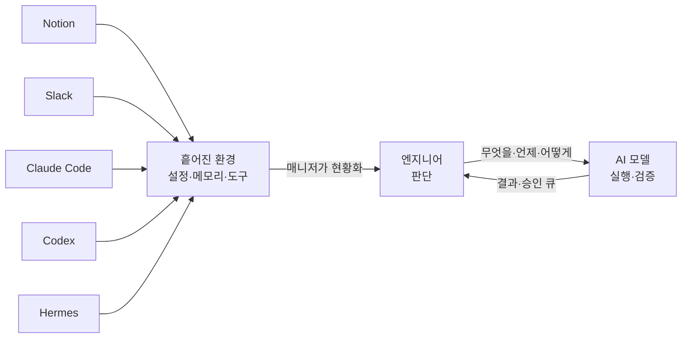
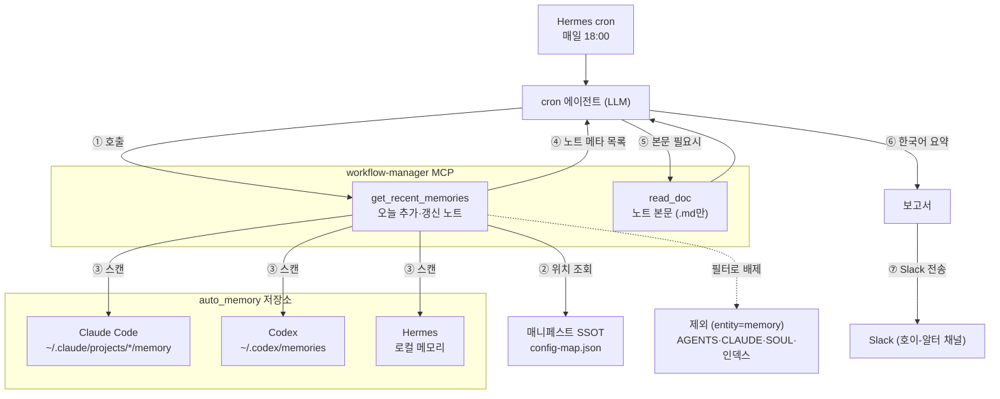

이번 주 집중 주제는 **AI 업무 환경 만들기**였다. 
Claude Code, Codex, MCP, 개인 에이전트 Hermes(이하 알터)를 *쓰고는* 있었지만, 업무 흐름 자체는 여전히 수작업이었다. 업무 읽기, 맥락 정리, 프롬프트 투입, 결과 확인을 매번 직접했다. 
그래서 이번 목표는 개별 업무를 더 자동화하는 게 아니라, **업무 자동화를 만들고 운영하는 상위 계층**을 세우는 것이었다.

## 관점 전환 - 한 단계 더 추상화된 코딩

- 기존 코딩 = 서비스를 직접 만드는 코딩
- 앞으로의 코딩 = AI 엔진이 서비스 개발 업무를 *대신 수행*하도록 만드는, 한 단계 더 추상화된 코딩

즉 AI가 일하고 검증하고 보고하는 흐름 자체를 코드와 명세로 작성한다. 
최종 목표는, 모든 업무를 직접 처리하는 사람이 아니라 **알터가 준비한 실행안과 승인 큐를 보고 판단만 하는 사람**이 되는 것이었다.

처음 그린 흐름은 이랬다:

```text
업무 발생
 → 업무 유형 분류
 → 필요한 컨텍스트 수집
 → Claude Code 또는 Codex에 작업 위임
 → MCP·Hermes로 도구 연결
 → 스크립트 기반 검증
 → 위험 작업은 승인 큐로 분리
 → 결과를 PR·issue·문서·리포트로 남김
```

흐름만 그린 게 아니라 **누가 무엇을 맡는지**도 함께 정했다.

- **사람** - 문제 정의, 우선순위, 위험도 판단, 최종 승인, 방향 결정.
- **알터** - 업무 수집, 유형 분류, 컨텍스트 정리, 작업 분배, 결과 요약, 승인 큐 생성.
- **Claude Code·Codex** - 코드 수정·테스트 작성, 문서 갱신, CI 실패 분석, PR 초안.
- **MCP, Hermes** - GitHub, DB 스키마, 문서, 로그, Slack 등 외부 도구를 컨텍스트로 연결.
- **스크립트, 가드레일** - 검증 실행, 권한 제한, 위험 작업 차단, 실패 보고.

판단과 승인은 사람 몫으로 남기고, 수집/분배/실행/검증을 기계 쪽에 넘기는 구도였다.

## 그럼 왜 그동안 자동화가 잘 안 됐을까

- **개별 작업 중심.** 
전체 흐름을 하나의 루프로 안 보고 중간 작업만 AI에 위임 → 자동화가 단발성 호출에 머묾.
- **수동 컨텍스트 주입.** 
관련 issue, PR diff, 실패 로그, DB 스키마, 테스트 명령·프로젝트 규칙을 매번 직접 찾아 붙임.
- **특정 상황 과적합.** 
입력, 맥락이 조금만 바뀌어도 새 프롬프트를 다시 작성. 재사용 가능한 워크플로 수준으로 추상화하지 못함.
- **낮은 신뢰도 → 잦은 개입.** 
자동화 구조가 부실 → 불신 → 재확인의 악순환. 심하면 자동화가 *오히려 추가 업무*로 전락.


## 일괄 구축의 실패와 '설정 병목'의 발견

하지만 거버넌스·자동화·운영·역할 에이전트·워크로그 파이프라인까지 한 번에 구축하려다, 나의 이해를 능가하는 구조가 만들어졌고 검증이 불가능했다. 그리고 이미 만들어진 자동화 업무들과 차별점이 거의 없었다.

여기서 멈추고 내가 진짜 불편했던 게 뭐였는지 다시 생각하였다.

워크플로나 도구가 부족했던 게 아니었다. 한 번 만든 걸 꾸준히 관리하고 고도화해야 했는데, 매번 처음부터 새로 만드느라 아무것도 쌓이지 않았다. 그리고 그 이유는 내가 가진 자산이 뭔지, 지금 당장 쓸 수 있는 게 뭔지 제대로 인지하지 못했기 때문이다.

뭐가 있는지를 모르니, 있는 걸 이어 키우는 대신 매번 새로 시작할 수밖에 없었다. 그리고 그 자산이 보이지 않았던 건 흩어져 있었기 때문이라고 생각했다. 에이전트 자체가 흩어지고(Codex, Claude Code, Hermes), 한 에이전트 안에서도 글로벌/프로젝트별/로컬 설정으로 또 분산된다. 관리도, 초기 세팅도 어렵고, 한번 적용하면 굳어 유연한 변경이 곤란하다. 자동화 운영 계층은 설정 위에 얹는 상위 계층인데, 정작 그 토대인 설정이 불안정했다.

## 문제 재정의

자동화 흐름을 만들기 전에, 분산된 설정을 모아 보고 관리하는 **도구**부터 만들기로 했다. 운영 레이어를 만들고자 했던 시도는 폐기하고 대신 단순한 매니저 하나를 만들었다.

이 매니저의 수집 엔진은 TypeScript로 짜서 Node에서 돌린다. 엔진은 configs/config-map.json이라는 매니페스트를 기반으로, 이 파일은 설정을 직접 담지 않고 도구별 스펙(agents/claude-code.json, codex.json, hermes.json)을 가리키기만 한다.

loadConfigMap이 이 진입점을 읽어 각 스펙을 선언한 순서대로 불러오고, 도구 이름을 키로 삼아 하나의 지도로 합친다.

합쳐진 지도는 collect가 넘겨받아 읽기 전용으로 훑는다. 도구를 돌고, 그 안의 스코프(enterprise·user·project·local)를 돌고, 스코프마다 선언된 항목을 하나씩 따라간다. 먼저 스코프의 기준 경로를 해석하는데, project 스코프면 지금 작업 중인 프로젝트 경로로 바꿔 끼운 뒤 항목 경로를 이어 붙여 실제 위치를 찾는다.

훑은 결과는 cli.ts가 INVENTORY.json 한 파일로 정리한다. 도구·스코프·항목이 존재 여부·수정 시각·크기와 함께 트리로 담긴다. GUI와 MCP 서버(get_inventory)도 같은 함수를 그대로 불러, 에이전트에게까지 똑같은 현황을 넘긴다.

그리고 이 과정 전체를 관통하는 원칙이 하나 있다 - 복사하지 말고, 원래 위치를 가리킨다.

## 그냥 한 폴더에 모을 수는 없을까?

매니저를 만들자 다시 한 번 반론이 떠올랐다. 흩어진 게 문제라면 한 폴더에 잘 모으면 되지, 굳이 위치 목록을 따로 만들 필요가 있나?

부분적으로는 가능해도 모든 에이전트의 기능들을 모으는 것은 어려워 보였다. 도구들의 글로벌 설정과 자동으로 쌓이는 메모리까지 포함하여, 종류도 생기는 방식도 제각각이라 한곳에 눌러 담기가 어려웠다.

게다가 도구들이 저마다 자기 홈을 하드코딩해 읽었다(Claude Code는 ~/.claude, Codex는 ~/.codex, Hermes는 세 군데). 특히 자동 메모리가 그렇다. 설정뿐 아니라 메모리도 작업 repo가 아니라 각 도구의 홈 아래에 쌓인다(Claude Code는 ~/.claude/projects/*/memory, Codex는 ~/.codex/memories, Hermes는 로컬 메모리). 
  
메모리는 AI 작업의 컨텍스트 그 자체인데, 정작 프로젝트 폴더 안에는 없다. 흩어진 메모리를 한눈에 보려면 결국 따로 훑어 주는 도구가 필요하다고 판단했다.

## 데스크탑 앱으로 - workflow-manager

실제로 들여다보고 다룰 화면이 필요했다. 가벼운 데스크탑 앱으로 확장했다(이름 `workflow-manager`, 스택 Tauri·React). 하나의 매니페스트 위에 두 부분을 올린 구조다.

- `configs/` — `config-map.json` 매니페스트. 위치의 단일 출처. 비밀도, 머신 경로도 없음.
- `app/` — Tauri·React 데스크탑 GUI. 내부에 Rust 읽기 엔진.
- `core/` — TypeScript 엔진. 같은 읽기를 한 번 더 구현. MCP 서버도 여기서 노출.

초기엔 앱이 직접 설정을 고치는 적용/제거 기능을 넣어 구현·테스트까지 했지만, 도구마다 어댑터를 다 만들려니 조합 폭발 + 시크릿 안전 처리가 반복적으로 헛돌았다. 

결국 그 기능은 archive하고, **변경은 에이전트가 판단·수행, 앱은 수집·조회와 에이전트 핸드오프만** 담당하도록 변경했다. 

핸드오프는 MCP 서버로 구현 — 도구 7개(`get_inventory`·`get_skills`·`search`·`read_doc`·`get_recent_memories`·`get_running_agents`·`get_usage_stats`), 전부 **메타데이터와 경로만** 반환하고 파일 내용·시크릿은 한 글자도 안 넘긴다.

## 이 앱이 굳이 필요한가

앱을 만들고 스스로 물었다. 이 앱이 굳이 필요한가, 프로젝트를 한 폴더에서 잘 관리하면 그만 아닌가? 실제로 써보니 단순 조회를 넘는 효용이 분명했다.

- **한눈에 보임.** 
4축(메모리·워크플로·구성·문서) 칸반에서 접고 펼치고 드릴다운하니, 흩어진 구성이 텍스트 덤프보다 훨씬 잘 들어온다.
- **놓친 설정 발견.** 
한 화면에 모아 보지 않았으면 흘려보냈을 설정을 실제로 찾아냈다.
- **메모리 관리.** 
메모리는 한 번 쓰고 끝나는 게 아니라 계속 쌓이고 갱신되는 자산이다. 도구마다 흩어져 있을 땐 뭐가 얼마나 쌓였는지조차 몰랐는데, 한 장소에 모아 보게 되면서 관리가 확실히 수월해졌다.
- **에이전트 핸드오프.** 
MCP로 에이전트를 붙여, 같은 인벤토리를 넘겨받은 에이전트에게 흩어진 환경 설정을 검토·자동 점검시키고 정리까지 맡길 길도 열렸다.

이 효용들을 이번 주 사용으로 실제 확인했다 → 앱으로 유지할 이유는 충분하다고 판단했다.

## 이번 주의 결과

처음 목표했던 "고도화된 자동화 운영 계층"에는 도달하지 못했다. 
대신 그 토대가 되는 매니저와, 그걸 다룰 앱과 에이전트 MCP를 만들었다.

- 세 도구 × 스코프에 흩어진 설정의 위치를 매핑하는 매니페스트(`config-map.json`)와 검증된 도구별 스펙.
- 칸반과 드릴다운을 갖춘 읽기 전용 데스크탑 앱(`workflow-manager`).
- 에이전트에게 같은 목록을 넘기는 MCP 서버(도구 7개, 전부 메타데이터, 경로만).

돌아보면 처음 필요하다 느낀 건 고도화된 워크플로 하나였지만, 진짜 필요했던 건 내가 가진 자원, 도구, 설정을 먼저 파악하는 일이었다. 결국 이 토대가 향하는 곳은 판단 능력이다 - 엔지니어에게 남는 몫은 의사결정과 판단, 그리고 컨텍스트 관리다.

무엇을/언제/어떻게 AI에 연결할지 정하는 힘이고, AI Native 전환은 그 자리를 대신하는 게 아니라 이를 보조하는 방향이어야 한다. 매니저를 만든 것도 그래서다 - 흩어진 상황을 한눈에 검토하고, 그 판단을 기르기 위한 토대다.

이 멘탈 모델을 한 장으로 그리면 이렇다:



## 알터 고도화 - 워크플로 4개

매니저를 통해 파악한 내용을 기반으로 알터에 업무 워크플로 4개를 추가 및 개선했다.

### 1. 아침 업무 브리핑

평일 아침 08:30, 부르지 않아도 자동으로 — 일정(Outlook)·할 일(Notion)·미완료 투두·지난주 일지 리캡을 한 장으로 묶어 보고한다. 특이사항(응답 미정 회의 등)도 함께 짚는다. 일정에는 손대지 않고 **조회·요약만** 한다.

### 2. 프로젝트 서버 일일 헬스 보고

매일 09:00, 두 갈래로 돈다 — 운영 백엔드의 최근 24시간(가용성·APM 에러율·활성 인시던트·5xx·배포/마이그레이션 실패)을 점검해 "종합: 정상/이상"으로 요약하고, 별도로 전일 처리량을 로그에서 집계해 따로 보고한다.

### 3. 슬랙 메시지 요약 + 태스크 후보 제안

하루 세 번(점심·오후·퇴근 전) 직전 구간의 채널 활동을 사람·주제별로 요약하고, 일정 DB 등록 후보를 뽑아 제안한다(등록은 사람 확인 후).

### 4. 데일리 AI 메모리 요약

매일 18:00, 위에서 만든 workflow-manager MCP를 그대로 쓴다 — `get_recent_memories`로 세 도구(Claude Code·Codex·Hermes)에 그날 새로 쌓인 메모리만 매니페스트의 위치 정보로 스캔하고, 필요하면 `read_doc`로 본문을 확인해 런타임·프로젝트별로 한국어 요약한다. 위 매니저의 첫 실사용 사례다.

이 워크플로의 흐름은 이렇다:



## /ai-checkup - 대화로 환경을 점검하는 스킬

만든 MCP를 실제로 대화에서 써 보려고, Claude Code에 `/ai-checkup` 스킬을 만들었다.
workflow-manager MCP로 내 AI 환경을 훑어, 지금 상태와 손볼 후보를 한 화면에 정리해 준다.

동작은 이렇다: 

먼저 `get_usage_stats`·`get_recent_memories`·`get_running_agents`·`get_skills`를 한 번에 불러 사용 통계와 최근 메모리, 실행 중인 에이전트, 설치된 스킬을 모은다. 여기에 MCP 설정 파일을 곁들여 어떤 서버가 연결돼 있는지까지 맞춰 본다. 그다음 이 메타데이터만으로 "낡았을 법한" 후보를 뽑는다. 
설명에 '미push'·'WIP'·'재적용' 같은 말이 박힌 메모리, 설치는 됐지만 최근 안 쓴 스킬, 연결만 돼 있고 한 번도 호출되지 않은 MCP 서버 같은 것들이다. 끝으로 현황 통계와 갱신 제안, 그리고 "다음에 뭘 하면 좋을지" 한두 줄을 함께 내놓는다.

중요한 건 이 스킬이 아무것도 손대지 않는다는 점이다. 읽기만 하고, 고칠 대상은 어디까지나 "후보"로만 내민다. 오래됐다고 곧 틀린 것도 아니라서, 정말 낡았는지 확인이 필요하면 `--deep`으로 후보만 골라 실제 대조까지 한다. 미push라던 브랜치가 origin에 이미 올라갔는지 `git`으로 확인하고, 참조하던 파일이 아직 있는지 뒤져 보는 식이다. 그래도 최종 삭제·수정은 내가 판단하고 승인한 뒤에만 이뤄진다.