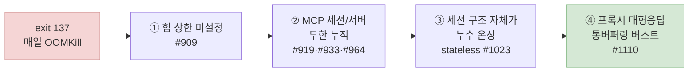
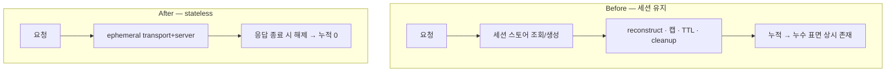
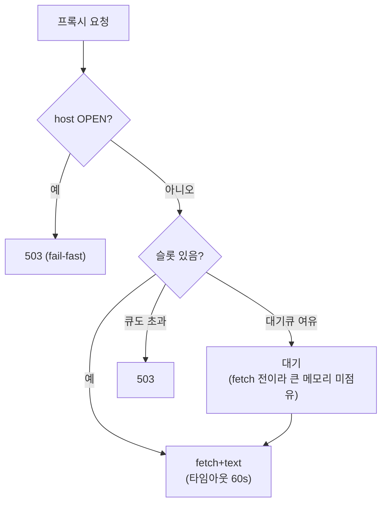

> **요약** — 컨테이너 메모리 1GiB짜리 `dcs-ai-server`가 매일 `exit 137`(OOMKill)로 죽었다. ① V8 힙 상한을 걸어 커널 OOMKill을 V8 GC로 옮기고, ② MCP 세션·서버 객체가 스토어에 무한 누적되던 누수를 close 보강·캡 적용·TTL 비연장으로 하나씩 막았다. 그래도 재발해서 ③ **세션 기반 구조 자체를 stateless로 갈아엎어** 누수 원인을 소멸시켰다. 그러자 OOM의 방아쇠가 ④ **프록시 대형 응답 통버퍼링**으로 옮겨갔고, host별 서킷브레이커·타임아웃·동시성 캡으로 막았다. 교훈은 하나다 — **누수는 패치가 아니라 구조로 막고, 방어선은 실측으로 긋는다.**

`dcs-ai-server`는 EC2 단독으로 돌던 것이 **EKS로 이관되며 멀티 파드(HPA로 3~14개 오르내림)**로 굴러가게 됐다. 그 뒤 사용자도 꾸준히 늘었다. 파드 하나의 메모리 limit은 **1GiB**. 어느 날부터 이 파드들이 하루에도 몇 번씩 `exit 137`로 죽기 시작했다. 137은 커널이 `SIGKILL`(128+9)로 프로세스를 강제 종료했다는 뜻 — **메모리 한도를 넘겨 OOMKill 당한 것**이다.

배경이 "멀티 파드 전환 + 사용자 증가"이다 보니, 의심은 자연히 둘로 갈렸다 — **부하가 늘어서 터지는가, 아니면 코드가 새는가?** 이 질문에 짐작으로 답하면 엉뚱한 걸 고친다. 그래서 이 글은 매 단계를 **실측으로 가려가며** 방어선을 쌓은 두 달의 기록이다. 그리고 한 방에 잡히지 않았다 — 원인을 하나 막으면 방아쇠는 다음 병목으로 옮겨갔고, 두 달에 걸쳐 방어선을 네 겹 쌓고서야 안정됐다. 어디가 새고 있었고, 어떻게 막았고, 왜 그것만으론 부족했는지까지 순서대로 적는다. ("부하냐 코드냐"의 데이터 답은 글 후반 **〈데이터로 본 안정화〉** 절에 있다.)

<aside style="font-family: var(--sans); font-size: 0.9rem; line-height: 1.65; background: var(--paper-2); border: 1px solid var(--line); border-radius: 8px; padding: 1em 1.25em; color: var(--ink-2); max-width: var(--measure-text); font-style: normal;">
<p style="margin: 0 0 0.5em; font-weight: 600; color: var(--ink);">📖 잠깐, 용어 정리 — 힙·GC·OOM <span style="font-weight: 400; opacity: 0.7;">(아는 분은 건너뛰세요)</span></p>
<p style="margin: 0 0 0.6em;">서버 운영이 처음이면 아래 다섯 단어만 알고 가면 이 글이 다 읽힙니다.</p>
<ul style="margin: 0; padding-left: 1.2em; list-style: disc;">
<li style="margin: 0.25em 0;"><strong>힙(heap)</strong>: 프로그램이 돌면서 만드는 객체(세션·응답 데이터 등)를 담아두는 메모리 공간.</li>
<li style="margin: 0.25em 0;"><strong>GC(가비지 컬렉션)</strong>: 힙에서 <strong>이제 아무도 안 쓰는(= 어떤 코드도 안 가리키는) 객체를 자동으로 치우는 청소부.</strong> JavaScript/Node는 메모리를 손으로 반납하지 않고 이 GC가 대신한다. 단, <strong>참조가 하나라도 남아 있으면 못 치운다.</strong></li>
<li style="margin: 0.25em 0;"><strong>메모리 누수(leak)</strong>: 죽은 객체인데 코드가 실수로 계속 가리키고 있어 GC가 못 치우는 상태 → 힙이 안 줄고 계속 찬다. (이 글의 6월 사건이 정확히 이것 — 죽은 세션을 <code>Map</code>이 붙들고 있었다.)</li>
<li style="margin: 0.25em 0;"><strong>OOM(Out Of Memory)</strong>: 힙/메모리가 한도를 넘어 더 못 담는 상태. <strong>두 종류</strong>가 있고 이 글 내내 구분한다 —
<ul style="margin: 0.2em 0; padding-left: 1.2em; list-style: circle;">
<li style="margin: 0.15em 0;"><strong>V8 FATAL <code>Reached heap limit</code></strong>: Node가 스스로 "힙 한도 초과"로 죽음.</li>
<li style="margin: 0.15em 0;"><strong>커널 OOMKill (<code>exit 137</code>)</strong>: 컨테이너 메모리 한도 초과로 OS가 프로세스를 강제 종료.</li>
</ul>
</li>
<li style="margin: 0.25em 0;"><strong><code>--max-old-space-size</code></strong>: V8 힙에서 오래 사는 객체 영역(old gen)의 상한선. 여기 닿으면 GC를 세게 돌리고, 그래도 못 줄이면 위의 FATAL이 난다.</li>
</ul>
<p style="margin: 0.6em 0 0;">한 줄 요약: <strong>GC는 "아무도 안 가리키는 것"만 치운다. 누수는 코드가 죽은 객체를 계속 가리켜 GC가 손 못 대는 사고다.</strong></p>
</aside>

## OOM이 옮겨 다닌 경로

먼저 전체 그림부터. OOM의 "진짜 원인"은 고정된 게 아니라, 앞의 원인을 막을 때마다 다음 병목으로 옮겨 다녔다.



두더지 잡기처럼 보이지만, 실제로는 **표면 패치 → 구조적 제거 → 새 방아쇠 방어**로 성격이 바뀌어 갔다. 하나씩 보자.

## 0. 먼저 실측 — 짐작하지 않는다

`exit 137`만 보고는 "무엇이 메모리를 잡고 있는지"를 알 수 없다. 그래서 코드를 고치기 전에 **재는 것부터** 했다.

- **원인 분석 문서(`ANALYSIS.md`)** — 코드 변경 없이 힙 성장 후보 3개를 지목했다: ① 힙 상한 미설정, ② MCP 연결이 TTL/cleanup 없이 단조 누적, ③ `main.ts`의 `res.send` 몽키패치가 응답 본문을 4중 복제.
- **임시 heap snapshot 엔드포인트** — `GET /server/admin/debug/heap-snapshot`을 붙여 `v8.getHeapSnapshot()`을 **버퍼링 없이 스트리밍**으로 내려받게 했다(이 자체가 OOM을 유발하면 안 되니까). Chrome DevTools로 retainer를 직접 열어 무엇이 힙을 붙들고 있는지 확인했다.

이 두 가지가 이후 모든 판단의 근거가 됐다. 뒤에 나오는 결정들은 전부 "짐작"이 아니라 스냅샷과 Datadog 실측에서 나온 것이다.

## 1. V8 힙 상한을 건다 — #909

가장 먼저, 가장 싸게 막을 수 있는 것.

**문제.** 여기엔 사실 "한도"가 **두 개** 있었는데, 둘이 어긋나 있었다.

1. **컨테이너의 진짜 한도 = 1GiB.** 이걸 넘으면 **OS(커널)가 프로세스를 통째로 강제 종료**한다(OOMKill, `exit 137`). 협상 없이 즉사.
2. **Node(V8)가 속으로 정한 "이쯤 차면 대청소(major GC) 하자"는 기준선.** V8은 평소 이 기준선에 다가가면 큰 GC를 돌려 힙을 비운다.

문제는 2번 기준선이 **설정돼 있지 않아서**, V8이 "이 머신 메모리 넉넉하네" 하고 자기 기준선을 **1GiB보다 높게** 잡아버린 것이다. 컨테이너가 1GiB로 갇혀 있다는 걸 V8은 몰랐다. 그래서 힙이 900MB, 950MB까지 차올라도 V8은 **"아직 여유 있네" 하며 대청소를 미뤘고** — 그 사이 힙이 **컨테이너의 진짜 한도 1GiB를 먼저 넘겨** OS가 프로세스를 죽여버렸다.

쉽게 말하면 — **화재 경보(GC)를 실제 화재 온도보다 높게 맞춰둔 것**이다. 경보가 울려서 스프링클러(GC)가 돌기도 전에, 방(컨테이너)이 먼저 타버렸다. V8은 자기 딴엔 "아직 청소할 때 아님"이었는데, 바깥 기준(컨테이너 1GiB)으로는 이미 한참 넘긴 상태였던 것.

**수정.** `server-deployment.yaml`의 `NODE_OPTIONS`에 `--max-old-space-size=768`을 추가했다.

```yaml
# charts/dcs-ai/templates/server-deployment.yaml
env:
  - name: NODE_OPTIONS
    value: "--require dd-trace/init --max-old-space-size=768"
```

이제 힙이 768MB에 닿으면 V8이 **스스로 강제 GC**를 돌린다. 컨테이너 limit(1024MB)에는 헤드룸을 남긴다. 커널 OOMKill(외부에서 프로세스를 죽임)이 V8 힙 관리(내부에서 회수 시도)로 바뀐 것이다.

이건 근본 해결이 아니라 **안전망**이다. 진짜로 메모리를 새고 있다면 768MB도 언젠가 찬다. 실제로 그랬다.

## 2. MCP 세션 누수 체인 — #919 → #933 → #964

heap snapshot이 범인을 지목했다. **`McpServer` 객체가 세션 스토어에 무한 누적**되고 있었다. 10분에 +95개씩, 스냅샷 시점 139개 중 136개가 스토어에 살아 있었다 — 좀비가 아니라 **우리가 안 놓아주고 있던 것**이다.

여기서부터 두더지 잡기가 시작된다. 세 번에 걸쳐 막았다.

### #919 — close 누락과 캡 우회

두 가지가 겹쳐 있었다.

1. 세션을 스토어에서 추방할 때 `transport.close()`만 부르고 **`server.close()`를 안 했다.** SDK 내부의 핸들러·타이머가 `McpServer`를 계속 retain했다(프로파일러로 확인). → 모든 정리 경로(`cleanupStale`/`evictOldest`/`closeAll`/`handleDelete`/`onclose`)에서 `server.close()`까지 부르도록 고쳤다.
2. `doReconstructSession`(끊긴 세션을 되살리는 패시브 복구 경로)이 **`MAX_SESSIONS` 캡 검사를 우회**하고 있었다. 재접속만으로 스토어가 무제한 증가했다. → reconstruct 경로에도 캡 + `evictOldest`를 적용했다.

> 오답 노트: 이 과정에서 idle TTL을 30분 → 4시간으로 늘렸다가 되돌렸다. reconstruct churn을 줄이려던 건데, TTL을 늘리니 **reaper가 오래된 세션을 트림하지 못해** 역효과가 났다. 캡으로 상한을 잡는 게 맞고, TTL은 30분으로 복귀했다.

### #933 — 고치다가 만든 무한 재귀

`server.close()`를 여기저기 붙였더니 이번엔 **스택오버플로로 파드가 crashloop**에 빠졌다. (메모리는 정상, 순수 로직 버그다.)

원인은 close의 순환 구조였다.


`onclose`가 `server.close()`를 부르고, SDK가 `server.close()` 안에서 `transport.close()`를 다시 부르며 `onclose`를 동기 재발화 → 무한 재귀(`RangeError: Maximum call stack size exceeded`).

**수정.** `onclose` 진입 즉시 `transport.onclose = undefined`로 핸들러를 떼어내, 중첩된 close에서 SDK의 `this.onclose?.()`가 no-op이 되게 했다(SDK가 optional chaining으로 부르는 걸 소스로 확인). `server.close()` 자체는 유지 — 클라 연결 단절 경로의 누수를 막아야 하니까.

### #964 — 죽은 세션이 영원히 안 죽던 이유

가장 교묘했던 누수. reconstruct(패시브 복구)가 `put()`으로 **Redis의 `lastAccessedAt` + 7일 TTL을 무조건 재기록**하고 있었다. 그래서 **죽은 옛 session-id로 재접속만 해도 7일 TTL이 영구히 리셋**됐다. 죽은 세션이 자연 만료되지 못하고 무한 누적 → 매일 힙 OOM.

**수정.** `put()`에 `extendRedisTtl` 옵션(기본 true)을 추가하고, reconstruct 경로만 `false`로 호출했다.

```typescript
// reconstruct는 메모리 엔트리만 적재, Redis TTL은 원본 유지
store.put(sessionId, entry, { extendRedisTtl: false });
```

`false`면 Redis 쓰기 자체를 생략한다 — `redis.set()`에 `KEEPTTL`이 없어서 TTL 생략 SET이 기존 TTL을 오히려 지워버리는 함정을, "쓰기를 안 하는 것"으로 우회했다. 이제 **실사용(tool call·ping)만 7일 TTL을 갱신**하고, 죽은 세션은 "마지막 실사용 +7일"에 자연 만료된다.

## 3. 패치를 멈추고 구조를 바꾸다 — stateless 전환 #1023

세 번을 막고 나서 인정했다. **세션 기반 구조 자체가 누수의 온상이었다.** 세션 스토어, reconstruct, `MAX_SESSIONS` eviction thrash, Redis 세션 누수, SDK 내부 동작에 의존한 close 패치 — 이 전부가 "세션을 오래 들고 있다"는 전제에서 나왔다. 개별 패치는 증상을 눌렀을 뿐, 새는 표면은 계속 남아 있었다.

그래서 mcp-host를 **stateless로 전환**했다. 요청마다 ephemeral transport + server를 만들어 처리하고, **응답이 끝나면 즉시 해제**한다. 세션 스토어·reconstruct·pre-init·`MAX_SESSIONS`·cleanup 로직을 통째로 삭제했다(GET/DELETE 세션 → 405).



핵심 판단은 **"우리가 세션을 정말 쓰는가?"**였다. mcp-host는 서버발신 알림·SSE 푸시·세션 스코프 상태를 쓰지 않는다. 즉 **세션을 유지할 이유가 없었다.** 그러니 stateless로 가도 기능 손실이 0이고, 대신 누수 원인이 **구조적으로 소멸**한다. 순 -1,430줄. 사내 orbit의 stateless 선례와 인프라팀 검토로 뒷받침했다.

이게 이 여정의 전환점이다. **두더지를 한 마리씩 잡는 대신, 두더지가 나올 굴을 메웠다.**

## 4. stateless 후속 — 요청당 낭비 줄이기 #929

stateless로 가니 새 비용이 생겼다. 요청마다 `createServer`가 `new Ajv()` + 스키마 shape 재구성을 반복했다. 세션을 안 들고 있으니 요청당 CPU/메모리 낭비가 늘어난 것이다.

여기서 "그럼 서버를 하나만 만들어 공유하자"(B안)는 **안 됐다** — SDK의 `Protocol`이 transport를 단일 `_transport` 필드로 1:1 소유해서, 서버를 공유하면 동시 요청의 응답이 서로 오배송된다(SDK 1.25.3 소스로 검증).

그래서 **서버 껍데기는 요청별로 두되, 비싼 불변 자산만 프로세스당 1회로 공유**하는 절충(C안)을 택했다.

- `AjvJsonSchemaValidator`를 프로세스당 1개 생성해 주입 → 요청당 `new Ajv()` 제거 (검증기는 stateless·재진입 안전).
- 툴 정의의 flat `schemaShape`를 `WeakMap`으로 정의당 1회 캐시 → 요청마다 shape 재구성 제거.

불변인 것만 공유하고 가변인 것은 격리한다 — 동시성 안전과 성능을 동시에 얻는 지점이다.

## 5. 방아쇠가 옮겨갔다 — 프록시 방어 계층 #1110

MCP 쪽을 구조적으로 막고 나니, OOM이 **다른 곳에서** 다시 나타났다. 이번엔 프록시(`/proxy/kg`·`/proxy/data-api`)였다.

Datadog으로 prd를 실측한 그림은 이렇다.

| 지표 | 실측값 |
|---|---|
| 파드 메모리 limit | 1GiB |
| `/proxy/kg` 응답 크기 | p90 **2.87MB**, max 3.08MB |
| 요청당 메모리 소비 | 통버퍼링 다중 복사로 **~10–12MB** |
| 정상 동시성 | 클러스터 ~8–20 (파드당 <1) |
| 사건 시 | 단일 IP **54건** 버스트 → working set 917MB(한도 90%) → 파드 OOM |

프록시는 upstream 응답을 `fetch` + `text()`로 **통째로 버퍼링**한다. 응답 하나가 몇 MB인데 다중 복사까지 겹치면 요청당 10MB를 넘고, 이게 동시에 수십 건 몰리면 1GiB가 순식간에 찬다. 정상 트래픽은 파드당 1건도 안 되니, 이건 **버스트에 대한 방어**의 문제였다.

세 겹으로 막았다.

**① host별 서킷브레이커.** 원래 KG 전용 서킷브레이커가 전역 단일 키였다. 이걸 `host별 키(cb:state:{host})`를 받는 범용 `CircuitBreakerService`로 일반화해 `common`으로 올렸다. 덕분에 **daisy 장애가 KG 차단기를 열던 교차오염이 사라졌다.** 프록시는 `new URL(url).host` 기준으로 판정하고, host가 OPEN이면 즉시 503(fail-fast).

**② upstream 타임아웃.** `AbortController` 기반으로 `PROXY_UPSTREAM_TIMEOUT_MS`(기본 60초)를 걸었다. 근거는 실측 — prd `/proxy/kg` 정상 응답이 max ~36초(p90 10초)라 30초면 정상 쿼리를 자르고, 관측 max의 ~1.6배 여유로 60초. 타임아웃 시 `recordFailure` 후 504.

**③ 파드당 동시성 캡.** in-process 세마포어로 upstream 호출(`fetch`+`text`)을 제한한다(기본 max 30 + 대기큐 30).



포인트는 **대기자는 `fetch` 이전 단계라 아직 큰 응답 메모리를 안 잡는다**는 것. 그래서 대기큐가 즉시 거부를 줄이면서도 in-flight 메모리는 `max × 요청당`으로 유계화된다. 메모리 limit이 **파드당**이니 캡도 파드당(in-process)이 정확 — 전역 Redis가 필요 없다.

이 캡은 정상 트래픽엔 절대 안 걸린다(정상 동시성이 파드당 1 미만). 오직 **버스트 안전밸브**로만 작동한다. per-pod 특성상 LB가 바쁜 파드로 보내면 타 파드가 한가해도 503이 날 수 있는데, 이건 대기큐로 완화하고 `Retry-After`는 후속 과제로 남겼다.

## 데이터로 본 안정화 — 수정 전과 후

여기까지는 서사다. 그런데 이 서사가 맞는지는 숫자로 확인해야 한다. 배경은 이렇다 — 이 서버는 EC2에서 **EKS(멀티 파드)로 옮겨졌고**, 그 뒤 **사용자도 계속 늘었다**. 그러면 자연스러운 의심이 생긴다: *OOM이 늘고 준 건 우리가 코드를 고쳐서인가, 아니면 그냥 트래픽이 늘고 줄어서인가?* 이걸 가르지 못하면 위의 "수정이 효과 있었다"는 주장은 근거가 없다.

### 측정의 함정 먼저

숫자를 믿기 전에 세 가지를 짚어야 했다.

- 우리 OOM은 **V8이 스스로 죽는 `FATAL ERROR: Reached heap limit`** 이지, 커널이 죽이는 **k8s `OOMKilled`가 아니다.** 그래서 쿠버네티스 `reason:oomkilled` 카운터엔 **안 잡힌다** — 이걸 모르고 그 메트릭만 봤다면 "OOM 거의 없음"으로 오판했을 것이다.
- 실제 OOM은 **로그 기반 모니터**(`"Reached heap limit"` 로그 감시)가 잡아 Slack으로 쏜다. 그런데 **로그 보관기간이 지나** 초기 로그는 사라졌다. 다행히 **Slack 알림이 사실상의 아카이브**로 남아, 그걸 되짚어 빈도를 복원했다.
- 그 모니터는 **6/11에 생겼다.** 그 이전(6/8의 대량 발생 등)은 알림이 없어, 당시 수동으로 조회해 스레드에 적어둔 수치로 보강했다.

정직하게 말하면, 그래서 이 데이터는 **절대 크래시 카운트가 아니라 "에피소드/추세"** 로 읽어야 한다. 그래도 방향성은 분명하다.

### ① OOM 빈도: 71건/일에서 클린으로

| 시점 | OOM 빈도 | 직전 조치 |
|---|---|---|
| 6/8 (수정 전) | **하루 71건** / ~56 파드 | — |
| 6/9 | 5건+ | MCP 세션 정리(Phase 1) |
| 6월 중순~하순 | 1~2 버스트/일, 무발생일 다수 | #919·#933·#964 |
| **7/8~12** | **5일 연속 0** | **#1023 stateless (7/9)** |
| 7/13~ | 산발 1버스트/일 | (성격이 바뀜 → 프록시) |

**71건/일 → 한 자릿수 → 5일 연속 클린.** 개별 누수 패치가 자릿수를 깎았고, stateless가 MCP 누수 계열을 끊었다.

### ② "늘어난 건 사용자 탓인가?" — 아니다

핵심 질문. 후반부(7월 중순)에 OOM이 다시 뜬 게 사용자 증가 때문이라면 코드 수정 서사는 김이 샌다. 그래서 **트래픽으로 정규화**했다 — OOM을 백만 요청당으로 환산한다.

| 주(월) | 총 요청 | OOM 에피소드 | **OOM/백만req** | 그 주 반영된 코드 → 국면 |
|---|---:|---:|---:|---|
| 6/08 | 4.07M | 15 | **3.7** | **#909** 힙 상한(6/10) · **#919** 세션 close·캡(6/11–12) — 소방작업 |
| 6/15 | 4.29M | 6 | **1.4** | **#933** onclose 재귀 수정(6/15) — 급감 시작 |
| 6/22 | 4.48M | 8 | 1.8 | **#964** Redis TTL 비연장(6/25) |
| 6/29 | 5.16M | 5 | 1.0 | — (누수 패치 안정화 구간) |
| **7/06** | **5.20M** | 2 | **0.4** | **#1023 stateless**(7/9) — 트래픽 최고인데 OOM 최저 |
| **7/13** | **3.08M** | 5 | **1.6** | (신규 배포 없음) — **프록시 통버퍼링 노출 부상** |
| 7/20 | 2.27M | 2 | 0.9 | 프록시 잔존 (**#1110** 방어는 미배포) |

두 지점이 서사를 확정한다.

- **6/15**: OOM/백만req가 **3.7 → 1.4**로 떨어질 때 트래픽은 오히려 **늘었다**. 부하가 늘었는데 OOM이 줄었으니, 개선은 **코드**(재귀 수정)지 트래픽이 아니다.
- **7/13**: 총 요청이 **5.2M → 3.08M(−40%)**, MCP 요청은 **−73%**로 급감했는데 OOM은 **2 → 5**로 늘었다. **트래픽이 줄었는데 OOM이 늘었다** = "사용자가 많아져서"로는 **설명 불가**.

후반부 OOM은 볼륨이 아니라 **프록시 통버퍼링 노출** 때문이다. `/proxy/kg`는 응답 크기 × 동시성(burst)에 민감하지, 총 요청 수엔 둔감하다. 실제 방아쇠도 "단일 IP 54건 동시 요청"이었다(볼륨 아님, 순간 집중). 그래서 트래픽이 줄어도 큰 응답 몇 개나 순간 버스트로 파드가 터진다.

> stateless(7/9)는 오히려 **범인이 아니다.** 그 주(7/06)가 OOM 최저였고, stateless는 세션 폴링을 없애 **MCP 요청량을 4배 줄였다**(1.34M→0.36M). 사용자가 떠난 게 아니라 불필요한 세션 관리 트래픽이 사라진 것 — 이것도 코드 효과다.

### ③ 메모리: "천장 체류"가 사라졌다

크래시 수 말고 메모리 점유 패턴도 같은 이야기를 한다. working_set이 컨테이너 한도(1GiB)의 **84%를 넘은 샘플 수**를 주별로 세어봤다.

- **6/8주**: 21개 중 **10개**가 84% 초과 — 메모리가 천장에 눌러앉은 전형적 누수.
- 누수 패치 이후: **2~4개/21**로 급감 — 더는 천장에 붙어있지 않고, 가끔 버스트만 튄다.

즉 peak(항상 ~90%)만 보면 안 변한 것 같지만, **"천장 체류 빈도"** 로 보면 누수가 잡힌 게 분명히 보인다. 진짜 개선은 peak가 아니라 이 체류 빈도에 있었다.

### ④ 모든 수정이 지표를 움직이진 않는다 — #929의 경우

#929(공통자산 공유)를 prd에 **격리 배포**하고(`kv0.1.64`), 배포 전후를 같은 날 트래픽으로 대봤다. 결과는 — **요청당 CPU 변화 없음**. 배포 직후 2시간 정규화가 +3.9%(노이즈 범위), 19시간 관찰에서도 CPU가 슬금슬금 오르는 **드리프트 0%**(리그레션 없음).

가장 깔끔한 건 정규화 트릭조차 필요 없는 방법이었다 — **같은 요청량(req/s)끼리 직접** 대보는 것. stateless-only 시절과 #929 적용 후에서 req/s가 같은(~0.41) 구간을 골라 CPU를 나란히 놨다:

| 구간 | req/s | CPU/pod | 스로틀/h |
|---|---:|---:|---:|
| stateless-only | 0.41 | 0.0725c | 637 |
| #929 적용 후 | 0.42 | 0.0730c | 673 |

**같은 부하에서 CPU/pod 차이 +0.8% — 사실상 동일하다.** #929는 같은 트래픽에서 CPU를 개선하지도, 악화시키지도 않았다. (참고로 CPU/pod가 하루 평균으로는 낮아 보이기도 하는데, 그건 #929가 아니라 밤새 트래픽이 빠지며 HPA가 파드를 절반으로 줄인 효과다 — 부하를 맞춰 보면 사라진다.)

그럼 #929는 헛수고였나? **아니다. #929의 이득은 CPU가 아니라 할당(GC) 쪽에 있다.** 요청마다 하던 `new Ajv()`·스키마 재구성을 없앴으니, 줄어드는 건 요청당 힙 할당이다. 그리고 이건 실제로 관측된다 — dd-trace 런타임 메트릭 `runtime.node.mem.heap_used` 로. 같은 req량(~0.41) 구간에서 stateless(7/21)와 #929 적용 후(7/23)의 힙 사용량을 대보면:

| 구간 | req/s | heap_used |
|---|---:|---:|
| stateless-only | 0.41 | 145.3 MB |
| #929 적용 후 | 0.42 | 141.7 MB |

**약 −2.5%.** 크진 않지만 #929 구간이 일관되게 낮아(범위도 144–147 → 140–144로 통째 내려감), 요청당 할당이 줄어든 방향과 정확히 맞는다. **CPU는 완전 flat이었는데 힙엔 희미한 신호가 있는 것** — #929가 겨눈 게 CPU가 아니라 할당이었음을 데이터가 뒷받침한다. (GC pause 시간 자체는 우리 컨테이너가 Alpine/musl 베이스라 dd-trace 네이티브 addon이 안 올라와 미수집 — 그래서 heap_used 가 유일한 관측 창이다.)

교훈: **모든 수정이 헤드라인 숫자를 바꾸진 않는다.** #929는 stateless가 들여온 요청당 낭비가 부하에서 누적되지 않게 막는 **예방적 위생 수정**이지, 오늘 지표를 흔드는 종류가 아니다. 그래도 되돌릴 이유는 없다 — "하던 일을 덜 하게" 만든 것이라 나빠질 수가 없다.

### ⑤ #1110 배포 첫 실측 — peak 900 → 547 (예비)

`#1110`(프록시 방어)을 **7/23 prd 배포**했다(`kv0.1.66`). 배포 방식에도 한 가지 판단이 있었다 — 정식 경로(main→dev→prd)로 올리면 그 사이 main에 쌓여 있던 **무관한 커밋들까지 운영에 함께 실린다.** 그래서 검증된 **이 세 커밋(방어층 2개 + SSRF allowlist 1개)만 prd에 cherry-pick**해 올렸다. (main엔 이미 정식 머지돼 있어, 다음 정식 배포 때 되돌아갈 위험은 없다.)

배포 직전/직후의 working_set **peak**(그 순간 가장 높은 파드 하나의 값)를 같은 지표로 나란히 놨다:

| 시점 (KST) | working_set peak | 버전 |
|---|---:|---|
| 7/22 오후~밤 | 700~849MB 빈번 | 배포 전 (kv0.1.65) |
| 7/23 10:00·10:10·11:40 | **900·899·903MB** (한도의 88~90%) | 배포 전 |
| ── 7/23 13:28 · #1110 배포 ── | | |
| 7/23 13:30~14:20 | **~547MB** (최고), 평소 240~500 | 배포 후 (kv0.1.66) |

**peak가 900대(OOM 근접)에서 ~547MB로, 대략 절반으로 눌렸다.** 배포 전엔 그날 오전에만 900을 세 번 찍었는데, 배포 후 첫 한 시간은 트래픽 스파이크가 있어도 500대에서 멈췄다. 캡이 "한 파드가 동시에 물 수 있는 큰 응답 수"에 상한을 걸어, 버스트가 1GiB로 치닫는 걸 끊은 것이다.

정직하게, 이건 **배포 후 ~1시간짜리 예비 신호**다. 배포 전 900 peak도 몇 시간에 한 번꼴로 간헐적으로 떴으니, 한 시간 데이터로 "해결"이라 못 박긴 이르다. **오후 피크 트래픽을 지나며 계속 500대에 눌리는지, OOM 모니터가 며칠간 조용한지**를 봐야 확정된다.

한 가지 더 — 배포 후에도 peak가 baseline(~200MB)이 아니라 500대인 건, 응답을 **여전히 통째로 버퍼링**하기 때문이다. 캡은 "1GiB를 넘겨 죽는 것"을 막는 안전밸브일 뿐, 요청당 메모리를 근본적으로 줄이진 않는다. 그건 응답을 버퍼링 없이 흘려보내는 **#1109(스트리밍, 다음 과제)**의 몫이다.

### 남은 검증

- **#1110 다지기**: 위 예비 신호(900→547)를 며칠 치 실측 + 오후 피크 + OOM 모니터 무발화로 굳힌다. 트래픽이 요일마다 출렁이므로, "배포 후 숫자"만 보지 말고 **트래픽으로 정규화**해 대봐야 fix 효과인지 주말 효과인지 갈린다.
- **#1109 스트리밍**: 통버퍼링 자체를 없애 peak를 baseline(~200MB)으로 되돌리는 근본 수정. 팀 논의 후 착수 예정.

두 건 다 "고쳤더니 좋아졌다"가 아니라 **같은 지표를 배포 전후로 정규화해 대보고** 다음 편에서 숫자로 확정한다.

## 가져갈 것

두 달간 OOM을 쫓으며 남은 것들.

1. **짐작 말고 잰다.** `exit 137`은 "메모리 부족"만 알려줄 뿐 범인을 안 알려준다. heap snapshot 엔드포인트와 Datadog 실측이 없었다면 엉뚱한 걸 고쳤을 것이다. 방어선 숫자(768MB, 60초, 캡 30)는 전부 실측에서 나왔다.
2. **표면 패치는 두더지 잡기다.** #919·#933·#964로 세 번 막았지만, 새는 표면이 남아 있는 한 다음 구멍이 또 났다. 개별 누수를 세 번 막고 나서야 "구조가 문제"라는 걸 인정했다.
3. **안 쓰는 상태는 들고 있지 마라.** stateless 전환의 핵심 질문은 "우리가 세션을 정말 쓰는가?"였다. 안 썼다. 유지할 이유 없는 상태를 버리니 누수 원인이 통째로 사라졌다(-1,430줄). **누수는 패치가 아니라 구조로 막는다.**
4. **"부하냐 코드냐"는 정규화해야 갈린다.** MCP를 잡으니 프록시가 나왔다. 다시 튄 OOM이 "사용자가 늘어서"처럼 보였지만, 실은 그 구간 트래픽은 **오히려 40% 줄어 있었다** — 요청당으로 정규화하고 나서야 원인이 부하가 아니라 코드 노출임이 드러났다. 병목은 한 겹 막을 때마다 다음으로 옮겨가고(정상이다), 그때마다 **방아쇠가 어디로 갔는지, 부하 탓인지 코드 탓인지 다시 실측**해야 한다.
5. **불변인 것만 공유한다.** #929의 교훈. 공유로 성능을 얻되, 동시성 안전이 깨지는 가변 상태(SDK의 transport 소유)는 격리한다. "다 공유"도 "다 격리"도 아닌 경계를 찾는 게 일이다.

OOM은 한 줄로 잡히지 않았다. 힙 상한이라는 안전망, 세 번의 누수 패치, 구조를 갈아엎는 결단, 그리고 실측으로 그은 방어선 — 이 네 겹이 다 필요했다. 그리고 지금도 마지막 겹(프록시)은 "완벽한 해결"이 아니라 "측정된 안전밸브"다. 그게 1GiB 안에서 살아가는 서버의 현실적인 방어 방식이라고 생각한다.
