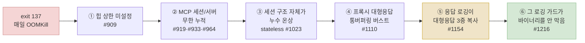
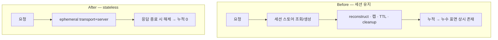
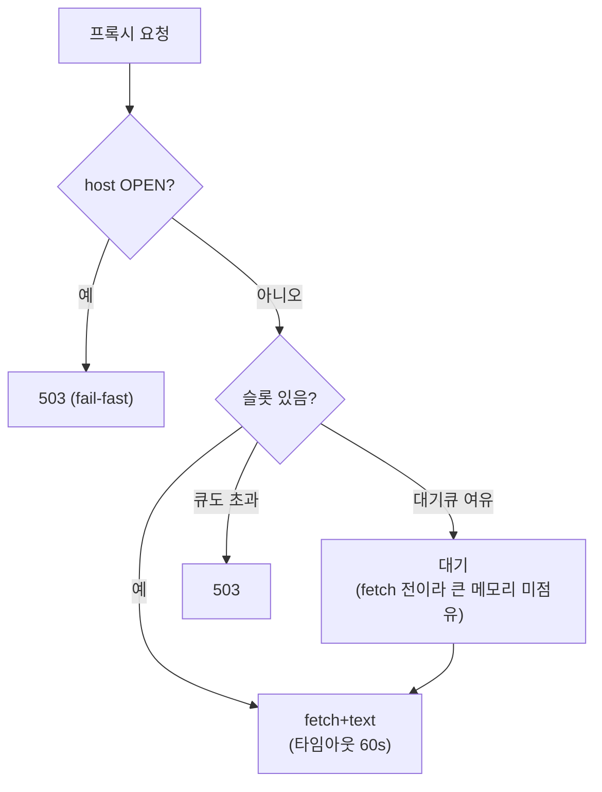

> **요약** — `dcs-ai-server`의 반복 OOM을 **메모리 누수 제거(stateless 전환)** 와 **프록시·로깅 메모리 최적화**로 잡았다. 하루 71건 → 5일 연속 0건, working_set peak 903MB → 286MB. 핵심은 개별 패치가 아니라 구조 제거였고, 추측이 아니라 실측이었다.
>
> **(2026-08-10 추가)** 3주 뒤 하루 44건으로 재발했다. 새 버그가 아니라 **7월에 넣은 로깅 가드가 절반만 막고 있었던 것** — 문자열만 검사해 바이너리 응답이 그대로 통과했다. 마지막 절 〈7. 3주 뒤〉에 원인·수정·실측을 이어 붙였다.

## 무슨 일이 있었나

`dcs-ai-server`는 EC2 단독으로 돌던 것이 **EKS로 이관되며 멀티 파드(HPA로 3~14개)** 가 됐고, 그 뒤 사용자도 꾸준히 늘었다. 파드 하나의 메모리 limit은 **1GiB**. 어느 날부터 파드들이 하루에도 몇 번씩 `exit 137`로 죽기 시작했다. 137은 커널이 `SIGKILL`(128+9)로 프로세스를 강제 종료했다는 뜻 — **메모리 한도를 넘겨 OOMKill 당한 것**이다.

배경이 "멀티 파드 전환 + 사용자 증가"였으니 의심은 둘로 갈렸다. **부하가 늘어서 터지는가, 코드가 새는가?** 여기에 짐작으로 답하면 엉뚱한 걸 고친다. 결론부터 말하면 **코드였고**, 그것도 한 곳이 아니었다 — 하나를 막을 때마다 방아쇠가 다음 병목으로 옮겨갔다.

<aside style="font-family: var(--sans); font-size: 0.9rem; line-height: 1.65; background: var(--paper-2); border: 1px solid var(--line); border-radius: 8px; padding: 1em 1.25em; color: var(--ink-2); max-width: var(--measure-text); font-style: normal;">
<p style="margin: 0 0 0.5em; font-weight: 600; color: var(--ink);">📖 용어 정리 — 힙·GC·OOM <span style="font-weight: 400; opacity: 0.7;">(아는 분은 건너뛰세요)</span></p>
<ul style="margin: 0; padding-left: 1.2em; list-style: disc;">
<li style="margin: 0.25em 0;"><strong>힙(heap)</strong>: 프로그램이 돌면서 만드는 객체를 담는 메모리 공간.</li>
<li style="margin: 0.25em 0;"><strong>GC</strong>: 힙에서 <strong>아무도 안 가리키는 객체</strong>를 자동으로 치우는 청소부. 참조가 하나라도 남아 있으면 못 치운다.</li>
<li style="margin: 0.25em 0;"><strong>메모리 누수</strong>: 죽은 객체를 코드가 계속 가리켜 GC가 손 못 대는 상태. 이 글 6월 사건이 정확히 이것 — 죽은 세션을 <code>Map</code>이 붙들고 있었다.</li>
<li style="margin: 0.25em 0;"><strong>OOM</strong>은 두 종류이고 글 내내 구분한다 — <strong>V8 FATAL <code>Reached heap limit</code></strong>(Node가 스스로 죽음)과 <strong>커널 OOMKill <code>exit 137</code></strong>(컨테이너 한도 초과로 OS가 죽임).</li>
<li style="margin: 0.25em 0;"><strong><code>--max-old-space-size</code></strong>: V8 힙 상한선. 여기 닿으면 GC를 세게 돌리고, 그래도 못 줄이면 FATAL이 난다.</li>
</ul>
</aside>

## OOM이 옮겨 다닌 경로


```mermaid
graph LR
  A[exit 137<br/>매일 OOMKill] --> B[① 힙 상한 미설정<br/>#909]
  B --> C[② MCP 세션/서버<br/>무한 누적<br/>#919·#933·#964]
  C --> D[③ 세션 구조 자체가<br/>누수 온상<br/>stateless #1023]
  D --> E[④ 프록시 대형응답<br/>통버퍼링 버스트<br/>#1110]
  E --> F[⑤ 응답 로깅이<br/>대형응답 3중 복사<br/>#1154]
  F --> G[⑥ 그 로깅 가드가<br/>바이너리를 안 막음<br/>#1216]
  style A fill:#F5D5D5,stroke:#C88
  style F fill:#F0E4C8,stroke:#C9A227
  style G fill:#D5E8D5,stroke:#8B8
```

성격은 **표면 패치 → 구조적 제거 → 새 방아쇠 방어**로 바뀌어 갔다.

## 0. 먼저 실측

`exit 137`만 보고는 무엇이 메모리를 잡고 있는지 알 수 없다. 코드를 고치기 전에 두 가지를 붙였다.

- **원인 분석 문서** — 코드 변경 없이 힙 성장 후보 3개를 지목: ① 힙 상한 미설정, ② MCP 연결이 TTL/cleanup 없이 단조 누적, ③ `main.ts`의 `res.send` 몽키패치가 응답 본문을 4중 복제.
- **임시 heap snapshot 엔드포인트** — `v8.getHeapSnapshot()`을 **버퍼링 없이 스트리밍**으로 내려받게 했다(이 자체가 OOM을 유발하면 안 되니까). Chrome DevTools로 retainer를 직접 열었다.

이후 모든 방어선 숫자(768MB, 60초, 캡 30, 1MB)는 여기서 나왔다.

## 1. V8 힙 상한을 건다 — #909

**원인.** 한도가 두 개인데 어긋나 있었다. 컨테이너의 진짜 한도는 **1GiB**인데, Node(V8)가 "이쯤 차면 대청소하자"고 잡는 기준선은 **설정돼 있지 않아** V8이 머신 메모리를 보고 1GiB보다 높게 잡아버렸다. 힙이 950MB까지 차올라도 V8은 "아직 여유 있네" 하며 GC를 미뤘고, 그 사이 컨테이너 한도를 먼저 넘겨 커널이 프로세스를 죽였다. **화재 경보를 실제 화재 온도보다 높게 맞춰둔 것**이다.

**수정.** `NODE_OPTIONS`에 `--max-old-space-size=768` 추가.

```yaml
# charts/dcs-ai/templates/server-deployment.yaml
env:
  - name: NODE_OPTIONS
    value: "--require dd-trace/init --max-old-space-size=768"
```

**효과.** 힙이 768MB에 닿으면 V8이 스스로 강제 GC를 돌리고, 컨테이너 limit(1024MB)에는 헤드룸이 남는다. 커널 OOMKill(외부에서 즉사)이 V8 힙 관리(내부에서 회수 시도)로 바뀌었다. 다만 이건 **안전망이지 해결이 아니다** — 진짜로 새고 있으면 768MB도 언젠가 찬다. 실제로 그랬다.

## 2. MCP 세션 누수 체인 — #919 → #933 → #964

heap snapshot이 범인을 지목했다. **`McpServer` 객체가 세션 스토어에 무한 누적**되고 있었다. 10분에 +95개씩, 스냅샷 시점 139개 중 136개가 스토어에 살아 있었다 — 좀비가 아니라 **우리가 안 놓아주고 있던 것**이다. 세 번에 걸쳐 막았다.

**#919 — close 누락과 캡 우회.** 세션을 추방할 때 `transport.close()`만 부르고 **`server.close()`를 안 했다.** SDK 내부의 핸들러·타이머가 `McpServer`를 계속 retain했다. 또 `doReconstructSession`(끊긴 세션 복구 경로)이 **`MAX_SESSIONS` 캡 검사를 우회**해, 재접속만으로 스토어가 무제한 증가했다. → 모든 정리 경로에서 `server.close()`까지 부르고, reconstruct에도 캡 + `evictOldest`를 적용했다.

> 오답 노트: reconstruct churn을 줄이려 idle TTL을 30분 → 4시간으로 늘렸다가 되돌렸다. TTL을 늘리니 **reaper가 오래된 세션을 트림하지 못해** 역효과가 났다. 상한은 캡으로 잡는 게 맞다.

**#933 — 고치다가 만든 무한 재귀.** `server.close()`를 붙였더니 이번엔 스택오버플로로 파드가 crashloop에 빠졌다(메모리는 정상, 순수 로직 버그). `onclose`가 `server.close()`를 부르고, SDK가 그 안에서 `transport.close()`를 다시 불러 `onclose`를 동기 재발화하는 순환이었다. → `onclose` 진입 즉시 `transport.onclose = undefined`로 핸들러를 떼어내, 중첩 close에서 SDK의 `this.onclose?.()`가 no-op이 되게 했다.

**#964 — 죽은 세션이 영원히 안 죽던 이유.** 가장 교묘했다. reconstruct가 `put()`으로 **Redis의 `lastAccessedAt` + 7일 TTL을 무조건 재기록**해서, **죽은 옛 session-id로 재접속만 해도 TTL이 영구히 리셋**됐다. 죽은 세션이 자연 만료되지 못하고 무한 누적 → 매일 힙 OOM.

```typescript
// reconstruct는 메모리 엔트리만 적재, Redis TTL은 원본 유지
store.put(sessionId, entry, { extendRedisTtl: false });
```

`false`면 Redis 쓰기 자체를 생략한다 — `redis.set()`에 `KEEPTTL`이 없어 TTL 생략 SET이 기존 TTL을 오히려 지워버리는 함정을, "쓰기를 안 하는 것"으로 우회했다.

**효과.** 세 패치로 OOM 빈도가 **하루 71건 → 한 자릿수**로 떨어졌다. 하지만 새는 표면 자체는 남아 있었다.

## 3. 패치를 멈추고 구조를 바꾸다 — stateless 전환 #1023

**원인.** 세 번을 막고 나서 인정했다. **세션 기반 구조 자체가 누수의 온상이었다.** 세션 스토어, reconstruct, `MAX_SESSIONS` eviction thrash, Redis 세션 누수, SDK 내부 동작에 의존한 close 패치 — 전부 "세션을 오래 들고 있다"는 전제에서 나왔다.

**수정.** mcp-host를 **stateless로 전환**했다. 요청마다 ephemeral transport + server를 만들어 처리하고, 응답이 끝나면 즉시 해제한다. 세션 스토어·reconstruct·pre-init·`MAX_SESSIONS`·cleanup 로직을 통째로 삭제(GET/DELETE 세션 → 405). 순 **-1,430줄**.


```mermaid
graph TD
  subgraph before["Before — 세션 유지"]
    R1["요청"] --> S1["세션 스토어 조회/생성"]
    S1 --> RC["reconstruct · 캡 · TTL · cleanup"]
    RC --> L["누적 → 누수 표면 상시 존재"]
  end
  subgraph after["After — stateless"]
    R2["요청"] --> E["ephemeral transport+server"]
    E --> X["응답 종료 시 해제 → 누적 0"]
  end
```

판단의 근거는 **"우리가 세션을 정말 쓰는가?"** 였다. mcp-host는 서버발신 알림·SSE 푸시·세션 스코프 상태를 쓰지 않는다. 즉 세션을 유지할 이유가 없었으니 기능 손실 0으로 누수 원인이 **구조적으로 소멸**한다.

**효과.** 배포(7/9) 직후 **5일 연속 OOM 0건**. 덤으로 세션 폴링이 사라져 **MCP 요청량이 4배 줄었다**(1.34M → 0.36M). 두더지를 한 마리씩 잡는 대신 굴을 메운 것이다.

## 4. stateless 후속 — 요청당 낭비 줄이기 #929

**원인.** stateless로 가니 요청마다 `createServer`가 `new Ajv()` + 스키마 shape 재구성을 반복했다.

"서버 하나를 공유하자"는 안 됐다 — SDK의 `Protocol`이 transport를 단일 `_transport` 필드로 1:1 소유해서, 공유하면 동시 요청 응답이 서로 오배송된다(SDK 1.25.3 소스로 검증).

**수정.** 서버 껍데기는 요청별로 두되 **비싼 불변 자산만 프로세스당 1회로 공유**했다. `AjvJsonSchemaValidator`를 프로세스당 1개 생성해 주입하고, 툴 정의의 flat `schemaShape`를 `WeakMap`으로 정의당 1회 캐시.

**효과.** 같은 부하(req/s ~0.41) 구간끼리 대보면 **CPU는 +0.8%로 사실상 동일**, `heap_used`는 145.3MB → 141.7MB로 **약 −2.5%**. #929가 겨눈 게 CPU가 아니라 요청당 할당이었으니 데이터와 방향이 맞는다. **헤드라인 숫자를 흔드는 수정은 아니고**, stateless가 들여온 요청당 낭비가 부하에서 누적되지 않게 막는 예방적 위생 수정이다.

## 5. 방아쇠가 옮겨갔다 — 프록시 방어 #1110

**원인.** MCP를 구조적으로 막고 나니 OOM이 프록시(`/proxy/kg`·`/proxy/data-api`)에서 다시 나타났다. 프록시는 upstream 응답을 `fetch` + `text()`로 **통째로 버퍼링**한다.

| 지표 | 실측값 |
|---|---|
| 파드 메모리 limit | 1GiB |
| `/proxy/kg` 응답 크기 | p90 **2.87MB**, max 3.08MB |
| 요청당 메모리 소비 | 통버퍼링 다중 복사로 **~10–12MB** |
| 정상 동시성 | 클러스터 ~8–20 (파드당 <1) |
| 사건 시 | 단일 IP **54건** 버스트 → working set 917MB(한도 90%) → OOM |

정상 트래픽은 파드당 1건도 안 된다. 즉 볼륨이 아니라 **버스트 방어**의 문제였다.

**수정.** 세 겹으로 막았다.

1. **host별 서킷브레이커** — 전역 단일 키였던 KG 전용 브레이커를 `cb:state:{host}` 키를 받는 범용 서비스로 일반화해 `common`으로 올렸다. 덕분에 **daisy 장애가 KG 차단기를 열던 교차오염이 사라졌다.** host가 OPEN이면 즉시 503(fail-fast).
2. **upstream 타임아웃** — `PROXY_UPSTREAM_TIMEOUT_MS` 기본 60초. 근거는 실측(prd 정상 응답 max ~36초, p90 10초 → 30초면 정상 쿼리를 자르고, 관측 max의 ~1.6배 여유로 60초).
3. **파드당 동시성 캡** — in-process 세마포어로 upstream 호출을 제한(기본 max 30 + 대기큐 30).


```mermaid
graph TD
  Q["프록시 요청"] --> CB{"host OPEN?"}
  CB -- "예" --> R503a["503 (fail-fast)"]
  CB -- "아니오" --> SEM{"슬롯 있음?"}
  SEM -- "예" --> F["fetch+text<br/>(타임아웃 60s)"]
  SEM -- "대기큐 여유" --> W["대기<br/>(fetch 전이라 큰 메모리 미점유)"]
  SEM -- "큐도 초과" --> R503b["503"]
  W --> F
```

**효과.** 대기자는 `fetch` 이전 단계라 아직 큰 응답 메모리를 안 잡는다. 그래서 즉시 거부를 줄이면서도 in-flight 메모리가 `max × 요청당`으로 **유계화**된다. 메모리 limit이 파드당이니 캡도 파드당(in-process)이 정확 — 전역 Redis가 필요 없다. 정상 트래픽엔 절대 안 걸리고 오직 버스트 안전밸브로만 작동한다.

## 6. 방아쇠가 한 번 더 — 응답 로깅의 3중 버퍼링 #1154

**원인.** #1110 배포 하루 뒤인 7/23 오전, OOM이 또 났다(kv0.1.65, 5건). 이번엔 프록시가 응답을 받은 *다음*, 그 응답을 남기던 **로깅 미들웨어**였다. 한 응답을 세 번 들고 있었다 — ① upstream 원본 문자열 ② `JSON.parse`한 객체 ③ 마스킹용 `sanitizeObject` 딥클론.

평소엔 응답이 몇 KB라 티도 안 났는데, 이날 방아쇠는 **39~42MB짜리 응답**이었다. 3중이면 응답 하나에 100MB를 훌쩍 넘긴다. #1110의 동시성 캡은 upstream 버퍼링을 겨눴지 **이 로깅 경로의 복사본은 캡 밖**이라, 같은 방아쇠가 캡을 우회했다.

**수정.** 로그 바디에 상한(1MB)을 두고, 초과 시 파싱·클론을 건너뛴다.

```typescript
const MAX_LOG_BODY_SIZE = 1024 * 1024; // 1MB
const isOversized =
  typeof data === 'string' && data.length > MAX_LOG_BODY_SIZE;

const logPayload = isOversized
  ? { truncated: true, size: data.length, preview: data.slice(0, 500) }
  : /* 기존 파싱 + 마스킹 경로 */;
```

임계값 1MB도 실측이다 — `/proxy/kg` 평시 응답 151건 기준 **정상 응답의 3.3%만** 잘리는 반면, OOM을 낸 39~42MB와는 **15배 이상** 여유가 있다. 관측을 위한 로깅이 정작 관측 대상을 죽이고 있었다.

**효과.** 7/23 17:10 `kv0.1.67` 배포. 이후 실측은 아래에.

## 데이터로 본 효과

서사가 맞는지는 숫자로 확인해야 한다. 질문은 서두의 그것 — *OOM이 줄어든 건 코드 때문인가, 트래픽이 출렁여서인가?*

> 측정 전제: 우리 OOM은 V8이 스스로 죽는 `Reached heap limit`이라 k8s `reason:oomkilled` 카운터엔 **안 잡힌다.** 실제 집계는 로그 기반 모니터의 Slack 알림을 되짚어 복원했고, 모니터 생성(6/11) 이전 구간은 당시 수동 조회 수치로 보강했다. 따라서 아래 숫자는 절대 크래시 카운트가 아니라 **에피소드/추세**로 읽어야 한다.

### ① OOM 빈도: 71건/일에서 클린으로

| 시점 | OOM 빈도 | 직전 조치 |
|---|---|---|
| 6/8 (수정 전) | **하루 71건** / ~56 파드 | — |
| 6/9 | 5건+ | MCP 세션 정리(Phase 1) |
| 6월 중순~하순 | 1~2 버스트/일, 무발생일 다수 | #919·#933·#964 |
| **7/8~12** | **5일 연속 0** | **#1023 stateless (7/9)** |
| 7/13~ | 산발 1버스트/일 | (성격이 바뀜 → 프록시) |

### ② "늘어난 건 사용자 탓인가?" — 아니다

OOM을 **백만 요청당으로 정규화**하면 부하와 코드가 갈린다.

| 주(월) | 총 요청 | OOM 에피소드 | **OOM/백만req** | 그 주 반영된 코드 |
|---|---:|---:|---:|---|
| 6/08 | 4.07M | 15 | **3.7** | **#909** 힙 상한 · **#919** 세션 close·캡 |
| 6/15 | 4.29M | 6 | **1.4** | **#933** onclose 재귀 수정 |
| 6/22 | 4.48M | 8 | 1.8 | **#964** Redis TTL 비연장 |
| 6/29 | 5.16M | 5 | 1.0 | — (안정화 구간) |
| **7/06** | **5.20M** | 2 | **0.4** | **#1023 stateless** — 트래픽 최고인데 OOM 최저 |
| **7/13** | **3.08M** | 5 | **1.6** | (신규 배포 없음) — 프록시 노출 부상 |
| 7/20 | 2.27M | 2 | 0.9 | 프록시 잔존 (#1110 미배포) |

두 지점이 서사를 확정한다.

- **6/15**: OOM/백만req가 3.7 → 1.4로 떨어질 때 트래픽은 오히려 **늘었다**. 부하가 늘었는데 OOM이 줄었으니 개선은 코드다.
- **7/13**: 총 요청이 5.2M → 3.08M(**−40%**), MCP 요청은 −73%로 급감했는데 OOM은 2 → 5로 **늘었다.** "사용자가 많아져서"로는 설명 불가.

후반부 OOM은 볼륨이 아니라 **프록시 통버퍼링 노출** 때문이다. `/proxy/kg`는 응답 크기 × 순간 동시성에 민감하지 총 요청 수엔 둔감하다.

<figure style="margin:2em 0;">
<svg viewBox="0 0 740 350" style="width:100%;height:auto;font-family:inherit" role="img" aria-label="주별 OOM 빈도(백만 요청당): 6/08 3.7, 6/15 1.4, 6/22 1.8, 6/29 1.0, 7/06 0.4, 7/13 1.6, 7/20 0.9, 7/24~27 0.0">
<text x="44" y="15" font-size="13" font-weight="600" fill="#211E29">주별 OOM 빈도 (백만 요청당) — 수정이 쌓일수록 0으로</text>
<line x1="52" y1="232.5" x2="704" y2="232.5" stroke="#E7E5EE"/>
<line x1="52" y1="165" x2="704" y2="165" stroke="#E7E5EE"/>
<line x1="52" y1="97.5" x2="704" y2="97.5" stroke="#E7E5EE"/>
<line x1="52" y1="30" x2="704" y2="30" stroke="#E7E5EE"/>
<line x1="52" y1="300" x2="704" y2="300" stroke="#D7D3E2"/>
<text x="44" y="304" font-size="10" text-anchor="end" fill="#585563">0</text>
<text x="44" y="236.5" font-size="10" text-anchor="end" fill="#585563">1</text>
<text x="44" y="169" font-size="10" text-anchor="end" fill="#585563">2</text>
<text x="44" y="101.5" font-size="10" text-anchor="end" fill="#585563">3</text>
<text x="44" y="34" font-size="10" text-anchor="end" fill="#585563">4</text>
<rect x="72.8" y="50.3" width="40" height="249.7" rx="3" fill="#8A63D6"/>
<rect x="154.3" y="205.5" width="40" height="94.5" rx="3" fill="#8A63D6"/>
<rect x="235.8" y="178.5" width="40" height="121.5" rx="3" fill="#8A63D6"/>
<rect x="317.3" y="232.5" width="40" height="67.5" rx="3" fill="#8A63D6"/>
<rect x="398.8" y="273" width="40" height="27" rx="3" fill="#8A63D6"/>
<rect x="480.3" y="192" width="40" height="108" rx="3" fill="#8A63D6"/>
<rect x="561.8" y="239.3" width="40" height="60.7" rx="3" fill="#8A63D6"/>
<circle cx="663.3" cy="300" r="4.5" fill="#3E8E5A"/>
<text x="92.8" y="44" font-size="12" font-weight="600" text-anchor="middle" fill="#211E29">3.7</text>
<text x="174.3" y="199.5" font-size="12" font-weight="600" text-anchor="middle" fill="#211E29">1.4</text>
<text x="255.8" y="172.5" font-size="12" font-weight="600" text-anchor="middle" fill="#211E29">1.8</text>
<text x="337.3" y="226.5" font-size="12" font-weight="600" text-anchor="middle" fill="#211E29">1.0</text>
<text x="418.8" y="267" font-size="12" font-weight="600" text-anchor="middle" fill="#211E29">0.4</text>
<text x="500.3" y="186" font-size="12" font-weight="600" text-anchor="middle" fill="#211E29">1.6</text>
<text x="581.8" y="233.3" font-size="12" font-weight="600" text-anchor="middle" fill="#211E29">0.9</text>
<text x="663.3" y="290" font-size="12" font-weight="700" text-anchor="middle" fill="#3E8E5A">0.0</text>
<text x="92.8" y="318" font-size="11" text-anchor="middle" fill="#585563">6/08</text>
<text x="174.3" y="318" font-size="11" text-anchor="middle" fill="#585563">6/15</text>
<text x="255.8" y="318" font-size="11" text-anchor="middle" fill="#585563">6/22</text>
<text x="337.3" y="318" font-size="11" text-anchor="middle" fill="#585563">6/29</text>
<text x="418.8" y="318" font-size="11" text-anchor="middle" fill="#585563">7/06</text>
<text x="500.3" y="318" font-size="11" text-anchor="middle" fill="#585563">7/13</text>
<text x="581.8" y="318" font-size="11" text-anchor="middle" fill="#585563">7/20</text>
<text x="663.3" y="318" font-size="11" text-anchor="middle" fill="#585563">7/24~</text>
<text x="92.8" y="333" font-size="9.5" text-anchor="middle" fill="#7A57D1">#909·919</text>
<text x="174.3" y="333" font-size="9.5" text-anchor="middle" fill="#7A57D1">#933</text>
<text x="255.8" y="333" font-size="9.5" text-anchor="middle" fill="#7A57D1">#964</text>
<text x="337.3" y="333" font-size="9.5" text-anchor="middle" fill="#585563">안정화</text>
<text x="418.8" y="333" font-size="9.5" text-anchor="middle" fill="#7A57D1">stateless</text>
<text x="500.3" y="333" font-size="9.5" text-anchor="middle" fill="#585563">프록시노출</text>
<text x="581.8" y="333" font-size="9.5" text-anchor="middle" fill="#585563">—</text>
<text x="663.3" y="333" font-size="9.5" text-anchor="middle" fill="#3E8E5A">#1110·1154</text>
</svg>
<figcaption style="font-size:0.82rem;color:#585563;margin-top:0.6em;line-height:1.55;">백만 요청당으로 정규화한 OOM 에피소드. <strong>6/15</strong>엔 트래픽이 늘었는데도 3.7→1.4로 떨어졌고(코드 효과), <strong>7/13</strong>엔 트래픽이 −40%인데 OOM이 되레 늘었다(프록시 노출) — 부하가 아니라 코드가 방아쇠였다는 증거. 마지막 <strong>7/24~27</strong>은 #1110·#1154 배포 후 트래픽 최다에도 0건.</figcaption>
</figure>

### ③ 메모리: "천장 체류"가 사라졌다

working_set이 컨테이너 한도의 **84%를 넘은 샘플 수**를 주별로 세면 누수가 잡힌 게 보인다.

- **6/8주**: 21개 중 **10개**가 84% 초과 — 메모리가 천장에 눌러앉은 전형적 누수.
- 누수 패치 이후: **2~4개/21**로 급감 — 더는 천장에 붙어있지 않고 가끔 버스트만 튄다.

peak(항상 ~90%)만 보면 안 변한 것 같지만, 진짜 개선은 **체류 빈도**에 있었다.

### ④ 안정 확정 — working_set 903MB → 286MB, 5일 무OOM

`#1110`(`kv0.1.66` 7/23 13:24)과 `#1154`(`kv0.1.67` 7/23 17:10)를 잇따라 배포했다. #1110은 정식 경로로 올리면 그 사이 main에 쌓인 **무관한 커밋까지 운영에 실리므로**, 검증된 세 커밋만 cherry-pick했다.

| 시점 (KST) | working_set peak | 상태 |
|---|---:|---|
| 7/20 22:00 | 917MB | OOM (kv0.1.62) |
| 7/21 16:00 | 895MB | OOM |
| 7/23 10:00~11:40 | **899~903MB** (한도의 88~90%) | OOM (kv0.1.65, 마지막) |
| ── 7/23 오후 · #1110 + #1154 배포 ── | | |
| **7/23 12:00 ~ 7/28 14:46 (5일)** | **최대 286MB** (한도의 28%) | **무OOM** ✅ |

배포 후 working_set은 **234~286MB에서 거의 일직선**이다. 900대 스파이크의 소멸이 대형 응답 버퍼링 경로가 닫힌 직접 증거다. 마지막 `Reached heap limit`은 7/23 11:44, 이후 **약 123시간 0건**. 그동안 prd는 `kv0.1.68→69`로 롤링됐지만 메모리 교란 없이 250MB대를 지켰다 — 재배포가 만든 착시가 아니다.

<figure style="margin:2em 0;">
<svg viewBox="0 0 740 340" style="width:100%;height:auto;font-family:inherit" role="img" aria-label="컨테이너 메모리 working_set peak: 7/20~23 OOM기 895~917MB, 7/23 오후 #1110·#1154 배포 후 286MB 이하로 급락">
<text x="44" y="15" font-size="13" font-weight="600" fill="#211E29">컨테이너 메모리(working_set) peak — 7/23 수정 후 절벽처럼 내려앉다</text>
<rect x="56" y="30" width="644" height="41.6" fill="#C0555B" fill-opacity="0.10"/>
<text x="694" y="46" font-size="9.5" text-anchor="end" fill="#B5544F">OOM 위험대 · 한도의 84%↑</text>
<line x1="56" y1="30" x2="700" y2="30" stroke="#C99" stroke-width="1" stroke-dasharray="4 3"/>
<text x="696" y="26" font-size="10" text-anchor="end" fill="#585563">1GiB 한도</text>
<line x1="56" y1="225" x2="700" y2="225" stroke="#E7E5EE"/>
<line x1="56" y1="160" x2="700" y2="160" stroke="#E7E5EE"/>
<line x1="56" y1="95" x2="700" y2="95" stroke="#E7E5EE"/>
<line x1="56" y1="290" x2="700" y2="290" stroke="#D7D3E2"/>
<text x="48" y="294" font-size="10" text-anchor="end" fill="#585563">0</text>
<text x="48" y="229" font-size="10" text-anchor="end" fill="#585563">256</text>
<text x="48" y="164" font-size="10" text-anchor="end" fill="#585563">512</text>
<text x="48" y="99" font-size="10" text-anchor="end" fill="#585563">768</text>
<text x="48" y="34" font-size="10" text-anchor="end" fill="#585563">1024</text>
<polyline points="56,57.1 136.5,62.7 217,74.4 297.5,60.7 378,217.4 458.5,217.4 539,230.3 619.5,230.3 700,225.3" fill="none" stroke="#7A57D1" stroke-width="2"/>
<line x1="337.75" y1="30" x2="337.75" y2="290" stroke="#3E8E5A" stroke-width="1.5" stroke-dasharray="5 3"/>
<text x="332" y="98" font-size="10" text-anchor="end" fill="#3E8E5A">#1110·#1154</text>
<text x="332" y="111" font-size="10" text-anchor="end" fill="#3E8E5A">배포 (7/23 오후)</text>
<circle cx="56" cy="57.1" r="3.8" fill="#C0555B" stroke="#FFFFFF" stroke-width="1.3"/>
<circle cx="136.5" cy="62.7" r="3.8" fill="#C0555B" stroke="#FFFFFF" stroke-width="1.3"/>
<circle cx="217" cy="74.4" r="3.8" fill="#C0555B" stroke="#FFFFFF" stroke-width="1.3"/>
<circle cx="297.5" cy="60.7" r="3.8" fill="#C0555B" stroke="#FFFFFF" stroke-width="1.3"/>
<circle cx="378" cy="217.4" r="3.8" fill="#3E8E5A" stroke="#FFFFFF" stroke-width="1.3"/>
<circle cx="458.5" cy="217.4" r="3.8" fill="#3E8E5A" stroke="#FFFFFF" stroke-width="1.3"/>
<circle cx="539" cy="230.3" r="3.8" fill="#3E8E5A" stroke="#FFFFFF" stroke-width="1.3"/>
<circle cx="619.5" cy="230.3" r="3.8" fill="#3E8E5A" stroke="#FFFFFF" stroke-width="1.3"/>
<circle cx="700" cy="225.3" r="3.8" fill="#3E8E5A" stroke="#FFFFFF" stroke-width="1.3"/>
<text x="62" y="52" font-size="11" font-weight="600" text-anchor="start" fill="#C0555B">917MB</text>
<text x="297.5" y="52" font-size="11" font-weight="600" text-anchor="middle" fill="#C0555B">903MB</text>
<text x="384" y="213" font-size="11" font-weight="700" text-anchor="start" fill="#3E8E5A">286MB</text>
<text x="56" y="305" font-size="9.5" text-anchor="middle" fill="#585563">7/20</text>
<text x="136.5" y="305" font-size="9.5" text-anchor="middle" fill="#585563">7/21</text>
<text x="217" y="305" font-size="9.5" text-anchor="middle" fill="#585563">7/22</text>
<text x="297.5" y="305" font-size="9.5" text-anchor="middle" fill="#585563">7/23오전</text>
<text x="378" y="305" font-size="9.5" text-anchor="middle" fill="#585563">7/23오후</text>
<text x="458.5" y="305" font-size="9.5" text-anchor="middle" fill="#585563">7/24</text>
<text x="539" y="305" font-size="9.5" text-anchor="middle" fill="#585563">7/25</text>
<text x="619.5" y="305" font-size="9.5" text-anchor="middle" fill="#585563">7/26</text>
<text x="700" y="305" font-size="9.5" text-anchor="middle" fill="#585563">7/27</text>
</svg>
<figcaption style="font-size:0.82rem;color:#585563;margin-top:0.6em;line-height:1.55;">파드 컨테이너 메모리(working_set) 최고치. OOM이 나던 7/20~23엔 한도(1GiB)의 88~90%인 <strong>900MB대</strong>까지 치솟았다(빨강). 7/23 오후 #1110·#1154 배포 직후 <strong>286MB(28%)</strong>로 내려앉아 이후 줄곧 그대로(초록) — 대형 응답 버퍼링이 1GiB로 치닫던 경로가 닫혔다.</figcaption>
</figure>

**"주말이라 조용한" 것도 아니다.** 부하와 나란히 놓으면 이렇다.

| 날짜 | 요청 수 | OOM | working_set peak |
|---|---:|---:|---:|
| 7/23 목 (수정 전) | 826k | 5 | 903MB |
| **7/24 금 (수정 후)** | **1,555k — 전 구간 최다** | **0** | 286MB |
| 7/25 토 | 229k | 0 | ~235MB |
| 7/26 일 | 237k | 0 | ~235MB |
| 7/27 월 (오전 4.5h) | 249k | 0 | ~255MB |

**트래픽이 가장 높았던 날(금 155만 req)에 OOM이 0**이었다. 정작 OOM이 터지던 7/20~23은 77만~97만으로 더 낮았다 — ②의 정규화 결론이 이번엔 원자료로 확정된 셈이다.

### ⑤ 한눈에 — 불안정기 vs 안정기

| 지표 | 6/8 최악기 | 7/20~23 프록시 OOM기 | **7/24~28 수정 후** |
|---|---|---|---|
| OOM 빈도 | **71건/일** (~56파드) | 산발 버스트 | **0건 / 5일** ✅ |
| working_set peak | 상시 ~90% | 895~917MB | **≤286MB (28%)** |
| 천장(84%+) 체류 | 10/21 샘플 | 간헐 버스트 | **0** |
| heap_used 평시 | 천장 눌러앉음 | ~145MB | ~140~180MB flat |
| 주간/일 트래픽 | 4.07M/주 | 2.3~3.1M/주 | **금 1.55M/일 (최다)** |
| 컨테이너 재시작 | 다수 | 7/21 **25**·7/23 10 | 주말·월 **0** |

한 가지는 짚어둔다 — 안정기 working_set이 baseline(~200MB)이 아니라 234~286MB인 건 응답을 **여전히 통째로 버퍼링**하기 때문이다. 캡과 로그 상한은 "1GiB를 넘겨 죽는 것"을 막는 안전밸브지 요청당 메모리를 줄이진 않는다. 그건 **#1109(스트리밍)** 의 몫으로 남아 있다.

## 7. 3주 뒤 — 같은 가드의 나머지 절반이 뚫렸다 (#1216)

여기까지가 7/28에 쓴 글이다. "5일 무OOM"으로 닫았는데 **3주 뒤 다시 죽기 시작했다.** 8/7 prd 배포(`kv0.2.0`→`0.2.2`) 직후부터 6시간당 재시작이 0~2에서 **16 → 28**로 뛰었고, 8/10 기준 하루 **44건**. 죽는 방식은 7월과 똑같았다 — `Reached heap limit`, `current_heap_limit=805306368`(= 768MB, #909에서 건 그 값).

### 프록시 가설은 증거가 깼다

의심은 프록시로 갔다. 응답이 7월보다 커져 있었기 때문이다 — 실측 p99 **10.3MB**, max **20.2MB**(#1110 당시 전제 "max ~3MB"의 6.7배). 한 사용자가 8분간 111번 대용량 조회를 반복한 기록도 있었다.

**그런데 주말 데이터가 이 가설을 깼다.** 그 사용자의 8/8~9 호출은 **0건**인데 OOM은 주말 내내 같은 빈도로 났고, 8/10 04:06에 죽은 파드는 **직전 몇 분간 프록시 요청이 아예 없었다.** 가설을 지지하는 증거보다 깨는 증거를 먼저 찾은 게 빨랐다.

### 원인 — 가드가 "타입"으로 판단했다

dd-trace가 `snapshot:on_oom`으로 OOM 순간의 힙 스냅샷을 이미 41건 모아두고 있었다. 평균 힙 **668MiB**의 구성은 이랬다.

| 점유 | 함수 |
|---:|---|
| **505 MiB (75%)** | `stringifyFnReplacer` — winston의 `safe-stable-stringify` |
| 112 MiB | Native |
| **34 MiB** | `sanitizeObject` (`main.ts`) |

메모리를 먹은 건 데이터 처리가 아니라 **로그를 만드는 작업**이었다. 7월과 같은 자리다. 플레임그래프의 폭(= 그 프레임 아래 귀속된 힙 비율)이 조상 관계를 명시한다.

```
Average Heap Live Size: 666 MiB                    (100%)
└ writeAsset (qd-serving.service.ts:60)             ~96%   ← QD 자산 서빙
  └ res.send (main.ts:240)                          ~96%   ← 로깅 미들웨어의 몽키패치
    ├ logHttp (winston-logger.service.ts:72)        ~90%   → safe-stable-stringify
    └ sanitizeObject (main.ts:170)                   ~5%
```

원인은 7월에 넣은 #1154 가드 한 줄이었다.

```typescript
const isOversized =
  typeof data === 'string' && data.length > MAX_LOG_BODY_SIZE;
```

`typeof data === 'string'`. **문자열만 검사한다.** `writeAsset`은 S3 자산을 `res.send(finalBuffer)`로 내보내는데 `typeof Buffer`는 `'object'`라 이 가드를 그냥 통과했다. 그 다음이 진짜 문제였다 — `sanitizeObject`가 `Object.entries(obj)`를 도는데, **`Object.entries(Buffer)`는 바이트마다 엔트리를 만든다.** 3MB 자산 하나가 프로퍼티 300만 개짜리 객체로 딥클론되고, 그걸 winston이 다시 직렬화한다.

| 3MB Buffer 하나 | 직렬화 시간 | 생성되는 로그 문자열 |
|---|---:|---:|
| 수정 전 | **691 ms** | **39.8M자 (약 38MB)** |
| 수정 후 | 0.05 ms | 30자 |

**3MB 응답을 내보내려고 38MB짜리 로그를 만들고 있었다.** 7월 방아쇠가 KG 프록시의 39~42MB **문자열**이었기 때문에 그때 가드도 문자열만 막았고, 바이너리 경로는 그대로 남아 3주 뒤 터졌다. 새 버그가 아니라 **한 번 고친 문제를 절반만 막았던 것**이다.

덧붙여, 이 로그는 애초에 필요하지도 않았다. 읽는 코드가 0건이고, `logDirectory`에 volume/PVC가 없어 파드가 죽으면 사라지며(하루 44번 죽던 그때 평균 보존 30분), Console 전송이 HTTP 컨텍스트를 명시적으로 제외해 Datadog에도 안 간다. **아무도 읽지 않고 저장되지도 않는 기록**을 만드느라 파드가 죽고 있었다.

### 수정 — 타입이 아니라 비용으로 판단한다

기준을 **"문자열인가"에서 "직렬화 비용이 큰가"** 로 바꿨다.

```typescript
// ① 응답 로깅 — 바이너리 분기를 문자열 가드보다 앞에 둔다
const isBinary = Buffer.isBuffer(data) || ArrayBuffer.isView(data);
if (isBinary) {
  logPayload = { binary: true, size: /* byteLength */ };
} else if (isOversized) {
  /* 기존 1MB 문자열 가드 유지 */
}

// ② sanitizeObject 진입부에도 같은 방어
if (Buffer.isBuffer(obj) || ArrayBuffer.isView(obj)) {
  return `[Binary ${size} bytes]`;
}
```

②가 이번 수정의 핵심이다. 7월엔 응답 로깅 한 지점만 막았다가 다른 경로가 남았다. 이번엔 **마스킹 함수 자체**에도 방어를 넣어, 나중에 다른 코드가 같은 함수를 불러도 같은 사고가 안 나게 했다. `res.send()` 호출처를 전수 조사하니 Buffer를 넘기는 곳은 4개 — 실제 킬러는 QD 자산(`qd-serving.service.ts`)이었지만 파일 다운로드·이미지 프록시·임베디드 앱 프록시도 같은 결함을 공유하는 잠재 위험이었다.

문자열·객체 응답의 기존 동작(마스킹, 1MB 가드)은 그대로고, `originalSend.call(this, data)`는 건드리지 않아 **클라이언트가 받는 바이트·헤더·상태코드는 변하지 않는다.** 덤으로 보안 구멍도 닫혔다 — 지금까지 다운로드한 **파일 내용이 로그에 바이트 단위로 평문 기록**되고 있었다(마스킹은 `password` 같은 이름표 붙은 key만 가린다).

### 효과

`kv0.2.3`을 8/10 12:31에 배포했다.

| 지표 | 배포 전 (8/10 오전) | 배포 후 85분 |
|---|---|---|
| OOM 발생률 | 시간당 약 2회 (하루 44건) | **0건** |
| 같은 시간 기대 발생 수 | 약 2.8건 | **0건** |
| working_set peak | **927~988MB** (한도의 86~92%) | **465MB (43%)** |
| 컨테이너 재시작 | 6시간당 20~28 | 0 |
| 최장 무사고 구간 | 45분 | **85분** |

정직하게 덧붙이면 — **7월의 "5일 무OOM"만큼 강한 증거는 아니다.** 85분은 배포 전 최장 소강(45분)의 두 배지만 며칠을 지켜본 게 아니다. 다만 힙 스냅샷 41건의 귀속, 코드 경로 확인, 재현 측정(691ms/38MB)이 메커니즘을 따로 확정하고 있어 지표는 마지막 조각에 가깝다.

## 남은 과제

지금의 안정은 "1GiB를 넘겨 죽는 것"을 막은 상태지 요청당 메모리를 줄인 건 아니다.

1. **#1109 스트리밍** — 프록시가 응답을 통째로 버퍼링하지 않고 흘려보내면 peak가 baseline(~200MB)까지 내려간다.
2. **응답 본문 로깅 제거** — stdout에 `method/url/status/size/duration` 한 줄 요약으로 대체. 지금 로그는 아무 데도 안 가지만 그 한 줄은 Datadog에 들어가 그래프가 된다. **관측성이 오히려 좋아진다.**
3. **QD `.json` 자산을 `isRedirectableAsset`에 추가** — presigned URL 리다이렉트로 서버 경유 자체가 사라진다.

## 가져갈 것

1. **짐작 말고 잰다.** `exit 137`은 "메모리 부족"만 알려줄 뿐 범인을 안 알려준다. 방어선 숫자(768MB, 60초, 캡 30, 1MB)는 전부 실측에서 나왔다.
2. **누수는 패치가 아니라 구조로 막는다.** #919·#933·#964로 세 번 막았지만 새는 표면이 남아 있는 한 다음 구멍이 났다. stateless 전환의 질문은 **"우리가 세션을 정말 쓰는가?"** 였고, 안 썼다. 유지할 이유 없는 상태를 버리니 원인이 통째로 사라졌다(-1,430줄).
3. **"부하냐 코드냐"는 정규화해야 갈린다.** 다시 튄 OOM이 "사용자가 늘어서"처럼 보였지만 그 구간 트래픽은 **오히려 40% 줄어 있었다.** 병목은 한 겹 막을 때마다 옮겨가고(정상이다), 그때마다 방아쇠가 어디로 갔는지 다시 실측해야 한다.
4. **관측 코드도 부하다.** 7월과 8월의 OOM은 둘 다 프록시가 아니라 그 응답을 **로깅하던 미들웨어**였다. 응답 바디를 로그에 남긴다면 반드시 상한을 두고, **그 로그를 실제로 누가 읽는지 먼저 확인한다.** 우리 경우엔 아무도 읽지 않았다.
5. **가드는 타입이 아니라 비용으로 짠다.** `typeof data === 'string'`은 당시 방아쇠가 문자열이었으니 자연스러운 선택이었지만, 타입으로 거르면 새 타입마다 구멍이 생긴다. Buffer는 `typeof`가 `'object'`라 그냥 통과했다.
6. **"이미 고친 문제"가 가장 위험하다.** 7월에 가드를 넣었기 때문에 오히려 "그건 막았다"는 안심이 생겼고, 실제로는 절반만 막혀 3주 뒤 나머지가 터졌다. 한 번 고친 자리는 다음에 볼 때 **"정말 전부 막혔나"를 다시 확인**해야 한다.

지금도 프록시 통버퍼링과 응답 본문 로깅은 "완벽한 해결"이 아니라 **"측정된 안전밸브"** 다. 그게 1GiB 안에서 살아가는 서버의 현실적인 방어 방식이라고 본다. 다만 안전밸브를 달았다고 그 자리가 끝난 건 아니다.
