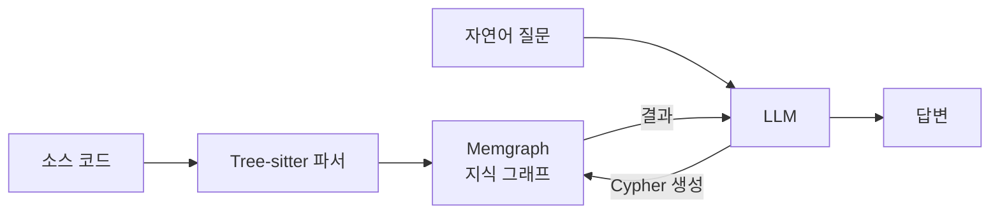

> **요약** — 코드베이스를 지식 그래프로 만들어주는 도구를 사내 모노레포(TypeScript 21만 줄)에 붙였다. 노드 17,850개·관계 52,200개가 생겼고 시각화도 됐다. 그런데 "이 가드를 누가 쓰나"를 물으니 실제 62곳 중 2곳만 답했다. 심볼 11개로 회수율을 재보니 패턴이 분명했다. **직접 호출은 40\~75% 잡히고, 의존성 주입과 데코레이터로 연결된 것은 0\~4%로 무너진다.** 구문 파서가 간접 참조를 못 보기 때문이다. 그래프는 없는 답을 지어내지 않는다. 대신 조용히 빠뜨린다.

코드베이스가 커지면 반복해서 묻게 되는 질문이 있다. "이 컬럼 지우면 뭐가 깨지나", "이 서비스를 아직 누가 쓰나", "이 모듈은 이제 죽은 코드인가". 지금은 이런 걸 대부분 grep으로 푼다. 검색어를 바꿔가며 여러 번 훑고 결과를 눈으로 걸러낸다.

그래서 [code-graph-rag](https://github.com/vitali87/code-graph-rag)가 눈에 들어왔다. 코드를 파싱해 함수와 클래스, 모듈을 그래프 DB에 넣고 자연어 질문을 그래프 쿼리로 바꿔 답하는 도구다. 구조를 그래프로 갖고 있으면 위의 질문들이 한 번의 쿼리로 끝난다.

실제로 붙여봤다. 결론부터 쓰면 **도입하지 않기로 했다.** 다만 그 판단에 이르는 과정에서 잰 숫자들이 "코드 분석 도구를 평가할 때 무엇을 확인해야 하는가"의 답이 됐다.

## 이 도구가 하는 일



Tree-sitter로 소스를 파싱해 함수와 클래스, 메서드, 모듈을 노드로, 호출·상속·임포트를 간선으로 만들어 Memgraph에 적재한다. 질문이 들어오면 LLM이 Cypher 쿼리를 생성해 그래프를 조회하고 답을 만든다. TypeScript를 포함해 12개 언어를 지원하고 라이선스는 MIT다.

대상은 사내 소재 관리 시스템(FMS)이다. pnpm 모노레포에 백엔드(NestJS)·프론트엔드(React)·공유 DB 패키지가 들어 있고, 소스는 1,217개 파일에 21만 줄이다.

## 적재 결과

설치는 패키지 매니저 한 줄로 끝났고 그래프 DB는 컨테이너로 함께 뜬다. 세 워크스페이스를 각각 적재했다. `node_modules`는 제외 옵션으로 걸러냈다. 소스가 1,217개인데 `node_modules`의 js/ts 파일은 루트에만 34,000개가 넘는다. 안 걸러내면 그래프가 통째로 노이즈에 덮인다.

| 워크스페이스 | 모듈(소스 파일) | 노드 | 관계 | IMPORTS |
|---|---|---|---|---|
| 백엔드 (NestJS) | 529 | 6,786 | 17,742 | 915 |
| 프론트엔드 (React) | 586 | 8,554 | 30,105 | 2,305 |
| 공유 DB 패키지 | 113 | 730 | 1,457 | 199 |
| **합계** | **1,228** | **17,850** | **52,200** | — |

백엔드 기준 3분 30초가 걸렸다. 파싱 자체는 견고했다. 클래스와 인터페이스, 타입, 메서드를 정확히 구분해 잡았고 내부 임포트도 경로 별칭을 풀어 실제 모듈로 연결했다. 재적재는 멱등이라 같은 소스면 수치가 그대로였다.

여기까지는 좋았다.

## 첫 질문에서 막혔다

가장 궁금했던 것부터 물었다. 협력사 데이터 격리를 담당하는 가드가 있는데, 이걸 어느 컨트롤러들이 쓰는지가 보안상 중요하다. 그래프에서 유입 간선을 조회했다.

결과는 **2건**이었다. 하나는 가드를 정의한 모듈 자신, 다른 하나는 이 가드를 직접 생성하는 테스트 코드였다.

같은 걸 grep으로 세어보니 **62곳**이었다.

## 회수율을 측정했다

여기서 재려는 건 정확도가 아니다. 그래프가 내놓은 간선은 전부 실재한다. 없는 참조를 지어내는 일은 없다. 문제는 반대쪽이다. **실재하는 참조 중 몇 개를 내놓느냐.** 정확도만 따지면 이 도구는 100점이고, 그래서 회수율을 따로 재지 않으면 빈틈이 드러나지 않는다.

한 심볼만으로 판단할 수 없어서 백엔드와 프론트엔드에서 각각 심볼을 골라 그래프 간선 수와 grep 결과를 대조했다.

| 심볼 | 성격 | 그래프 | grep | 회수율 |
|---|---|---|---|---|
| 응답 래핑 헬퍼 | 직접 호출 함수 | 12 | 17 | 71% |
| 사업자번호 검증기 | 직접 호출 함수 | 2 | 4 | 50% |
| 상세 diff 저장 메서드 | 클래스 메서드 | 4 | 26 | 15% |
| 감사 컬럼 구독자 | DI 등록 클래스 | 1 | 25 | 4% |
| 협력사 스코프 가드 | 데코레이터 참조 | 2 | 62 | 3% |
| 소재 코드 발급기 | DI 주입 서비스 | 0 | 6 | 0% |

프론트엔드는 사정이 달랐다.

| 심볼 | 성격 | 그래프 | grep | 회수율 |
|---|---|---|---|---|
| 목록 조회 훅 | 커스텀 훅 | 6 | 8 | 75% |
| 응답 언래핑 유틸 | 순수 함수 | 66 | 97 | 68% |
| 상태 표시 컴포넌트 | React 컴포넌트 | 61 | 133 | 46% |
| 콤보박스 필드 | React 컴포넌트 | 14 | 37 | 38% |
| 확인 다이얼로그 | React 컴포넌트 | 24 | 65 | 37% |

두 수치는 엄밀히 같은 단위가 아니다. grep은 줄 수를 세니 임포트 문·타입 주석까지 포함해 과다 집계한다. 그래프는 간선을 센다. 한 파일에서 세 번 쓰면 grep은 3, 그래프는 임포트 1 + 참조 몇 개가 된다. 그러니 회수율 70%를 "30% 놓쳤다"로 읽으면 안 된다.

하지만 **0%와 3%는 측정 오차로 설명되지 않는다.** 여기엔 다른 일이 벌어지고 있다.

## 구문 파서는 간접 참조를 못 본다

무너진 심볼들의 공통점은 분명하다. 전부 **이름을 직접 부르지 않고 연결되는 것들**이다.

```typescript
// 그래프가 보는 것 — 호출 지점이 코드에 그대로 있다
const result = withResponseMeta(data, meta);

// 그래프가 못 보는 것 — 데코레이터 인자로 넘어간 클래스
@UseGuards(SupplierScopeGuard)
export class DmaterialController { ... }

// 그래프가 못 보는 것 — 토큰으로 주입된 의존성
constructor(@Inject(MATERIAL_CODE_ISSUER) private readonly issuer: MaterialCodeIssuer) {}
```

Tree-sitter는 구문 파서다. 문법 구조는 정확히 읽지만 **타입을 해석하지 않고 프레임워크의 실행 의미도 모른다.** 데코레이터 인자로 넘어간 클래스가 "이 컨트롤러의 모든 요청에 이 가드가 적용된다"는 뜻이라는 걸 알 방법이 없다. 주입 토큰이 어느 구현으로 연결되는지도 마찬가지다.

우리 백엔드는 모듈 간 직접 임포트를 금지하고 의존성 주입으로만 연결하는 규칙을 쓴다. 결합도를 낮추려고 택한 구조인데, **바로 그 구조가 그래프에서는 통째로 비어 보인다.** 아키텍처 규칙을 잘 지킬수록 그래프가 볼 수 있는 게 줄어드는 역설이다.

프론트엔드 회수율이 두 배 이상 높은 것도 같은 이유다. React는 컴포넌트를 임포트해서 JSX에 직접 쓴다. 참조가 코드 표면에 드러나 있으니 구문 파서로도 따라갈 수 있다.

간선의 정확도에도 같은 한계가 나타난다. 전체 호출 간선 17,092건 중 대상 이름이 `value`인 것이 2,218건으로 13%를 차지한다. `constructor`, `length`, `t` 같은 이름을 더하면 16%다. 이름으로 매칭하다 보니 서로 다른 객체의 같은 이름 속성이 한 노드로 뭉친다.

## "모노레포 통합 그래프"는 적재 단위에서 끊긴다

프론트엔드에서 공유 DB 패키지의 타입까지 한 그래프로 추적하는 것도 기대했다. 세 워크스페이스를 각각 적재한 뒤 크로스 간선을 조회했다.

| 방향 | 간선 수 |
|---|---|
| 백엔드 → DB 패키지 | 0 |
| 프론트 → DB 패키지 | 0 |
| 프론트 → 백엔드 | 0 |

모든 조합이 0이다. 처음엔 도구가 워크스페이스 패키지를 npm 패키지와 구분하지 못하는 것이라고 결론 냈다. 로그를 열어보니 아니었다.

파서는 `package.json`을 읽고 이걸 정확히 인식한다.

```
Found dependency: @fnf-fms/db (spec: workspace:*)
```

`workspace:*`라는 것까지 안다. 문제는 다음 단계다. 워크스페이스 패키지의 실제 경로를 찾을 때 **적재 루트 안에 있는 것만 지도에 올린다.** `apps/api`를 적재하면 이렇게 나온다.

```
JS workspace package: @fnf-fms/api -> ...\apps\api
```

자기 자신 하나뿐이다. `packages/db`는 적재 루트 밖이라 경로를 못 찾고, `@fnf-fms/db`는 npm에서 받은 것과 똑같이 불투명한 외부 노드로 남는다. 우리 저장소에서 이 해석을 실제로 담당하는 건 pnpm이 `node_modules`에 심어둔 심볼릭 링크인데, 그 디렉터리는 노이즈 때문에 제외했으니 남은 단서는 `package.json`뿐이었다.

여기에 이름 문제가 겹친다. 임포트는 패키지 이름을 따라 `@fnf-fms.db.getOracleDataSourceOptions`로 해석되는데, `packages/db`를 따로 적재했을 때 붙은 이름은 `fms-db.*`다. 같은 코드에 이름 공간이 두 개 생겨서 양쪽이 한 DB에 들어와 있어도 이어붙일 방법이 없다.

즉 이 0은 도구가 워크스페이스를 못 읽어서 나온 게 아니다. **내가 워크스페이스를 따로 적재해서 나온 숫자다.** 적재 단위가 해석 범위를 정한다.

그럼 모노레포 루트를 한 번에 적재하면 되는가. 지도는 제대로 만들어진다.

```
@fnf-fms/api -> apps\api
@fnf-fms/web -> apps\web
@fnf-fms/db  -> packages\db
```

세 개가 다 잡힌다. 다만 **그 적재가 끝나는 걸 못 봤다.** 우리 저장소에는 git worktree가 20개 넘게 붙어 있는데, `--exclude .worktrees`를 걸었어도 패키지 탐색 단계가 그 안으로 들어갔다. 워크트리 경로 96개를 훑은 뒤 10분 넘게 출력이 멎어 거기서 중단했다. 제외 옵션이 파일 파싱에는 걸리지만 앞단의 패키지·폴더 탐색에는 안 걸린다.

그래서 "루트로 적재하면 이어진다"는 확인하지 못했다. 확인한 건 두 가지다. 워크스페이스별로 따로 적재하면 반드시 끊긴다. 그리고 한 번에 적재하려면 워크트리처럼 같은 패키지 이름이 여러 경로에 중복으로 존재하는 트리를 먼저 치워야 한다.

같은 성격의 누락이 프로젝트 안에서도 일어난다. 백엔드 적재 로그를 보면 임포트 간선 2,006건이 "확인할 수 없는 내부 대상"으로 폐기됐다. 그래프에 남은 것보다 버려진 것이 많다.

## 예상 못한 수확 — LLM 없이 쓰는 법

이 도구는 질의에 LLM을 쓴다. 사내 코드를 외부 모델에 보내는 것도, API 비용도 부담이라 MCP로 붙여서 우리가 이미 쓰는 코딩 에이전트를 LLM 자리에 앉히면 되지 않을까 싶었다.

안 된다. MCP 서버를 띄우려 하니 기동 자체가 실패했다.

```
MCP Server Error: Failed to initialize CypherGenerator
```

서버가 시작 시점에 자기 LLM을 초기화한다. MCP는 완성된 답변을 넘기는 통로일 뿐, 내부의 쿼리 생성기 자리를 외부 에이전트가 대신할 수 없는 구조다.

그런데 확인하는 과정에서 더 나은 길이 보였다. **적재와 질의가 완전히 분리돼 있다.** 파싱과 그래프 적재는 LLM을 전혀 타지 않는다. Memgraph는 그냥 표준 프로토콜을 쓰는 그래프 DB라 외부에서 직접 붙어 Cypher를 던질 수 있다.


적재만 도구에 맡기고 쿼리는 이미 쓰고 있는 코딩 에이전트가 직접 작성해 던지면 된다. API 키가 아예 필요 없고 중간 LLM이 잘못된 쿼리를 만들 여지도 사라진다. 처음에 원했던 구조가 오히려 더 단순한 형태로 성립했다.

다만 이건 도구의 강점이 아니라 그래프 DB를 쓴 덕분에 얻은 것이다. 적재기와 저장소가 분리돼 있으면 상위 레이어를 갈아끼울 수 있다. 설계 선택이 낳은 부산물이다.

## 그래서 어디에 쓸 수 있나

측정 결과를 용도별로 나누면 이렇게 갈린다.

| 쓸 수 있는 것 | 근거 |
|---|---|
| 모듈 임포트 구조·순환 참조 탐지 | 프로젝트 내부 임포트는 경로 별칭까지 정확히 해석 |
| 파일·클래스·메서드 전수 인벤토리 | 파싱 자체는 견고, 디스크 파일 수와 일치 |
| 구조 시각화 | 웹 UI에서 서브그래프 렌더링 |

| 쓰면 안 되는 것 | 근거 |
|---|---|
| "이거 지우면 뭐가 깨지나" | DI·데코레이터 참조 회수율 0~4% |
| 죽은 코드 판정 | 위와 동일. 살아 있는 코드를 죽었다고 답한다 |
| 프레임워크 배선 추적 | 구문 파서의 원리적 한계 |
| 워크스페이스 간 의존성 | 워크스페이스별로 적재하면 크로스 간선 0. 루트 일괄 적재는 미검증 |

우리가 실제로 자주 묻는 질문은 대부분 아래 표에 있다. 그래서 도입하지 않기로 했다.

위쪽 표의 용도라면 TypeScript 전용 도구가 더 낫다. 타입 체커를 그대로 쓰는 도구들은 경로 별칭과 재수출까지 정확히 풀고 규칙을 CI에 걸 수도 있다. 언어를 가리지 않는 범용성은 단일 언어 저장소에서 이점이 아니라 정밀도를 내준 대가다.

## 이 한계는 이미 알려져 있다

측정을 마치고 저장소 이슈를 뒤졌다. 내가 겪은 것이 거의 그대로 올라와 있었다.

워크스페이스 문제는 **#945**다. 대형 폴리글랏 모노레포에서 관측된 것으로, 제목부터 "앱이 워크스페이스 패키지 TS SDK를 호출하면 거의 해석되지 않고, 해석되는 몇 개는 이름 폴백 오결합"이다. SDK 메서드 519개와 그걸 호출하는 앱 함수 114개가 그래프에 있는데 호출 간선은 4개로만 해석됐고, 그마저 파이썬 함수가 TS 내부 클로저에 붙는 식의 오결합이었다고 적혀 있다. 원인 진단도 같다. 워크스페이스 패키지 이름으로 임포트하면 그 이름을 디렉터리로 매핑할 방법이 없다는 것.

이 이슈는 2026년 7월 24일에 닫혔다. **그리고 그 수정이 내가 로그에서 본 `JS workspace package: ...` 매핑이다.** 기능은 이미 들어와 있었고, 내가 적재 루트를 좁게 잡아 그 기능이 일할 범위를 스스로 뺏은 셈이다. 같은 계열로 Go 다중 모듈(#941)과 Rust 워크스페이스 크레이트(#1033)도 이미 닫혀 있다.

간접 참조 쪽은 아직 열려 있다. **#1180**은 JS/TS 파싱을 TypeScript 컴파일러 API로 갈아끼우자는 제안인데, 배경 설명이 내 측정과 정확히 겹친다.

> `parsers/js_ts/`(2,526줄)가 TypeScript 컴파일러가 이미 아는 것을 재구현하고 있다. `type_inference.py`(619줄)는 타입 시스템을 근사한다.

타입을 근사하는 한 주입 토큰과 데코레이터는 계속 새어 나간다. 상위 로드맵 이슈(**#1191**)의 한 줄이 방향을 요약한다. "컴파일러가 오라클이고 Tree-sitter는 backbone이다." TS 데코레이터를 흐름 분석에서 다루자는 이슈(**#1196**)도 따로 열려 있다.

정리하면 내가 잰 숫자는 이 도구가 못 하는 일의 목록이 아니다. **지금 아키텍처가 어디까지 왔는지의 좌표다.** 컴파일러 기반 프론트엔드가 들어오면 이 글의 0~4%는 다시 재야 한다.

## 솔직한 오답 노트

이번 검증에서 내가 틀린 것이 네 번 있었다. 넷 다 같은 종류의 실수다.

**하나.** 적재가 끝난 줄 알고 그래프를 조회해 관계 수를 보고했다. 로그 타임스탬프를 다시 보니 아직 진행 중이었고 완료 후 호출 간선이 3,701에서 6,360으로 늘었다. 로그 출력이 잠잠해진 것을 완료 신호로 읽었는데, 실제 완료 신호는 종료 코드와 완료 메시지였다.

**두울.** 중간에 중단시킨 적재본을 "부분 조각이니 지우라"고 권했다. 확인해보니 모듈 수가 디스크 파일 수와 거의 같았고 다시 적재해도 전체 수치가 한 개도 안 바뀌었다. 이미 완결된 상태였다. 중단 시점만 보고 결과를 추정했다.

**세엣.** 크로스 워크스페이스 간선이 있을 거라 가정하고 "지우면 그 연결을 잃는다"고 경고했다. 재보니 애초에 0이었다. 없는 것을 잃을까 봐 걱정한 셈이다.

**네엣.** 그 0을 "도구가 워크스페이스 패키지를 외부 패키지로 취급한다"는 도구의 한계로 단정해 이 글에 그렇게 썼다. 로그를 열어보니 도구는 `workspace:*`까지 정확히 읽고 있었고, 못 이은 이유는 내가 워크스페이스를 따로 적재해서였다. 한 가지 실행 방식에서 나온 결과를 도구의 속성으로 일반화했다. 이 글에서 가장 오래 살아남은 오답이다.

네 번 모두 **관측 가능한 사실을 관측하지 않고 정황으로 추정**했다. 이 글의 나머지 숫자들이 그나마 믿을 만한 이유는, 그때마다 정황을 버리고 다시 쟀기 때문이다.

## 가져갈 것 (체크리스트)

코드 분석 도구를 평가할 때:

1. **가장 자주 묻는 질문 하나를 정해 먼저 던진다.** 우리 경우 "이 가드를 누가 쓰나"였고 첫 질문에서 62 대 2가 나왔다. 기능 목록을 읽는 것보다 빠르다.
2. **이미 쓰는 방법과 같은 대상으로 대조한다.** grep 결과와 나란히 놓으면 회수율이 바로 보인다. 단위가 다르니 절대값이 아니라 자릿수를 본다.
3. **도구가 코드의 무엇을 읽는지 확인한다.** 구문만 읽는지, 타입까지 해석하는지. 프레임워크가 의존성 주입이나 데코레이터, 설정 파일로 배선한다면 구문 파서는 그 간선을 볼 수 없다.
4. **한 종류가 아니라 성격별로 여러 심볼을 잰다.** 직접 호출만 재봤다면 70%를 보고 도입했을 것이다. 간접 참조를 섞어야 0%가 드러난다.
5. **누락은 환각보다 조용하다.** 그래프는 없는 답을 지어내지 않는다. 대신 62를 2로 답하고 그 2가 정확해서 의심할 계기를 주지 않는다. 정답률만큼 회수율을 확인한다.

도구가 나쁘다는 결론은 아니다. 파싱은 견고했고 설치도 매끄러웠으며 무엇보다 **왜 안 맞는지가 측정 가능한 형태로 나왔다.** 다만 우리 코드베이스는 결합도를 낮추려고 간접 참조를 적극적으로 쓰고 있었다. 그것이 이 도구가 볼 수 없는 바로 그 영역이었다. 도구의 한계와 우리 아키텍처의 강점이 정확히 겹친 셈이다.

그래서 이 결론에는 유효기간이 있다. 지금 판단은 "도입하지 않는다"지만 근거는 도구가 나쁘다는 것이 아니다. 우리 코드가 간접 참조 중심이고, 그걸 읽어내는 일이 아직 로드맵 위에 있다는 것이다. 워크스페이스 경계가 그랬듯 이것도 한 번의 릴리스로 뒤집힐 수 있는 종류의 한계다. 컴파일러 프론트엔드가 들어오면 같은 측정을 다시 할 만하다.
