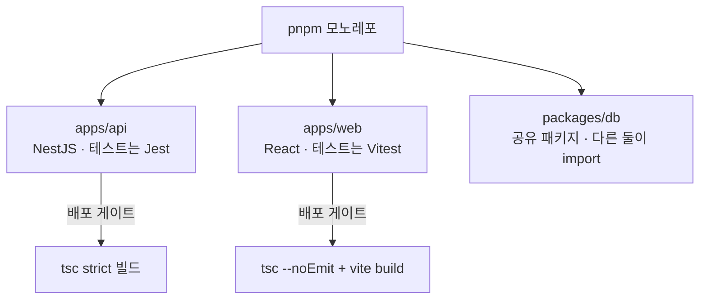
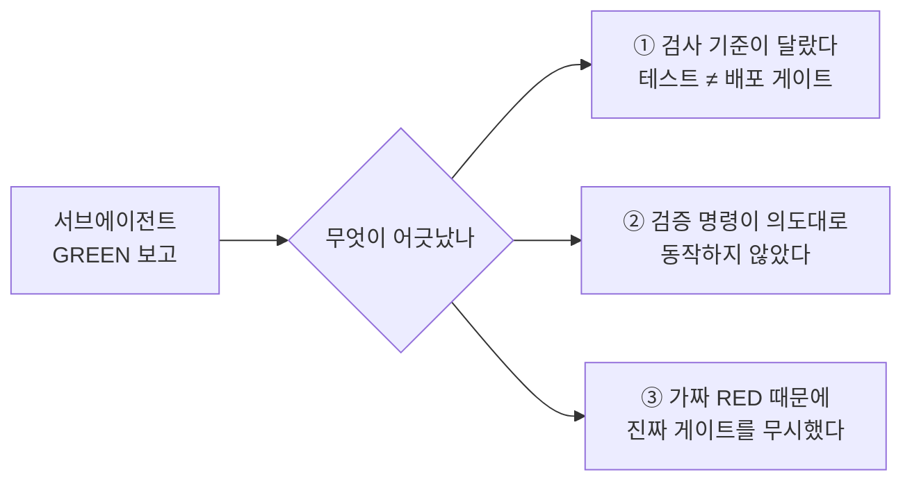

> **요약** — 서브에이전트가 "테스트 전부 통과"로 완료 보고했지만, 실제 배포 게이트인 strict tsc에서 타입 에러 4건이 나왔다. 테스트·타입 체크·앱 부팅·CI 게이트는 각각 다른 것을 검사하는데, 에이전트는 지시받은 검사만 통과시키기 때문이다. 결론: 위임 프롬프트에 배포 게이트 명령을 그대로 적고, 완료 판정은 메인이 그 명령의 exit code로 직접 한다.

규모 있는 구현은 서브에이전트에 위임하는 게 기본 워크플로가 됐다. 메인 에이전트는 컨텍스트를 아끼며 감독하고, 구현과 리뷰는 별도 에이전트가 맡는다.

어느 날 백엔드 검증 로직 구현을 위임받은 서브에이전트가 "Jest 20/20 PASS, DONE"으로 보고했다. 테스트 러너 출력까지 첨부된 정상 보고였다. 그런데 메인이 배포용 빌드를 돌리자 타입 에러 4건이 나왔다.

```
TS2538: Type 'undefined' cannot be used as an index type
```

에이전트가 거짓 보고를 한 게 아니다. 테스트는 실제로 20/20 통과였다. 문제는 **테스트 통과와 배포 가능이 다른 기준이라는 것**이다. 이 글은 그 뒤로 정리한 "GREEN 보고가 어긋나는 세 가지 경우"와 검증 책임을 어떻게 재배치했는지를 기록한다.

## 배경 — 우리 검증 구조가 어떻게 생겼나

사건이 난 곳은 사내 관리 시스템(FMS)이다. pnpm 모노레포 하나에 세 패키지가 산다.



포인트는 세 가지다.

- **검증 수단이 한 패키지에도 여러 겹이다.** 예를 들어 api는 ① Jest 유닛 테스트, ② strict tsc 빌드, ③ NestJS 앱 부팅, ④ CI 파이프라인 — 넷이 각각 다른 것을 검사한다.
- **CI에서 배포를 실제로 막는 것은 tsc뿐이다.** lint와 유닛 테스트는 `continue-on-error: true`라서 빨개도 배포가 나간다. 즉 "배포 게이트 = tsc"인데, 이 사실은 워크플로 파일을 뜯어봐야 보인다.
- **병렬 작업은 git worktree 단위다.** 기능마다 워크트리를 파고 서브에이전트가 그 안에서 구현·검증한다. 새 워크트리는 `pnpm install`만으로는 부족하고 공유 패키지(db)를 먼저 빌드해야 테스트가 돈다 — 이게 뒤에 나올 "가짜 RED"의 단골 원인이다.

문제의 핵심은 이 구조에서 나온다. **검사가 네 겹인데, 서브에이전트는 그중 지시받은 한 겹(Jest)만 돌리고 완료 보고를 했다.**

## 사건 재구성 — Jest는 타입을 검사하지 않는다

서브에이전트가 작성한 코드에 `record[path[1]]` 같은 배열 인덱스 접근이 있었다. strict 설정(`noUncheckedIndexedAccess`)에서 `path[1]`은 `string | undefined`라서, 인덱스로 쓰면 tsc가 에러를 낸다.

그런데 Jest는 통과했다. **테스트 러너는 ts-jest/swc로 트랜스파일만 하고 타입 체크를 건너뛰기 때문이다.** 런타임에서 `undefined` 인덱스 접근은 에러 없이 `undefined`를 돌려주니, 테스트 20개가 전부 GREEN인 것과 tsc 에러 4건은 모순이 아니다. 배포 게이트는 `tsc -p tsconfig.build.json`이었고, 서브에이전트의 검증 범위에 이 명령이 없었을 뿐이다.

비슷한 사건이 하나 더 있었다. 테스트가 전부 GREEN인 백엔드 모듈이 머지됐는데, 실제 앱을 부팅하니 DI 컨테이너가 의존성을 해석하지 못해 기동에 실패했다. 인터페이스 타입 파라미터에 주입 토큰이 빠져 있었다. 유닛 테스트는 컨테이너 없이 목을 주입해 돌리니 이것도 못 잡는다. 테스트 GREEN, 타입 GREEN이어도 부팅이라는 별도 검사가 남아 있었다.

## GREEN 보고가 어긋나는 세 가지 경우

사건들을 모아 보니 패턴이 셋으로 갈렸다. 셋 다 에이전트의 문제가 아니라 검증 체계의 문제다.



### ① 검사 기준이 달랐다

위의 두 사건이 여기 해당한다. 검증 레이어가 여러 겹이고, 각 레이어가 잡는 것과 놓치는 것이 다르다.

| 검사 | 잡는 것 | 놓치는 것 |
|---|---|---|
| 유닛 테스트 (Jest/Vitest) | 로직·회귀 | strict 타입, DI 배선, 빌드 |
| tsc (strict) | 타입 | 로직, 런타임 배선 |
| 앱 부팅 / e2e | DI·설정·통합 | 세부 로직 |
| CI 배포 게이트 | 위 중 **일부만** | — |

핵심은 마지막 줄이다. **CI에서 실제로 배포를 막는 검사(gating)는 이 중 일부뿐이다.** 그러니 "에이전트가 어떤 검사를 통과했는가"보다 먼저 확인할 것은 **이 레포의 게이트가 정확히 어떤 명령인가**다. 게이트가 tsc라면 완료 판정도 tsc로 해야 한다.

### ② 검증 명령이 의도대로 동작하지 않았다

검증 명령 자체가 잘못 도는 경우도 있다.

- 문서에 적힌 단일 파일 테스트 형식 `pnpm --filter <pkg> test:unit -- <파일>`이 실제로는 필터가 적용되지 않아 **전체 스위트를 돌리고 있었다.** pnpm이 `--` 뒤 인자를 러너에 전달하지 않는 케이스라 `--` 없이 써야 필터가 동작한다. 좁게 검증한다고 믿는 동안 매번 전체가 돌았다. 반대로 말하면, 명령이 의도와 다른 범위를 검증하고 있어도 출력만 봐서는 알기 어렵다.
- 긴 테스트 출력을 `| tail`로 받으면 tail이 EOF까지 버퍼링해서 진행 중인 프로세스가 멈춘 것처럼 보인다. 이걸 hang으로 판단해 죽이면 "검증 실패"라는 잘못된 결론이 남는다.

처음 쓰는 검증 명령은 **의도한 범위를 실제로 재는지부터 확인**해야 한다. 필터가 적용됐다면 실행 시간부터 다르다.

### ③ 가짜 RED 때문에 진짜 게이트를 무시했다

환경 요인으로 생기는 가짜 RED가 반복되면 빨간불을 노이즈로 취급하게 된다.

- 새 워크트리에서 공유 패키지(db)를 먼저 빌드하지 않으면 테스트 스위트가 통째로 "failed to run"으로 실패한다. assertion 실패가 아니라 모듈 해석 실패다.
- 전체 스위트를 병렬로 돌리면 CPU 부족으로 무거운 테스트가 false timeout에 걸린다. 격리해서 재실행하면 통과한다.
- 브라우저 검증에서 mock 세션은 in-memory라서 페이지 전체 리로드 한 번에 로그인이 풀린다. 기능이 깨진 게 아니라 검증 방법이 세션을 초기화한 것이다.

이런 일을 몇 번 겪으면 "이 RED는 원래 그렇다"는 목록이 생긴다. 여기서 사고가 났다.

> 솔직한 오답 노트: 한동안 빨갛던 tsc 에러 몇 건을 "무시해도 되는 baseline"으로 판정하고, **"1차 검증에서 tsc는 건너뛰라"고 메모까지 남겼다.** 틀렸다. 그 tsc는 배포 게이트였고, 무시하는 동안 배포가 막혀 있었다. 가짜 RED 목록은 필요하지만, 어떤 RED를 목록에 넣기 전에 **그 검사가 gating인지부터 확인**해야 한다. non-gating 노이즈와 게이트를 같은 목록에 넣으면 목록 전체를 믿을 수 없게 된다.

## 검증 책임의 재배치

이걸 그냥 두면 안 되는 이유가 하나 더 있다. 에이전트 워크플로는 위임 단계가 여러 겹이라 **오류가 복리로 쌓인다**(compounding errors). 단계당 신뢰도가 99%여도 10단계를 거치면 전체 신뢰도는 약 90%로 떨어진다. 단계 하나하나의 작은 검증 구멍을 방치할수록 전체 파이프라인은 빠르게 못 믿을 것이 된다.

지금은 역할을 이렇게 나눈다. 요지는 **서브에이전트의 요약은 의도의 서술이지 변경의 증거가 아니라는 것**이다.

- **서브에이전트**: 구현 + 자기 검증. 위임 프롬프트에 "테스트 통과"가 아니라 **게이트 명령을 그대로 명시**한다("구현 후 `build`까지 exit 0"). 이것만으로 첫 사건 같은 유형은 대부분 예방된다.
- **메인 에이전트**: 완료 보고를 받으면 **게이트 명령을 직접 재실행**한다. 태스크 사이 또는 최종에 한 번, 배포 게이트와 동일한 명령으로 exit code를 확인한다. 중요한 결정 전에는 diff 스팟 체크도 메인이 한다.
- **독립 리뷰**: 구현 관점과 리뷰 관점을 분리한다. 구현한 에이전트에게 검증을 다시 맡기면 같은 기준으로 다시 검사할 뿐이다. 다른 에이전트에게 fresh 컨텍스트로 리뷰를 맡긴다.

비용은 든다. 게이트 재실행은 몇 분, 독립 리뷰는 그 이상이다. 하지만 이번에 깨진 4건을 배포 시점에 발견했다면 롤백과 원인 추적으로 몇 배를 치렀을 것이다. 위임으로 아낀 시간의 일부를 검증에 재투자하는 것이 이 워크플로의 유지비다.

## 가져갈 것 (체크리스트)

에이전트에게 구현을 위임할 때:

1. **레포의 진짜 게이트를 먼저 확인한다** — CI에서 무엇이 gating이고 무엇이 `continue-on-error`인지. 완료 판정 기준은 "테스트 통과"가 아니라 게이트 명령이다.
2. **위임 프롬프트에 게이트 명령을 그대로 적는다** — "테스트 돌려봐"가 아니라 "`<게이트 명령>` exit 0까지". 에이전트는 명시된 기준까지만 검증한다.
3. **그래도 메인이 게이트를 직접 재실행한다** — 요약은 의도 서술이지 증거가 아니다. exit code를 직접 본다.
4. **검증 명령 자체를 의심한다** — 필터가 실제로 적용되는지, 출력이 버퍼링 때문에 멈춘 것처럼 보이는 건 아닌지. 처음 쓰는 명령은 범위부터 확인한다.
5. **가짜 RED 목록에는 gating 여부를 함께 적는다** — 게이트가 무시 목록에 섞이면 같은 사고가 반복된다.

이 사건의 교훈은 "에이전트를 믿지 마라"가 아니다. 에이전트는 지시받은 범위를 정확히 검증했다. 교훈은 **검증 체계를 설계하는 책임까지 위임할 수는 없다**는 것이다. 무엇으로 검사하고, 무엇이 게이트이며, 누가 최종 exit code를 확인하는지는 위임한 쪽의 일이다.
