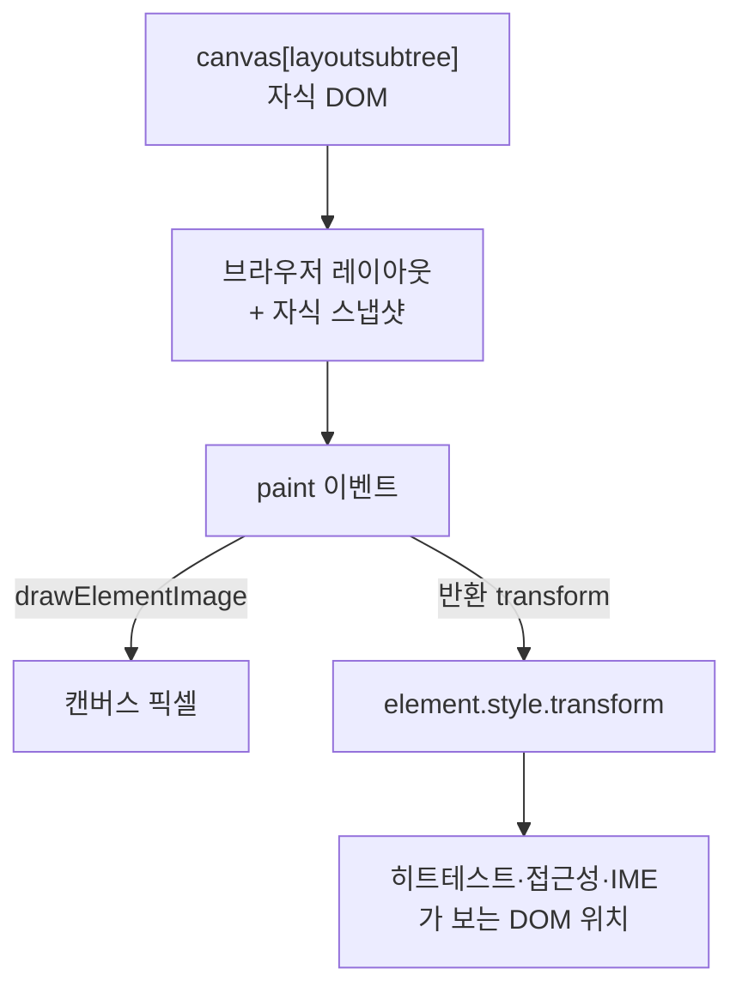

> **요약** — `<canvas>`에 `layoutsubtree` 를 붙이면 자식 DOM이 레이아웃에 참여하고, `ctx.drawElementImage(el, x, y)` 로 그 요소를 캔버스 픽셀로 그린다. 텍스트 줄바꿈·폰트·인풋 위젯을 브라우저 레이아웃 엔진이 계산해 주므로 `fillText()` 로 글자를 찍던 시절의 한계(줄바꿈·i18n·접근성)가 사라진다. 다만 우리가 플래그(`chrome://flags/#canvas-draw-element`)를 켜고 재본 빌드(Chromium 141)에서는 **그리기까지만** 됐다. **포인터 히트테스트가 캔버스 자식에 닿지 않고**(`elementFromPoint` 가 캔버스를 반환), **그린 뒤 `getImageData()` 는 SecurityError**, **`paint` 이벤트·`requestPaint()`·`captureElementImage()` 는 아예 없고**, **기본 그리기 크기가 CSS px → 그리드 px 1:1이라 고DPI 보정을 직접 해야** 했다. API 이름도 `drawElement` → `drawElementImage` 로 바뀌는 중이다. 지금 단계의 결론: **데모로는 충분히 쓸 만하고, 운영 코드에는 폴백을 전제로만.** [데모 페이지](../../labs/html-in-canvas/)를 같이 만들어 뒀다.

## 캔버스가 20년 못 하던 것

캔버스에 글자를 넣는 방법은 오래 `fillText()` 하나였다. 이게 주는 건 "한 줄짜리 글리프 렌더러"다. 줄바꿈은 직접 계산해야 하고, 한글·아랍어·이모지의 폭 계산과 양방향 텍스트는 우리 몫이고, 스크린리더는 캔버스 안을 못 본다(대체 텍스트를 따로 써 주는 수밖에 없고, 그게 실제 렌더링과 같다는 보장이 없다).

그래서 캔버스로 UI를 그리는 팀은 늘 같은 우회를 한다. **DOM을 캔버스 위에 겹치기.** 차트 라이브러리가 축 라벨과 툴팁을 `<div>` 로 얹는 게 정확히 이거다. 겹치기는 잘 동작하지만, 캔버스 안의 좌표계와 DOM 좌표계를 손으로 맞춰야 하고, 캔버스 쪽 효과(회전·셰이더·3D 텍스처)를 DOM에는 적용할 수 없다.

[HTML-in-Canvas 제안](https://github.com/WICG/html-in-canvas)은 이 문제를 뒤집는다. DOM을 캔버스 *위*에 얹는 게 아니라, **DOM을 캔버스 *안*에 그린다.**

## API는 프리미티브 세 개



**1. `layoutsubtree` 속성.** `<canvas>` 에 붙이면 직계 자식들이 레이아웃과 히트테스트에 참여한다. 자식은 스태킹 컨텍스트가 되고 페인트 컨테인먼트를 갖지만, **명시적으로 그려질 때까지 화면에 보이지 않는다.** 이게 중요한 함의를 갖는다 — 폴백은 "그리기가 실패했을 때"가 아니라 "지원 안 하는 브라우저에서 자식이 아예 안 보이는 상태"를 대비해야 한다. 즉 폴백 코드는 **DOM을 캔버스 밖으로 되돌리는 일**이다.

**2. `drawElementImage(element, dx, dy[, dw, dh])`.** 캔버스의 직계 자식을 캔버스 좌표계에 그린다. 캔버스의 현재 변환행렬(CTM)이 적용되고, **소스 요소에 걸린 CSS `transform` 은 그리기에서 무시된다**(히트테스트에는 계속 적용된다). 오버플로는 요소의 보더박스로 잘린다. 반환값은 "그려진 위치에 DOM 위치를 맞추는 CSS transform"이다. WebGL은 `texElementImage2D`, WebGPU는 `copyElementImageToTexture` 가 같은 일을 한다.

**3. `paint` 이벤트.** 자식의 렌더링이 바뀌면 캔버스에서 발생한다. `changedElements` 로 무엇이 바뀌었는지 알려주고, 매 프레임 갱신이 필요하면 `requestPaint()` 로 `requestAnimationFrame()` 처럼 한 번 더 부를 수 있다. 워커에서 그리려면 `captureElementImage()` 로 스냅샷(`ElementImage`)을 떠서 `OffscreenCanvas` 로 전송한다.

설명서에 나오는 최소 예제는 이렇게 짧다.

```html
<canvas id="canvas" style="width: 400px; height: 200px;" layoutsubtree>
  <form id="form_element">
    <label for="name">name:</label>
    <input id="name">
  </form>
</canvas>

<script>
  const ctx = document.getElementById('canvas').getContext('2d');
  canvas.onpaint = () => {
    ctx.reset();
    const transform = ctx.drawElementImage(form_element, 100, 0);
    form_element.style.transform = transform.toString();  // DOM 위치 동기화
  };
</script>
```

마지막 두 줄이 이 API의 설계 핵심이다. **그림은 캔버스가 그리지만 클릭·포커스·스크린리더·IME는 여전히 DOM 위치를 본다.** 그래서 그린 위치와 DOM 위치를 맞추는 변환을 되돌려주고, 개발자는 그걸 `style.transform` 에 그대로 꽂는다. 소스 요소의 CSS transform이 *그리기에서* 무시되는 이유도 여기 있다 — 그 자리는 동기화 전용으로 비워 둔 것이다.

## 우리가 재본 것 (Chromium 141 + 플래그)

문서만 읽으면 "이제 캔버스 안에서 폼도 되고 접근성도 된다"로 들린다. 그래서 켜 봤다. 환경은 컨테이너에 들어 있던 헤드리스 Chromium 141이고, `--enable-features=CanvasDrawElement` 로 켰다(브라우저에서는 `chrome://flags/#canvas-draw-element`). 오리진 트라이얼 구간(148\~150, 연장 154)보다 이전, 개발자 트라이얼(138+) 쪽 빌드다.

먼저 감지 결과. 이름이 이동 중이다.

| 심볼 | Chromium 141 | 설명서(현행) |
|---|---|---|
| `canvas.layoutSubtree` | available | 동일 |
| `ctx.drawElement` | available | 없음(옛 이름) |
| `ctx.drawElementImage` | — | 현행 이름 |
| `canvas.onpaint` / `paint` 이벤트 | — | 있음 |
| `canvas.requestPaint()` | — | 있음 |
| `canvas.captureElementImage()` | — | 있음 |
| `PaintEvent` / `ElementImage` | — | 있음 |

그리기는 된다. 회전 변환을 걸고 폼 하나를 그렸더니 라벨·인풋·값까지 브라우저가 레이아웃한 그대로 캔버스 픽셀이 됐다. 문단도 한글 어절 단위로 줄바꿈되고 `<strong>` 굵기가 유지된다. 이 부분은 광고 그대로다.

문제는 나머지다.

**① 히트테스트가 자식까지 닿지 않는다.** `layoutsubtree` 를 붙인 캔버스의 자식은 실제로 레이아웃된다(속성이 없으면 `getBoundingClientRect()` 가 전부 0이지만, 붙이면 정상적인 박스를 갖는다). 그런데 그 박스 위 좌표로 `document.elementFromPoint()` 를 물으면 자식이 아니라 **캔버스**가 나온다. `elementsFromPoint()` 도 `CANVAS > BODY > HTML` 뿐이다. 즉 이 빌드에서 캔버스 안의 인풋은 **클릭으로 포커스할 수 없다.** 다만 `input.focus()` 로 스크립트가 직접 포커스를 주면 `document.activeElement` 는 정상적으로 그 인풋이 되고, 그 뒤 타이핑은 동작한다. "상호작용 가능한 캔버스 UI"는 아직 절반만 와 있다.

**② 그리면 캔버스가 오염된다.** `drawElement()` 를 한 번 호출한 뒤 `getImageData()` 를 부르면 `SecurityError` 가 난다. 설명서가 말하는 *read-back-allowed rendering*(크로스오리진·시스템 색·방문 링크·IME 같은 민감 정보를 그리기에서 제외해 픽셀 읽기를 허용하는 모델)이 이 빌드에는 아직 없고, 대신 통째로 리드백을 막아 둔 것으로 보인다. 캔버스를 이미지로 내보내는 파이프라인(미디어 익스포트 — 이 API의 주요 유즈케이스 중 하나)은 이 빌드에선 성립하지 않는다.

**③ 기본 크기가 CSS px → 그리드 px 1:1이다.** 설명서는 `dw`/`dh` 를 생략하면 "요소가 캔버스 밖에서와 같은 화면 크기를 갖도록" 크기를 정한다고 적어 뒀다. 실제로는 그렇지 않았다. 같은 요소를 (a) 그리드 400×100 = CSS 400×100 캔버스와 (b) 그리드 800×200 / CSS 400×100 캔버스에 각각 그렸더니, (b)에서 화면상 **절반 크기**로 나왔다. 그리드 좌표 1칸 = CSS 1px로 그린다는 뜻이다. 고DPI 화면에서는 캔버스 그리드를 기기 픽셀에 맞추는 게 정석이므로(안 맞추면 흐려진다), **CSS→그리드 배율만큼 CTM을 `scale()` 해 주고 CSS 픽셀 좌표계에서 계산하는 편이 안전하다.** 더 안전한 건 **목적지 크기(`dw`/`dh`)를 아예 명시하는 것**이다 — 그러면 기본 크기 규칙이 빌드마다 어떻게 해석되든 결과가 같다. 141에서 `scale(2,2)` 를 걸고 `dw`/`dh` 를 명시한 경우와 생략한 경우를 나란히 그려 화면 크기가 같은 것도 확인했다. 우리 데모는 명시하는 쪽으로 짰다.

**④ 소스 요소의 CSS transform은 정말로 무시된다.** `transform: rotate(30deg) scale(2)` 가 걸린 div를 그렸더니 회전도 확대도 없이 원래 크기로 반듯하게 그려졌다. 사양대로다. 그리고 이 규칙 덕분에 ③을 우회한 동기화 계산이 단순해진다.

**⑤ `paint` 이벤트가 없으니 갱신은 직접 돌려야 한다.** 이 빌드에는 이벤트가 없어서 `requestAnimationFrame` 으로 그렸다. 즉 "DOM이 바뀌었을 때 다시 그리기"의 트리거를 개발자가 만들어야 한다 — 타이핑·포커스 링·캐럿 깜빡임까지 모두. 매 프레임 무조건 다시 그리면 편하지만, 그건 그대로 상시 rAF 루프 비용이다.

## 동기화 변환, 실제로 쓴 식

`drawElementImage()` 가 변환을 돌려주는 최신 빌드라면 그 값을 그대로 쓰면 된다. 반환값이 없는 구형 빌드에서는 직접 계산해야 하는데, 요소에 `transform-origin: 0 0` 을 주면 식이 짧아진다. 그리기 변환을 CSS 픽셀 좌표계(`M`)로 세우고, 그리기는 그리드 좌표계에서 하니 CTM 앞에 CSS→그리드 배율 `S` 만 곱한다. 그러면 DOM에 적용할 CSS transform은 `M` 그 자체다.

```js
const grid = canvas.width / canvas.clientWidth;   // CSS px → grid px

// 카드를 캔버스 중앙에 회전·배율로 놓는 변환 (CSS px 좌표계)
const cw = card.offsetWidth, ch = card.offsetHeight;
const M = new DOMMatrix()
  .translateSelf(canvas.clientWidth / 2, canvas.clientHeight / 2)
  .rotateSelf(angle)
  .scaleSelf(scale)
  .translateSelf(-cw / 2, -ch / 2);

ctx.reset();
ctx.setTransform(new DOMMatrix().scaleSelf(grid, grid).multiplySelf(M));

// 목적지 크기(cw, ch)를 명시해 기본 크기 규칙에 의존하지 않는다
const returned = hasNew
  ? ctx.drawElementImage(card, 0, 0, cw, ch)
  : ctx.drawElement(card, 0, 0, cw, ch);

// 히트테스트·접근성·IME 가 보는 DOM 위치를 그려진 위치에 맞춘다
card.style.transform = (returned || M).toString();
```

`transform-origin` 을 기본값(50% 50%)으로 두면 설명서에 있는 일반형(`T_origin⁻¹ · S⁻¹ · T_draw · S · T_origin`)을 그대로 계산해야 한다. 데모에서는 원점을 `0 0` 으로 고정해 그 항을 없앴다.

## 데모 페이지

[/labs/html-in-canvas/](../../labs/html-in-canvas/) 에 올려 뒀다. 세 갈래로 분기한다.

1. `drawElementImage` + `paint` 이벤트가 있으면 그걸 쓴다(오리진 트라이얼 빌드).
2. `drawElement` 만 있으면 `requestAnimationFrame` 으로 대신 그린다(플래그 빌드).
3. 둘 다 없으면 **카드를 캔버스 밖으로 옮겨** 평범한 DOM으로 보여준다.

페이지 상단에 감지 결과를 표로 그대로 노출했다. 지금 이 글을 읽는 브라우저에서 어느 심볼이 있는지 바로 보인다. 지원 브라우저에서는 회전·배율 슬라이더로 캔버스 좌표계 변환을 만지고, 헤드라인 입력으로 DOM을 바꾸면 캔버스 픽셀이 따라 갱신되는 걸 확인할 수 있다. 히트테스트가 안 닿는 빌드를 위해 "캔버스 속 인풋에 포커스" 버튼도 넣었다.

## 지금 쓸 만한가

**아직 운영에 넣을 API는 아니다.** 오리진 트라이얼이 진행 중이고 이름조차 바뀌고 있다(`drawElement` → `drawElementImage`). 크롬 단독 구현이라 다른 엔진에서는 폴백이 곧 유일한 경로다. 즉 이 API로 만든 화면은 **DOM 버전을 항상 함께 유지**해야 한다 — 데모에서 확인한 대로 그 폴백은 "캔버스 밖으로 DOM을 되돌리기"라 어렵진 않지만, 두 벌을 계속 맞춰야 하는 비용은 남는다.

그럼에도 눈여겨볼 이유는 두 가지다.

- **캔버스 텍스트의 대안이 처음으로 "브라우저 레이아웃 엔진"이 됐다.** `html2canvas` 처럼 레이아웃을 재구현하는 도구는 항상 실제 렌더링과 미묘하게 어긋나고, SVG `foreignObject` 우회는 폰트·외부 리소스 제약이 붙는다. 이건 실제 레이아웃 결과를 그대로 가져오는 첫 경로다. 차트의 축·범례처럼 "캔버스 안의 글자"가 많은 화면이 1차 후보다.
- **3D/셰이더 위의 실제 UI.** WebGL `texElementImage2D` / WebGPU `copyElementImageToTexture` 로 진짜 DOM을 텍스처로 쓸 수 있다. 3D 씬 안의 패널을 이미지로 굽지 않고 살아 있는 DOM으로 유지하는 그림이 가능해진다.

반대로 지금 구조상 조심할 점도 분명하다. 캔버스 안의 스크롤·애니메이션은 **자바스크립트가 그리는** 것이므로 컴포지터 스레드가 독립적으로 갱신해 주지 않는다(설명서도 "auto-updating canvas"를 향후 과제로 적어 둔다). 스크롤되는 콘텐츠를 캔버스 안에 넣는 선택은, 캔버스 전체를 스크롤시키는 선택과 성능 특성이 완전히 다르다. 그리고 크로스오리진 iframe·이미지·`url()` 참조는 그리기에서 제외된다 — 남의 도메인 콘텐츠를 캔버스로 합성하는 용도는 애초에 막혀 있다.

우리 판단은 이렇다. **차트/에디터의 텍스트 렌더링 개선과 3D 패널은 실험 가치가 있고, 미디어 익스포트는 리드백 상태가 정리된 뒤에 다시 본다.** 그리고 이 API를 언제 쓰든 설계의 절반은 폴백이다. 캔버스 자식이 "그려질 때까지 보이지 않는" 모델이므로, 폴백을 나중에 붙이면 지원 안 하는 브라우저에서 **화면이 조용히 비어 버린다.** 순서를 뒤집어서, DOM으로 동작하는 화면을 먼저 만들고 캔버스 경로를 얹는 편이 안전하다.

---

**참고**

- 제안 설명서: [WICG/html-in-canvas](https://github.com/WICG/html-in-canvas) · 사양 초안: [wicg.github.io/html-in-canvas](https://wicg.github.io/html-in-canvas/)
- 크롬 오리진 트라이얼 안내: [Introducing the HTML-in-Canvas API origin trial](https://developer.chrome.com/blog/html-in-canvas-origin-trial) · [ChromeStatus 항목](https://chromestatus.com/feature/5172548013916160)
- 이 글의 측정 환경: 헤드리스 Chromium 141(`--enable-features=CanvasDrawElement`). 오리진 트라이얼 빌드(148\~150)에서는 위 ①\~⑤ 중 일부가 이미 고쳐졌을 수 있다 — 데모 페이지가 두 이름을 모두 감지하는 이유다.
