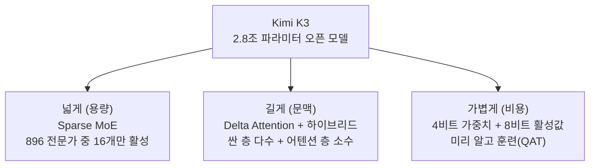

> **요약** — 매주 신상 LLM·기법을 하나씩 깊게 뜯어보다 보니, 개별 모델을 쫓는 것보다 **축으로 보는 게** 훨씬 쓸모 있었다. 그동안 본 sparse attention·SSM·MoE·양자화·diffusion은 제각각처럼 보여도, 사실 **"거대해진 모델을 실용적으로 굴리는" 세 개의 축**(문맥을 길게 · 용량을 크게 · 비용을 싸게) 위에 놓인다. 이 지도를 그려두면 다음 신상이 와도 "얘는 어느 축의 무슨 수를 뒀나"로 바로 읽힌다. 마지막에 나온 Kimi K3는 세 축을 한 모델에 다 합쳐놓은 좋은 예다. 단, 화제성 있는 벤치 수치는 대부분 발표사 self-report라 걸러 읽어야 한다.

새 모델·기법을 하나씩 깊게 파는 리서치를 이어오면서 든 생각이 있다. 매주 "이번 주 화제 모델"을 쫓으면 끝이 없는데, **한 발 물러나 "무슨 문제를 어느 각도로 푸나"로 묶으면** 그림이 단순해진다. 지금 프런티어 모델들이 공통으로 푸는 문제는 결국 하나다 —

> 모델은 계속 커지는데(파라미터·문맥), **그걸 감당할 비용은 안 커지게** 하고 싶다.

이 한 문장이 세 갈래로 갈린다. 문맥을 **길게**(어텐션 비용), 용량을 **크게**(파라미터), 저장·연산을 **싸게**(비트). 아래는 그동안 뜯어본 기법들을 이 세 축에 놓은 지도다.

## 왜 개별 모델이 아니라 "축"으로 보나

이유는 실용적이다. 신상 모델은 매주 나오고, 발표 자료는 죄다 "우리가 제일 빠르고 싸고 똑똑하다"고 한다. 개별 모델을 외우면 다음 주면 낡는다. 그런데 **"이 모델은 문맥 비용을 어떤 수로 줄였나"**로 물으면, 답이 몇 가지 계열로 수렴한다 — 그 계열만 이해해두면 신상이 와도 분류가 된다.

그리고 하나 더. 뜯어보면 볼수록 **화제성과 실체는 자주 어긋난다.** 벤치마크 점수·속도·비용 절감률은 대부분 **발표사 자체 측정(self-report)이고 제3자 재현이 아직 없는** 경우가 많았다. 그래서 나는 숫자보다 **구조**를 본다 — 구조는 재현 여부와 무관하게 "무엇을 어떻게 바꿨나"라는 사실이니까.

## 축 1 — 문맥을 길게: 어텐션 비용 줄이기

가장 붐비는 축이다. 트랜스포머의 어텐션은 두 가지 비용이 문맥 길이에 따라 폭증한다.

- **연산**: 토큰 쌍마다 점수를 매기니 O(N²) — 문맥이 2배면 연산은 4배.
- **메모리(KV 캐시)**: 과거 토큰의 키·값을 다 들고 있어야 해서, 문맥이 길수록 계속 커진다.

에이전트가 긴 문맥을 필수로 쓰는 시대라 이 비용이 병목이다. 해법은 크게 두 계열로 갈렸다.

### (a) 선택 — 다 보지 말고 골라 보기 (sparse attention)

원본은 다 보관하되, 지금 토큰이 **관련 있는 과거만 골라** 어텐션한다. 무관한 쌍의 계산을 건너뛰어 O(N²)를 깬다.

- **블록 단위로 골라 보기** — 과거를 위치순 블록으로 묶고, 싼 계산으로 "볼 만한 블록"을 top-k개 고른 뒤 그 블록만 진짜로 어텐션한다.
- **층끼리 선택을 공유** — 이웃한 층들이 고르는 대상이 거의 같다는 관찰에서, 몇 개 층을 묶어 첫 층만 고르고 나머지는 그 선택을 재사용해 "고르는 비용" 자체를 줄인다.

핵심은 **"무엇을 볼지 고르는" 것이라 어휘 표현력은 유지하면서 N²만 깬다**는 점. 다만 이건 연산은 줄여도 **메모리(KV)는 별로 못 줄인다** — 고르려면 결국 원본을 다 들고 있어야 하니까.

### (b) 요약 — 원본을 버리고 상태에 눌러담기 (SSM / linear attention)

발상을 아예 바꾼 계열이다. 과거를 낱개로 보관하지 않고, **고정 크기의 요약 상태 한 장에 계속 눌러담는다.**

- 어텐션을 버리고 **RNN처럼 상태를 갱신**하는 SSM(대표적으로 Mamba) 계열이 여기 속한다. 연산이 O(N)이고, 추론 메모리가 **문맥 길이와 무관하게 일정**하다 (KV 캐시가 없다).
- 대가는 **정확한 회상이 약하다**는 것. 원본을 버리고 요약만 남기니, 먼 과거의 세부를 정밀하게 되살리기 어렵다.

여기서 최근 눈에 띄는 정제가 **delta rule** 계열이다. 요약 상태에 새 정보를 그냥 더하면 옛 정보와 겹쳐 뭉개지는데, **"그 자리의 옛 값을 지우고 차이만 써넣어"** 상태 갱신("x=5였는데 이제 x=10")을 정확하게 만든다. 게다가 **채널(차원)마다 잊는 속도를 따로** 둬서(오래 둘 정보는 천천히, 금방 버릴 건 빨리) 고정 메모리를 더 알뜰하게 쓴다.

### 그래서 결론은 — 하이브리드

흥미롭게도 **순수한 승자는 없었다.** 순수 SSM은 회상이 약하고, 순수 어텐션은 비싸다. 그래서 현재 실전 모델들은 **대부분 층을 싼 계열(SSM/linear)로 깔고, 소수의 진짜 어텐션 층을 끼워** 넣는다. 싼 층이 대부분을 빠르게 처리하고, 가끔 낀 어텐션 층이 "먼 과거 정확 회상"을 원본으로 보강하는 식이다. 섞는 비율(어텐션을 몇 층마다 한 번 넣나)은 회사마다 다르다.

> 교훈: "어텐션을 죽이자"는 급진 노선도, "어텐션만 쓰자"는 고집도 아니었다. **약점이 상보적인 둘을 섞는 게** 답이었다.

## 축 2 — 용량을 크게: 쓰는 만큼만 계산하기 (MoE)

두 번째 축은 "모델을 키우고 싶은데 계산비는 그만큼 안 늘리고 싶다"이다. 답은 **Mixture-of-Experts(MoE)** — 트랜스포머의 한 부품(FFN)을 여러 벌 복제해 "전문가"로 두고, 토큰마다 **라우터가 그중 일부만 골라** 계산한다.

| | 지식 저장 용량 | 토큰당 계산량 |
|---|---|---|
| 빽빽한(dense) 모델 | 파라미터 전부 | **파라미터 전부** |
| **MoE** | 전문가 전부 (넓게 저장) | **고른 일부만** |

그래서 "총 파라미터는 조 단위인데 토큰당 실제 계산은 그 일부"라는 숫자가 나온다 — **아는 건 넓게 담되, 매 토큰엔 관련된 것만 꺼내 쓰는** 구조다. 요즘 초대형 오픈 모델이 죄다 이 방식인 이유다.

진짜 난제는 **로드밸런싱**이다. 라우터가 몇몇 전문가만 편애하면 그들만 학습돼 더 자주 뽑히는 악순환(부익부 빈익빈)이 일어나, 만들어둔 전문가 대부분이 놀고 용량이 낭비된다. 이걸 막는 장치가 계속 진화 중이다 — 보조 손실로 균등을 강제하거나(부작용 있음), 사용량을 보고 가감점을 동적으로 주거나, 최근엔 **배분 규칙을 "상대평가"로** 바꾸는 접근도 나왔다. "점수 X 이상이면 선택"(절대평가, 규모가 바뀌면 기준이 깨짐) 대신 **"점수 분포의 상위 몇 %"**(상대평가)로 뽑으면, 규모를 키워도 손으로 맞출 하이퍼파라미터 없이 밸런싱이 안 깨진다.

> 교훈: MoE는 "더 큰 두뇌"를 "싼 추론"과 맞바꾸는 수다. 그런데 진짜 어려운 건 아키텍처가 아니라 **크게 키워도 안 무너지게 하는 학습 안정성**이더라.

## 축 3 — 비용을 싸게: 비트를 줄이기 (양자화)

세 번째 축은 저장·연산의 최소 단위인 **비트**를 줄인다. 가중치 하나를 16비트로 저장하던 걸 4비트로 줄이면 저장이 1/4이 된다.

핵심 두 가지를 뜯으면서 배웠다.

- **microscaling(그룹 배율)** — 가중치를 낱개로 4비트로 뭉개면 오차가 크다. 그래서 **여러 개를 블록으로 묶고, 블록마다 공유하는 배율(스케일) 하나**를 별도로 둔다. 실제 값 = (저비트 숫자) × (블록 배율). 부호·크기를 분리해 담아 저비트로도 정밀도를 지킨다.
- **양자화 인식 학습(QAT)** — 다 만든 모델을 나중에 뭉개면 품질이 눈에 띄게 떨어진다(흔히 10~15%). 그래서 **처음부터 "저비트로 뭉개질 것을 알고" 훈련**한다. 그러면 모델이 저비트 포맷에 적응해 손실을 크게 줄인다.

극단으로는 가중치를 **1비트·3진(−1/0/+1)**까지 미는 연구도 있는데, 이건 품질 리스크가 커서 처음부터 그 포맷으로 훈련해야 한다. 실전에서 더 자주 쓰이는 타협점은 **4비트 가중치 + 8비트 활성값** 조합이다 — 덜 민감한 가중치는 과감하게 4비트로, 학습 안정성에 민감한 활성값은 8비트로 여유를 둔다. 새 하드웨어(Blackwell·MI400)가 4비트 포맷을 네이티브로 지원하는 것도 이 선택을 밀어준다.

> 교훈: "비트를 줄이면 멍청해지지 않나?"가 자연스러운 걱정인데, **미리 알고 훈련하면(QAT)** 손실이 생각보다 작다. 파라미터가 수십억 개라 개별 오차가 서로 상쇄되는 덕도 크다.

## 세 축이 한 모델에서 만난다 — Kimi K3

최근 나온 오픈 모델 하나(Moonshot의 Kimi K3, 2.8조 파라미터)를 뜯어봤더니, **위 세 축을 한 모델에 다 얹어놓은** 좋은 사례였다.

- **넓게(축 2)** — 전문가 수백 개 중 토큰당 극히 일부만 활성. 밸런싱은 앞서 말한 "상대평가" 계열로 안정화.
- **길게(축 1)** — delta rule 기반의 싼 어텐션 층을 다수 깔고, 진짜 어텐션 층을 일정 비율로 끼운 하이브리드. 요약 상태를 쓰는 층은 KV 캐시가 없어 메모리를 크게 아낀다.
- **가볍게(축 3)** — 4비트 가중치를 처음부터 QAT로 훈련. 그 결과 조 단위 모델의 저장 용량이 극적으로 준다.

세 축이 독립적으로 발전하다 이렇게 한 모델로 수렴하는 걸 보면, "지도"로 봐온 게 헛되지 않았다 싶었다. **개별 기법이 아니라 축을 이해해두면, 신상 모델은 "이 축들의 어떤 조합인가"로 빠르게 분해된다.**

(다만 이 모델의 성능·효율 수치도 대부분 발표사 self-report다. 구조는 논문·공개 자료로 확인되지만, 벤치 숫자는 커뮤니티 재현을 기다리는 게 맞다.)

## 축을 가로지르는 두 가지 관통 교훈

기법을 넘어, 여러 모델을 뜯어보며 반복해서 확인한 게 둘 있다.

**1. 순수보다 하이브리드가 이긴다.** 어텐션이든 SSM이든, "이거 하나로 다 한다"는 급진 노선은 대체로 실전에서 밀렸다. 약점이 상보적인 것들을 **섞는** 게 답이었다 (문맥 축의 SSM+어텐션이 대표적).

**2. 구조는 범용, 성능은 데이터·스케일이 정한다.** 아키텍처를 아무리 바꿔도, 모델이 "무엇을 아느냐"는 결국 학습 데이터와 규모가 정했다. 작은 모델은 구조가 좋아도 사실을 자주 지어냈고, 자기 최신 아키텍처조차 학습 컷오프 밖이라 틀리게 설명하는 일이 흔했다. **구조는 "어떻게 처리하나"를 정하지 "무엇을 아나"를 정하진 않는다.**

## 마치며 — 지도의 쓸모

이 글은 특정 모델 추천이 아니다. 매주 신상을 쫓다 지친 끝에 그린 **분류 지도**에 가깝다. 다음에 화제의 모델이 나오면, 벤치 순위표를 외우는 대신 이렇게 물으면 된다 —

- 문맥 비용은 어느 계열로 줄였나? (골라 보기 / 요약하기 / 하이브리드)
- 용량은 MoE인가, 빽빽한 모델인가? 밸런싱은 어떻게 하나?
- 비트는 몇 비트로, 미리 알고 훈련했나?

세 질문이면 대부분의 신상이 몇 분 만에 분해된다. 그리고 벤치 숫자는 — **누가 쟀는지 먼저 보고** 나서 믿으면 된다. 우리 일에 실제로 쓸 모델을 고를 때, 이 지도가 "화제"와 "실체"를 가르는 필터가 되어준다.
