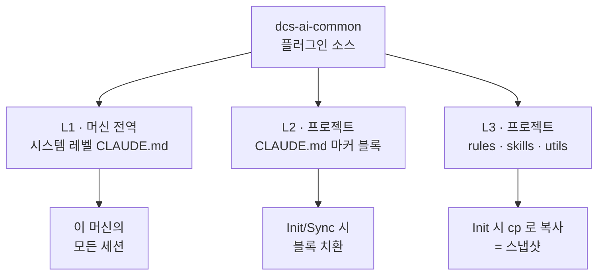

새 모델이 나오면 하는 일은 대개 정해져 있다. 릴리스 노트를 읽고, 벤치마크를 보고, 우리 기준 모델을 올릴지 말지 정한다. 이번에도 그럴 줄 알았다.

그런데 조사를 **공식 문서 → 커뮤니티 → 우리 코드** 순서로 내려가면서, 세 개의 가정이 차례로 깨졌다.

1. "우리 기준은 직전 세대다" → **아니었다.** 실제 코드는 두세 세대 뒤에 있었다.
2. "우리는 아직 새 모델을 안 쓴다" → **이미 쓰고 있었다.** 커밋 하나 없이.
3. "서비스 코드를 고치면 된다" → **플러그인이 먼저였다.** 서비스만 고치면 계속 덮어써진다.

이 글은 그 세 번의 반전과, 거기서 나온 반직관적인 결론 하나에 대한 기록이다 — **이번 마이그레이션에서 우리가 할 일의 절반은 프롬프트를 지우는 것이다.**

---

## 1. 시작은 평범한 조사였다

Anthropic은 이번 릴리스를 "점진 개선"이 아니라 **step-change**라고 표현했다. 가격은 그대로($5/$25)인데 성능은 크게 올랐고, 컨텍스트는 1M이 기본값이자 최댓값이다.

API 관점에서 깨지는 변경은 두 개였다.

| 변경 | 내용 | 왜 위험한가 |
|---|---|---|
| **thinking 기본 ON** | 이전엔 `thinking`을 생략하면 사고 없이 실행됐다. 이제는 adaptive로 돈다 | `max_tokens`는 *사고 + 응답*을 합친 하드 리밋이다. 응답 길이에 딱 맞춰둔 워크로드는 **에러 없이 조용히 잘린다** |
| **thinking 비활성화 제약** | `thinking: {"type":"disabled"}`는 effort `high` 이하에서만 허용 | `xhigh`/`max`와 조합하면 400. **요청 단위로 검증**되므로 모든 호출 지점을 봐야 한다 |

여기에 이전 세대부터 누적된 제거 항목(`budget_tokens`, `temperature`/`top_p`/`top_k`, assistant prefill)이 그대로 유효하다.

여기까지는 흔한 마이그레이션 체크리스트다. 눈에 걸린 건 그 다음 문단이었다.

### 공식 문서가 "지우라"고 말한다

바뀐 건 API만이 아니었다. **동작**이 바뀌었고, 문서는 그에 대한 대응으로 *추가*가 아니라 *삭제*를 요구했다.

- 이 모델은 **시키지 않아도 자기 작업을 검증한다.** 그래서 "검증 스텝을 넣어라" 같은 지시가 모델의 본래 행동과 **중첩되어 과잉 검증**을 만든다. 문서는 담백하게 적어놨다 — 제거하면 토큰이 줄고 품질 손실은 없다.
- **서브에이전트를 적극적으로 던진다.** 직전 세대는 위임을 *덜* 해서 "더 위임하라"는 프롬프트가 필요했다. 이제는 **정확히 반대**로, 상한을 걸어야 한다.
- 기본 응답과 파일 산출물이 **둘 다 길어졌다.** 그리고 `effort`는 *얼마나 생각하는지*만 조절한다 — *얼마나 말하는지*는 조절하지 않는다. effort를 낮춰 응답을 줄이려는 시도는 실패한다.

특히 첫 번째가 걸렸다. **"AI에게 self-check를 시켜라"는 일반적으로 좋은 조언인데, 여기서는 틀린다.** 우리 프롬프트 라이브러리에 그 규칙이 전역으로 깔려 있다면, 새 모델용 예외가 필요하다는 뜻이다.

---

## 2. 평가가 반으로 갈렸다 — 그리고 갈린 이유가 힌트였다

벤치마크는 압도적이었다. Frontier-Bench 43.3%(직전 세대 18.7%), ARC-AGI 3에서 30.2%(직전 세대 1.5%). Cursor는 자사 벤치에서 플래그십과 0.2점 차이를 절반 가격에 냈다고 발표했다.

그런데 현장 평가가 정확히 갈렸다.

Simon Willison은 리더보드 1위를 짚으며 *"relentlessly proactive"*라고 썼다. 이미지를 볼 방법을 주지 않았더니 **스스로 컴퓨터 비전 파이프라인을 짜서** 원시 픽셀에서 기하 정보를 뽑아냈다는 사례를 인용했다.

같은 날, Every의 Dan Shipper는 이렇게 썼다.

> **a hard model to love** — 지시와 다투고, 작업 완료 전에 멈추고, 기존 스킬·플러그인과 잘 안 맞았다. 첫 반응은 *"What have they done to my boy?"*

그런데 이 리뷰의 결론이 반전이다. 팀은 **기존 스킬을 전부 지우고 처음부터 시작했고**, 그러자 *"dramatically better, flashes of brilliance"*가 됐다.

### 여기서 진단이 나온다

Every의 불만 네 가지 — ①지시와 다툼 ②작업 완료 전 중단 ③기존 스킬과 충돌 ④"내 애가 왜 이래" — 를 공식 문서의 "동작 변화" 절과 나란히 놓아봤다. **전부 예고되어 있던 것이었다.** 과잉 검증, 범위 판단, 과잉 위임.

즉 **모델 결함이 아니라, 이전 모델용으로 누적한 스캐폴딩이 새 모델의 본래 행동과 중첩되어 생긴 부작용**이다. "스킬을 다 지웠더니 좋아졌다"는 증언이 이 진단을 정확히 뒷받침한다.

이게 이번 릴리스의 진짜 뉴스라고 봤다. **갈린 기준선은 모델 성능이 아니라 "누적된 프롬프트 자산의 양"이다.** 자산이 없는 신규 구축은 쉽고, 자산이 많은 팀일수록 마찰이 크다. 우리는 후자다.

### 수치가 있는 반론도 하나 봤다

CodeRabbit이 자사 코드 리뷰 파이프라인에서 A/B를 돌린 결과를 공개했다. 알려진 이슈 탐지율이 61.1% → 55.2%로 **떨어졌고**, nitpick은 23개 → 92개로 늘었다. "단독 리뷰어로 쓰지 말고 recall 지향 커버리지와 페어링하라"는 결론.

다만 이 수치는 그대로 받기 어렵다고 봤다. 공식 문서에 이런 경고가 있다 — 리뷰 프롬프트에 *"only report high-severity issues"* 같은 문구가 있으면 **새 모델은 그 지시를 문자 그대로 따른다.** 버그는 똑같이 찾아내되, 기준 미달로 판단한 걸 보고하지 않는다. 정밀도는 오르고 **측정된 recall은 떨어진다.**

CodeRabbit의 결과가 딱 그 모양이다(정밀도 +4.1%p, 탐지율 −5.9%p). 프롬프트를 조정한 뒤 측정한 것인지가 공개되지 않아, 우리가 같은 걸 돌릴 때는 **이 변수를 통제해야 할 지점**으로 남겨뒀다.

---

## 3. 우리 코드를 열어보니 — 세 가지 틀린 가정

여기서부터가 예상 밖이었다.

### 가정 ① "우리 기준은 직전 세대다"

아니었다. 실제로 코드에 박혀 있는 모델을 세어보니 서비스 본체는 두 세대 전, 일부 사이드 프로젝트는 한 세대 전이었다. 문서상 "직전 세대가 기준"이라고 알고 있었던 건, 그 세대가 그 이전과 **breaking change가 없어서 차이를 못 느꼈기** 때문이다.

이건 실무적으로 꽤 다르다. 한 단계 점프가 아니라 **breaking change를 누적 적용**해야 한다는 뜻이다.

### 가정 ② "우리는 아직 안 쓴다"

플러그인의 에이전트 정의를 열었다.

```yaml
# agents/build-error-resolver.md
model: opus
```

`opus`는 **버전 고정이 아니다. "최신 Opus"를 가리키는 별칭이다.**

새 모델이 출시된 그 순간, 이 에이전트는 커밋 하나 없이 갈아탔다. 우리가 "도입할지 검토"하는 동안 이미 프로덕션에서 돌고 있었다는 뜻이다. 같은 방식으로 지정된 게 하나 더 있었다.

| 에이전트 | frontmatter | 실제 | 하는 일 |
|---|---|---|---|
| build-error-resolver | `model: opus` | **최신 Opus** | 빌드 에러 수정 · **파일 쓰기** |
| dashboard-deployer | `model: opus` | **최신 Opus** | **EC2 Docker 배포** |
| figma-migrator | `model: sonnet` | 최신 Sonnet | 코드 마이그레이션 |
| rules-sync | `model: haiku` | Haiku 4.5 | 규칙 동기화 |

하필 **가장 부작용이 큰 두 개**다. 하나는 파일을 고치고, 하나는 배포한다. 여기에 새 모델의 **범위 확장**(요청하지 않은 단계 추가)과 **과잉 위임**이 결합하면, "빌드만 고쳐줘"가 리팩터링이 되고 배포 에이전트가 요청 밖 리소스를 건드릴 수 있다.

편의를 위해 쓴 별칭이 **무통보 자동 업그레이드 채널**이었다. 이건 이번 모델의 문제가 아니라 우리 구조의 문제다. 다음 모델에서도 똑같이 일어난다.

> **조치**: 즉시 명시 버전으로 핀 고정 → 검증 후 명시적으로 올린다. 별칭은 파일럿이 끝날 때까지 쓰지 않는다. 그리고 **모델 릴리스 모니터링을 릴리즈 체크리스트에 넣는다** — 지금 구조에서는 우리가 안 움직여도 시스템이 움직인다.

### 가정 ③ "서비스 코드를 고치면 된다"

플러그인 rules를 훑다가, 한 파일에서 멈췄다. `rules/common/performance.md` — 성능 최적화 가이드다. 그 안에 이런 게 들어 있었다.

| 현재 내용 | 문제 |
|---|---|
| 모델 라우팅 표 (세 세대 전 모델들) | stale |
| "Extended thinking … reserving up to **31,999 tokens**" | 고정 사고 예산 = 폐기된 개념 |
| `export MAX_THINKING_TOKENS=10000` | 제거된 파라미터 개념. 따르면 **사고를 인위적으로 잘라낸다** |
| "Use **multiple critique rounds**" | **과잉 검증** 유발 |
| "Use **split role sub-agents** for diverse perspectives" | **과잉 위임** 유발 — 정확히 반대로 해야 하는 지시 |
| "Avoid last **20% of context window**" | 200K 창 가정 (이제 1M) |

**공식 문서가 "지우라"고 명시한 항목이 한 파일에 모여 있었다.** 그리고 이 파일은 프로젝트마다 복사된다.

옆 파일(`agents.md`)에는 `ALWAYS use parallel Task execution`이 있었다. 이미 적극적으로 위임하는 모델에게 붙는 촉진 지시다. 필요한 건 촉진이 아니라 상한인데.

여기서 순서가 뒤집혔다. **서비스 코드만 고쳐봐야 플러그인이 계속 오염된 지시문을 덮어쓴다.** 플러그인이 먼저다.

---

## 4. 지울 것과 남길 것 — 유일하게 어려운 판단

"검증 지시문을 지워라"를 그대로 실행하려고 `dcs-ai-common`에 grep을 걸었더니 **"검증"이 20곳 넘게** 나왔다.

여기서 전부 지웠으면 사고가 났을 것이다. 나온 것들이 서로 다른 종류였기 때문이다.

- `교차검증 필수`, `부분합 검증`, `필터 최소화 검증` — 이건 **데이터 정합성 규칙**이다. 분석 결과가 맞는지 판정하는 기준.
- `event.origin` 검증, S3 key prefix 검증 — **보안 경계**.
- `pnpm build` / `tsc` 실행 — **결정론적 외부 검사**.
- `multiple critique rounds`, `Verify after each fix`, `ALWAYS verify typecheck passes` — 이건 **모델에게 스스로를 의심하라는 지시**.

앞의 셋과 마지막 하나는 완전히 다른 물건이다. 앞의 셋은 모델이 바뀌어도 유효한 **합격 기준**이고, 마지막 하나만 **스캐폴딩**이다.

João Queiros의 리뷰에서 이 원칙을 빌렸다.

> **Simplify the model instructions, not the acceptance criteria.**
> 테스트·필수 파일·소스 규칙·보안 경계·완료 정의는 유지하고, **중복된 코칭만 제거**하라.

우리 팀이 쓸 판별 기준은 한 줄로 정리했다.

> **사람이 실행 결과를 보고 합격/불합격을 판정할 수 있으면 → 합격 기준(유지).
> 모델의 태도나 습관을 요구하는 문장이면 → 스캐폴딩(삭제).**

`ALWAYS verify typecheck passes after migration` 같은 문장은 이 기준으로 반으로 갈린다. **typecheck 실행은 남기고, `ALWAYS verify` 문구만 지운다.**

이 구분은 파트 안에서 이미 한 번 비싸게 배운 것이기도 하다. 호이가 쓴 [서브에이전트의 GREEN을 믿지 마라](../dont-trust-subagent-green/)는 정확히 반대 방향에서 같은 지점에 도달한다 — 서브에이전트가 "테스트 20/20 통과"로 보고했는데 배포 빌드에서 타입 에러가 났고, 원인은 에이전트가 아니라 **검사 기준이 달랐던 것**이었다. 거기서 얻은 결론(모델의 자기 보고가 아니라 하네스의 결정론적 게이트를 믿어라)이 여기서 그대로 쓰인다. **모델이 스스로 검증하는 능력이 좋아질수록, 신뢰의 근거는 오히려 모델 밖 게이트로 옮겨가야 한다.** 지울 것은 모델에게 거는 주문이고, 남길 것은 사람이 확인할 수 있는 관문이다.

### 없어서 문제인 것도 있었다

지울 것만 찾다가, **있어야 하는데 없는 것**이 더 심각하다는 걸 뒤늦게 봤다.

간결성 지시문을 grep했더니 rules·정책 문서 전체에서 **0건**이었다. 이 플러그인의 주 용도가 `src/output/`에 pptx·xlsx·html 산출물을 만드는 것인데, **분량을 통제하는 문장이 하나도 없다.** 새 모델의 길어진 산출물이 그대로 나간다는 뜻이다.

범위 통제와 서브에이전트 상한은 없는 정도가 아니라 **역방향**이었다 — "사용자 승인 없이 즉시 실행"이 네 곳, `ALWAYS parallel`이 한 곳.

다만 이건 지울 게 아니라고 봤다. **"승인 없이 즉시 실행"은 의도된 제품 설계다** — 분석 질의마다 승인을 받으면 UX가 망가진다. 필요한 건 삭제가 아니라 **자율의 경계를 명시**하는 것이다.

> 계획 수립·데이터 조회·분석은 승인 없이 진행한다. 단, 요청하지 않은 추가 분석·파일 생성·범위 확대는 하지 않는다.

---

## 5. 복사본 함정 — 고쳤다고 반영된 게 아니다

플러그인을 고치기로 하고 배포 구조를 다시 봤다. 세 개의 층이 있었다.



L1·L2는 정본이 한 곳이라 고치면 전파된다. 문제는 **L3다. `cp`로 복사된 스냅샷**이라, 플러그인을 고쳐도 **이미 배포된 프로젝트는 옛 규칙을 그대로 쓴다.**

트리를 스캔해보니 임시 프로젝트 두 곳에 rules 3종이 전부, 본체 레포와 worktree 15개에도 배포되어 있었다.

그래서 **"Sync 전파"를 독립된 단계로 분리**했다. 이걸 계획에 안 넣으면 "고쳤는데 왜 그대로지"를 나중에 디버깅하게 된다. 실제로 이 함정은 이번에 처음 인지한 게 아니라, 예전에 rules를 고치고 반영이 안 돼 한참 헤맸던 적이 있다. 그때는 원인을 못 찾고 넘어갔었다.

---

## 6. 그래서 순서를 바꿨다

처음 세운 계획은 평범했다 — 평가셋 고정 → API 호환성 수정 → 프롬프트 정리 → effort 측정. 진단이 끝나고 두 군데를 옮겼다.

| # | 단계 | 왜 여기인가 |
|---|---|---|
| 0 | **에이전트 모델 핀 고정** | 계획이 아니라 사고 방지. 지금 이 순간에도 미검증 모델이 배포 작업을 한다 |
| 1 | 평가셋 고정 · 베이스라인 | 품질·토큰·지연 + **산출물 분량**까지 4축 |
| 2 | **플러그인 정화 (삭제 중심)** | 여기가 성패 |
| 3 | **Sync 전파** | L3는 복사본. 빠뜨리면 절반만 고친 상태 |
| 4 | 서비스 코드 API 호환성 | |
| 5 | effort 스윕 · 라우팅 | |
| 6 | 신기능 (캐시·fallback·tool changes) | 선택 |

순서를 바꾸면 안 되는 지점이 두 개 있다.

- **0은 병렬이 아니라 선행이다.** 미검증 모델이 배포 권한을 가진 상태를 먼저 끊는다.
- **2(삭제) → 5(측정).** 스캐폴딩을 걷어내지 않은 상태에서 effort를 재면, Every와 같은 결론(*"이 모델 별로다"*)에 도달한다. 우리가 측정하려는 게 모델인지 우리 스캐폴딩인지 구분이 안 된다.

전면 기본 모델 승격은 하지 않기로 했다. Dan Shipper의 현재 라우팅을 참고해서, **경계가 명확한 파일럿 레인**부터 간다. 첫 대상은 사내 코드 리뷰 도구다 — 실패 비용이 낮고, 코드 리뷰가 이 모델의 강점 영역이고, CodeRabbit 사례 덕에 **무엇을 측정해야 하는지가 이미 명확**하다.

---

## 남은 질문

정직하게 적어두면, 이 글 시점에 끝난 건 **진단과 순서 재조정까지**다.

- **effort 스윕을 아직 안 돌렸다.** `low`/`medium`이 이례적으로 강하다는 게 공식·커뮤니티 공통 관찰인데, 우리 워크로드에서 어디까지 내려도 품질이 유지되는지는 측정 전이다. 플러그인·서비스 어디에도 effort 개념 자체가 없어서, 파라미터를 노출하는 작업부터 해야 한다.
- **CodeRabbit의 recall 하락이 프롬프트 탓인지 모델 탓인지 모른다.** 우리 리뷰 프롬프트에서 심각도 필터를 제거하고 후단에서 거르는 구조로 바꿔 재현해볼 생각이다.
- **별칭 정책을 어디까지 금지할지 안 정했다.** 전면 금지하면 보안 패치성 업데이트도 수동이 된다. "부작용 있는 작업(파일 쓰기·배포)을 하는 에이전트만 핀 고정"이 지금의 잠정안이다.

---

가장 오래 남을 교훈은 마이그레이션 순서가 아니라 이거였다.

**우리가 쌓아온 프롬프트 자산은 자산인 동시에 부채다.** 모델의 소극성을 이기려고 넣은 강조, 실수를 막으려고 넣은 검증 스텝, 위임을 유도하려고 넣은 촉진 지시 — 전부 그때는 옳았다. 그리고 모델이 그 문제를 스스로 해결한 순간, 같은 문장이 부작용으로 바뀐다.

그래서 새 모델을 볼 때 던질 질문이 하나 늘었다. "무엇이 좋아졌나"만이 아니라, **"우리가 넣어둔 것 중 이제 필요 없어진 게 뭔가."**
