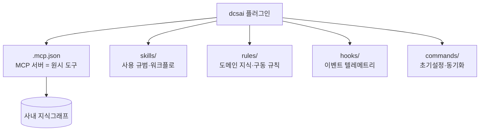

우리 부문이 만든 **dcsai 플러그인**은 사내 지식그래프(KG)에서 매출·재고·SCM 데이터를 정식 API로 꺼내 쓰게 해준다. 그런데 이 플러그인은 **Claude Code 전용**이다. 나는 터미널의 Claude Code 말고도 자율 에이전트 **Hermes**와, 또 하나의 코딩 CLI **Codex**를 쓴다. 같은 KG를 세 곳에서 똑같이 쓰고 싶었다.

처음엔 간단할 줄 알았다. "MCP는 표준 프로토콜이니 서버 주소만 등록하면 되겠지." 이 가정은 두 군데서 틀렸다. 이 글은 **무엇이 틀렸고, 세 러너가 왜 다르게 동작하며, 결국 어떻게 붙였는지**의 기록이다.

## 먼저: 플러그인은 MCP 하나가 아니다

"MCP만으로는 이 기능이 다 동작하지 않는다"가 출발점이었다. 플러그인을 열어보면 이유가 보인다. Claude Code 플러그인은 **여러 겹의 번들**이다.



KG를 **제대로** 쓰는 데 실제로 필요한 건 세 겹이었다.

- **MCP 서버** — `get_intents` → `get_skills` → `get_tool_schema` → `execute_kg_api_to_context` 같은 원시 도구. 이게 엔진이다.
- **rules/** — KG를 *어떻게 구동하는가*. 의도를 점진 탐색하는 전략, 1500토큰 기준 데이터 처리, 그리고 F&F 도메인 지식(브랜드 코드, 분석 프로세스, 교차검증).
- **skills/** — "raw SQL을 직접 실행하지 말고 정식 KG API로만" 같은 사용 규범.

> 솔직한 오답 노트: 나는 처음에 "MCP + 스킬 2겹이면 된다"고 진단했다. 틀렸다. 실제 두뇌는 `rules/`의 **도메인 규칙**이었다 — 이게 없으면 데이터는 돌아와도 그게 무슨 브랜드·무슨 지표인지 러너가 모른다. 도구보다 규칙이 먼저다.

hooks(텔레메트리)와 commands(프로젝트 스캐폴드)는 KG 사용 자체와는 무관해서 이식 대상에서 뺐다.

## 세 러너의 결정적 차이 — "지식을 어떻게 먹는가"

같은 플러그인 자산을 옮기는데 러너마다 방법이 달랐던 건, 셋이 **지식을 주입받는 구조**가 근본적으로 다르기 때문이다. 이게 이 글의 핵심이다.

| 축 | Claude Code | Codex | Hermes |
|---|---|---|---|
| 성격 | 대화형 CLI (플러그인 원산지) | 대화형 CLI (별개 구현, Node) | 상시·자율 에이전트 |
| 플러그인/스킬 | 네이티브 (마켓플레이스·로더) | **없음** | 스킬 엔진 있음 (CC와 동형) |
| 지식 로딩 | 온디맨드 스킬 + rules | **AGENTS.md 상시 로드** | 온디맨드 스킬(+references) |
| 규칙 이식 형태 | 그대로 | 파일 조각 + AGENTS.md 포인터 | 스킬 파일 그대로(심링크 가능) |
| MCP 등록 | 플러그인 `.mcp.json` | `config.toml` | `config.yaml` |
| OAuth 현실 | 자동 (플러그인) | DCR 거부 → **Bearer 래퍼** | SDK hang → **수동 PKCE** |

한 줄로 요약하면:

- **Claude Code** = 원산지. 플러그인이 통째로 작동한다.
- **Hermes** = Claude Code와 **같은 스킬 엔진**을 쓴다. 그래서 스킬 파일을 그대로 옮기면(심지어 심링크로) 트리거될 때만 온디맨드로 로드된다. 손실이 없다.
- **Codex** = 스킬 시스템이 **아예 없다**. 유일한 주입점은 `AGENTS.md` 한 파일인데, 이건 매 세션 **항상 로드**된다. 그래서 무거운 규칙은 별도 파일로 두고 AGENTS.md가 "필요하면 이 파일을 읽어라"로 가리키게 했다 — 플러그인이 원래 `project-policy → rules`로 하는 구조를 그대로 모사한 셈이다.

즉 **"온디맨드 스킬 로딩이 있느냐"** 하나가 이식 난이도를 갈랐다.

## Hermes 이식 — OAuth가 로그인 단계에서 hang

Hermes 쪽은 스킬 엔진 덕에 규칙 이식은 쉬웠다. MCP 등록도 한 블록이면 끝이다.

```yaml
# ~/.hermes/config.yaml
mcp_servers:
  dcsai:
    url: https://dcsai.fnf.co.kr/server/mcp
    auth: oauth
    enabled: true
```

문제는 인증이었다. `hermes mcp login dcsai`를 돌리면 **인가 URL을 띄우기도 전에 교착**하고 빈 에러(`Authentication failed:` + `Event loop is closed`)로 죽었다. 서버 엔드포인트(register/authorize/token)는 curl로 전부 정상. 범인은 번들된 **Python MCP SDK의 async OAuth 흐름**이 Hermes 이벤트루프 위에서 깨지는 거였다.

우회로는 표준 Authorization Code + PKCE 그랜트를 **직접** 수행해, 발급받은 토큰을 Hermes 저장소(`~/.hermes/mcp-tokens/dcsai.json`)에 정식 포맷으로 써 넣는 것. 서버가 정상이니 클라이언트 흐름만 손으로 대체하면 됐다.

> 실전 함정 하나 더 — 토큰 기록은 민감 작업이라, 우회 스크립트를 **에이전트가 직접 실행하면 자동 차단**된다. 스크립트 작성은 AI가 하되, 브라우저 승인과 실행은 사람이 직접 해야 하는 핸드오프 지점이 있었다.

규칙 이식은 심링크로 걸되, 플러그인 캐시 경로에 **버전이 박혀 있다는**(`.../1.2.18/`) 함정이 있었다. 다음 업데이트에 옛 디렉토리가 GC로 스윕되면 심링크가 끊긴다 — 규칙이 조용히 사라진다. 그래서 현재 버전 경로를 `installed_plugins.json`에서 해소해 재링크한다. 이때 **주기가 관건**이다: 처음엔 월간 cron에 얹었는데, 플러그인이 며칠에 한 번꼴로 갱신되니 재링크 전에 핀 버전이 스윕돼 끊겼다. 원칙은 **재링크 주기 ≥ 업데이트 빈도** — 그래서 지금은 **Hermes 게이트웨이 기동 시 + 매일 cron** 두 곳에서 재링크한다(2줄짜리 idempotent라 사실상 공짜). 끊김이 특히 무서우면 심링크 대신 **복사**가 안전하다 — GC와 무관해 절대 안 끊기고, 대신 재복사로 최신화만 챙기면 된다.

## Codex 이식 — "등록은 됐는데 도구가 안 뜬다"

Codex는 완전히 다른 코드베이스(Node)라 Hermes의 그 버그와는 무관했다. 자체 `codex mcp login`도 있다. 그런데 등록을 마쳐도 **dcsai 도구가 목록에 안 나타났다.**

원인은 OAuth **동적 클라이언트 등록(DCR)** 비호환이었다. Codex/mcp-remote가 등록 요청에 붙이는 필드(`software_id`, `software_version` 등)를 dcsai 서버가 거부해서, discovery 전에 실패한 것. 단순 `url` 방식도, 기본 `mcp-remote` 방식도 같은 이유로 조용히 실패했다.

최종 working setup은 DCR을 아예 건너뛰고, **Hermes가 이미 들고 있는 토큰을 Bearer 헤더로 주입하는 래퍼**였다.

```bash
# ~/.codex/bin/dcsai-mcp-remote.sh (요지)
TOKEN="$(jq -r '.access_token' "$HOME/.hermes/mcp-tokens/dcsai.json")"
exec npx -y mcp-remote https://dcsai.fnf.co.kr/server/mcp \
  --header "Authorization:Bearer ${TOKEN}" --silent
```

```toml
# ~/.codex/config.toml — 기존 dcsai 블록이 있으면 '교체'(중복 선언 금지)
[mcp_servers.dcsai]
command = "/Users/<you>/.codex/bin/dcsai-mcp-remote.sh"
args = []
```

이 방식은 **Hermes가 먼저 인증돼 토큰 파일이 있는 머신** 전용이라는 전제가 붙는다. 그 대신 두 러너가 토큰 하나를 공유하니 갱신도 한 곳에서 하면 양쪽에 반영된다.

## 남은 것들 — 정직하게

- **토큰이 ~60분마다 만료된다.** 게다가 SDK 자동 refresh도 위와 같은 버그로 hang한다. 그래서 브라우저 없이 `refresh_token` 그랜트로 갱신하는 스크립트를 주기 cron 후보로 남겼다. 근본 해결은 SDK 패치이고, 그건 별도 트랙이다.
- **이식 범위는 KG 조회·분석(텍스트 결론)까지다.** PPTX·차트·대시보드 같은 **산출물 생성**은 별도 레벨 — Python 유틸·배포 스킬·전용 환경이 더 필요해서, 사실상 플러그인의 프로젝트 스캐폴드를 재현해야 한다. 시각화 규칙은 "차트 유형 판단 참고용"으로만 넣었다.
- **이건 우회로 모음이다.** 두 OAuth 이슈는 클라이언트/호환성 문제이지 서버 결함이 아니다. 가장 깔끔한 답은 플러그인이 Codex·Hermes를 **공식 지원**하는 것 — 이 글이 그 제안의 근거가 되면 좋겠다.

## 가져갈 것 (체크리스트)

플러그인/MCP를 다른 러너로 옮길 때:

1. **플러그인을 겹으로 분해하라** — MCP(도구) / rules(규칙·도메인) / skills(규범)가 각각 필요한지 따진다. 도구만 옮기면 반쪽이다.
2. **러너의 지식 주입 모델을 먼저 확인하라** — 온디맨드 스킬이 있으면 파일째, 없으면(AGENTS.md류) 상시 파일 + 포인터.
3. **MCP는 표준이지만 OAuth는 아니다** — 등록됐는데 도구가 안 뜨면 DCR 호환성을 의심하고, 가능하면 이미 확보한 토큰을 Bearer로 주입하는 우회를 고려한다.
4. **버전 박힌 캐시 경로를 그냥 심링크하지 마라** — 업데이트 GC에 끊긴다. 현재 경로를 해소해 재링크하되 **주기를 업데이트 빈도 이상**(기동 시+매일)으로 두거나, 아예 **복사**로 끊김 자체를 없앤다.

세 러너를 한 KG에 붙이고 나니, 배운 건 도구 셋업이 아니라 **"플러그인이란 결국 지식을 러너에 먹이는 포맷"**이라는 관점이었다. 포맷이 다르면 같은 지식도 다르게 담아야 한다.
