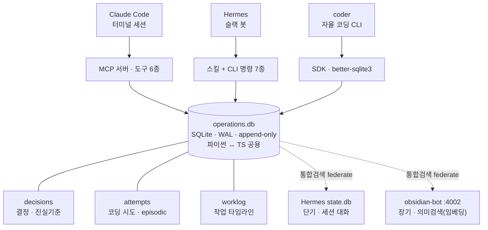

멀티에이전트 글은 대개 "이렇게 나누면 좋다"에서 끝난다. 그런데 실제로 하나의 AI를 여럿으로 쪼개 보면, 얻는 것보다 먼저 오는 게 **서로가 뭘 했는지 잊는 문제**다. Redis 블로그의 "Sub-agents: splitting context across specialized AI agents"(Jim Allen Wallace, 2026-06-22)를 읽다가 이 대목에서 멈췄다 — "isolated context는 각 에이전트를 집중시키지만, 팀을 일관되게 만들어주진 않는다."

내 컴퓨터에는 이미 여러 AI가 각자 돌고 있었다. 터미널의 Claude Code, 슬랙 봇, 자율 코딩 CLI. 이들은 서로를 몰랐다. 그래서 이 글을 교과서 삼아, **공유 메모리 계층을 내 손으로 붙여봤다.**

### 큰 그림 — 이건 사다리의 첫 칸이다

솔직히 말하면, "에이전트끼리 기억을 공유한다"는 건 내가 풀고 싶은 문제의 *첫 칸*일 뿐이다. 진짜 그림은 더 크다. 기억이 갇히는 **경계**가 단계적으로 넓어지는 사다리를 상상했다.

| 단계 | 어떤 경계를 없애나 | 상태 |
|---|---|---|
| ① 세션 간 | 어제 세션 ↔ 오늘 세션 | ✅ append-only 저장소로 확보 |
| ② 에이전트 간 | Claude Code ↔ 슬랙 봇 ↔ coder | ✅ **이 글의 범위** |
| ③ 기기 간 | 회사 데스크탑 ↔ 개인 노트북 ↔ … | ◻︎ 다음 목표 |
| ④ 팀 간 | 나 ↔ 파트원 각자의 작업 | ◻︎ 궁극적 비전 |

- **당장의 통증은 ③, 기기 간 단절이었다.** 나는 여러 기기에서 일하는데, 한 기기에서 AI에게 내린 결정과 쌓인 작업 맥락이 그 기기 안에만 갇혀 다른 기기에선 안 보였다. "어제 노트북에서 뭘 정했더라"를 매번 사람 머리로 이어 붙이고 있었다. 이 단절을 없애는 게 애초의 출발점이다.
- **최종적으로 가고 싶은 곳은 ④, 팀 공유 메모리다.** 파트원 각자가 어떤 결정을 내렸고 무슨 작업이 어디까지 왔는지를, 서로 묻지 않아도 **하나의 기억에서** 파악하는 것. 지금 우리는 진행 현황을 슬랙·노션·구두로 재확인하는데, 그 맥락이 이미 각자의 작업 흐름 안에 쌓이고 있다면 그걸 **원천에서 합치는** 게 맞다.

여기서 중요한 설계 판단 하나 — 이 네 칸은 *다른 문제*가 아니라 **같은 문제의 반경 확대**다. "기억을 어디에 가두지 않고 하나의 진실로 모으나"라는 질문은 세션이든 기기든 사람이든 동일하다. 그래서 나는 처음부터 **경계에 독립적인 토대**(append-only 단일 원천 + 언어·진입구 중립)를 골랐다. ①②를 그 토대 위에 세워두면, ③기기·④팀으로 올라가는 건 *새 시스템을 만드는 일*이 아니라 *같은 저장소의 반경을 넓히는 일*이 된다. 이 글은 그 사다리의 ①②를 어떻게 세웠는지에 대한 기록이고, ③④는 마지막 장에서 다시 짚는다.

이 글은 세 부분이다 — (1) 원문이 가르쳐준 것, (2) 내가 어떻게 적용했나(핵심), (3) 거기서 자연스럽게 딸려 나온 관계 계층과 다음 과제.

---

## 1. 먼저, Redis 글이 가르쳐준 것 — 왜 공유 메모리인가

이 절은 원문을 "친절한 선생님" 모드로 다시 정리한 것이다. 뒤에서 내가 적용한 이야기를 하려면 이 개념들이 먼저 깔려 있어야 한다.

### 서브에이전트란, 그리고 왜 하나를 여럿으로 쪼개나

**서브에이전트**는 큰 시스템 안에서 *좁게 정의된 역할 하나*를 맡는 특화 컴포넌트다. 각자 LLM을 추론 엔진으로 써서, 정해진 경계 안에서 입력을 인식하고·판단하고·행동한다. 만능 에이전트 하나가 모든 걸 저글링하는 대신, 집중된 에이전트들의 팀을 갖는 셈이다.

가장 흔한 배선은 **sub-agent-as-tools** 패턴 — 메인 오케스트레이터가 도구 호출로 서브에이전트에게 일을 위임하고, 자신은 상위 추론에 집중한다. 조율 방식은 보통 넷으로 나뉜다.

| 패턴 | 누가 통제하나 | 언제 맞나 |
|---|---|---|
| **Orchestrator–worker** | 중앙 오케스트레이터가 쪼개 배분·취합 | 하위 작업이 명확히 분해될 때 |
| **Supervisor** | 슈퍼바이저가 도메인 주인에게 위임 | 캘린더·메일·CRM처럼 도메인이 뚜렷할 때 |
| **Swarm** | 중앙 없음, 에이전트끼리 직접 넘김 | 한 번에 하나만 활성, 서로를 알아야 함 |
| **Router** | 라우팅 단계가 분류해 알맞은 곳으로 | 입력 종류가 갈릴 때 |

원문의 조언은 담백하다 — **먼저 단일 에이전트, 다음 프롬프트 엔지니어링, 다음 도구. 멀티에이전트는 한계에 부딪힌 다음에나 졸업하듯 가라.**

### 쪼개는 이유: 컨텍스트 창은 다 담지 못한다

하나의 창에 전부 욱여넣으면 두 가지가 무너진다.

- **비용** — 셀프 어텐션은 토큰 쌍마다 점수를 계산해 O(n²)로 늘어난다. 창이 길수록 느리고 비싸지고, 루프를 돌수록 청구서가 쌓인다.
- **품질** — 더 은근한 문제다. 모델은 *lost in the middle*을 겪는다: 관련 정보가 맨 앞·맨 뒤에 있을 때 성능이 정점이고, 중간에 묻히면 떨어진다. 원문 인용 — 한 벤치마크에서 Claude 3.5 Sonnet 정확도가 컨텍스트 32K→256K로 커지자 **29%에서 3%로 떨어졌다.** 창이 크다고 추론이 좋아지지 않는다. 오히려 반대일 수 있다.

> 그래서 각 서브에이전트에게 **깨끗하고 경계 지어진 창**을 준다. 특화 에이전트가 지저분한 걸 뒤져 *압축된 요약만* 오케스트레이터에게 돌려주고, 상세 맥락은 자기 안에 격리한다. "더 똑똑한 에이전트를 더한 게 아니라, 집중된 작업에 *깨끗한 작업실*을 준 것"이라는 비유가 좋았다.

### 그런데 쪼개면 새 문제가 온다 — 서로를 잊는다

여기가 핵심이다. 맥락을 조각내면 에이전트들이 서로 뭘 하는지 놓친다. 원문이 든 숫자 — 순차 추론 과제에서 멀티에이전트가 단일 대비 **39~70% 성능이 떨어진** 벤치마크가 있었고, 주범은 *에이전트 간 어긋남(misalignment)*이었다. 1,600+ 실행 트레이스 분석은 실패 대부분이 모델이 아니라 **명세·조율 문제**에서 왔다고 짚는다. 똑똑한 모델은, 스스로를 잊도록 배선된 시스템을 고쳐주지 않는다.

증상은 익숙하다 — 이미 한 걸 또 하고, 히스토리가 잘려 나가고, 목표에서 이탈하고, 남이 필요한 정보를 쥐고 안 준다. **에이전트는 자기 자식과 상태를 공유한다고 *착각*하지만 실제로는 아니다.**

### 격리만으로 부족한 이유: 공유된 '진실'이 없다

isolated context는 창을 깨끗하게 유지하지만 **공통 기준(common ground truth)**을 주지 못한다. 기획 에이전트가 "이 모듈 폐기"를 정해도, 그 결정을 못 본 코딩 에이전트가 그걸 처음부터 다시 만든다. 공통 기준이 없으면 공유 맥락 자체가 네 가지로 썩는다.

- **Context poisoning** — 환각/오류가 컨텍스트에 들어가 반복 참조되며 "사실"로 굳는다.
- **Context confusion** — 불필요한 정보가 답 품질을 끌어내린다(그래서 OpenAI 가이드는 도구 20개 미만 권장).
- **Context clash** — 새 정보가 기존 프롬프트와 충돌한다(문서·에이전트 간 용어 정의가 어긋날 때).
- **Context rot** — 창이 안 찼는데도 입력이 길어지면 출력 품질이 떨어진다.

### 답: 계층으로 조직된 공유 메모리 + 검색

원문의 결론은 **shared memory + retrieval**이고, 둘은 다른 일을 한다 — 검색은 "내 데이터에 뭐가 있나", 메모리는 "전에 무슨 일이 있었나"에 답한다. 그리고 메모리는 **계층**일 때 잘 돈다.

- **단기(thread-scoped)** — 지금 세션의 진행 중인 대화.
- **장기(cross-session)** — 세션을 넘겨 남는 사용자/앱 수준 지식. 여기서 **벡터 검색**이 등장한다 — 기억을 의미 청크로 쪼개 임베딩으로 바꿔 저장하면, 같은 뜻의 다른 표현이 벡터 공간에서 가까이 앉는다. 그래서 정확한 단어를 몰라도 *의미가 비슷한* 과거가 검색된다.
- 더 잘게는 **episodic**(특정 사건 회상)·**semantic**(구조화된 사실).

다만 원문도 정직하게 짚는다 — 에이전트 간 읽기/쓰기 권한의 *표준 프로토콜*은 아직 열린 문제고, 대부분 팀이 임시로 푼다. (이건 뒤에서 내 "남은 과제"와도 이어진다.)

**여기까지가 이론이다. 이제 내가 이걸 어떻게 붙였는지로 간다 — 이 글의 진짜 본론.**

---

## 2. 내가 어떻게 적용했나 — 여러 AI에게 하나의 기억을 (핵심)

내 상황은 원문의 문제 정의와 거의 그대로였다. 이 컴퓨터에서 세 종류의 AI가 각자 돌고 있었다.

- **Claude Code** — 모든 터미널 코딩 세션
- **Hermes** — 슬랙 봇(오케스트레이터)
- **coder** — 이슈를 자동 개발하는 자율 코딩 CLI

이들은 서로의 결정·작업·맥락을 몰랐다. 어제 세션에서 내린 결정이 오늘 세션엔 없고, 슬랙에서 정한 게 터미널엔 안 왔다. 원문의 표현대로 "함께 보는 single source of truth"가 없었다. 그래서 하나 만들었다.

### 핵심 원리는 한 문장이다 — 하나의 저장소에, 덮어쓰지 않고, 쌓기만 한다

```
모든 AI가 같은 저장소에 append-only(추가 전용)로 기록한다.
```

이 한 줄에서 세 가지가 따라 나온다.

- **덮어쓰지 않는다.** 결정을 바꾸려면 새 결정을 쌓고 "이전 것을 대체한다"(`supersedes`)고 표시한다. 이력이 통째로 보존되고, "지금의 진실"은 *대체되지 않은 최신 행*을 쿼리로 계산한다.
- **동시 접근이 안전하다.** 쓰기가 추가뿐이라 충돌(lost update)이 없다. 저장소는 로컬 **SQLite를 WAL 모드**로 열어, 파이썬·타입스크립트 등 서로 다른 언어의 여러 프로세스가 동시에 읽고 써도 깨지지 않는다.
- **있는 건 다시 안 만든다.** 장기 의미검색·세션 대화 기록은 이미 갖춘 걸 재사용하고, 빠져 있던 "결정·작업 로그"만 새로 채웠다.

> 왜 허점이 없나: "현재 상태"를 *저장*하는 게 아니라 *사건을 쌓고 조회 시점에 계산*하기 때문이다. 그래서 두 AI가 동시에 써도 마지막 승자 다툼이 없고, 잘못된 결정도 지우지 않고 새 결정으로 덮으므로 "왜 이렇게 됐나"의 경로가 항상 남는다. — 원문이 말한 *context poisoning*(오류가 사실로 굳음)에 대한 내 나름의 방어다. 오류는 지우는 게 아니라, 대체됐다고 표시된 채 이력에 남는다.

### 아키텍처 — 한 저장소, 세 갈래 접근, 두 갈래 federate



세 종류의 AI가 각자 편한 방식으로 — 표준 도구(MCP) / 슬랙 스킬+CLI / 코드 SDK — **같은 파일 하나**(`operations.db`)를 읽고 쓴다. 진입구는 달라도 진실은 하나다. 이게 원문의 "sub-agent 시스템이 필요한 조각들을 도구 동물원(tool zoo) 대신 한 엔진에 얹는다"에 대한 내 버전이다 — 다만 나는 Redis 대신, 이미 깔려 있고 언어 중립인 SQLite를 골랐다.

### 동작 원리 — 질문 하나가 답이 되기까지

"AI가 어떻게 내 메모리를 찾아 답하지?"의 정체는 다섯 단계다. AI는 답을 *외우지* 않는다. **어떻게 가져올지를 알고, 직접 도구를 실행해 가져온다.**

1. **판단** — AI 머릿속엔 각 스킬의 "제목+한 줄 설명"만 늘 올라와 있다(점진적 공개). 질문이 그 설명과 맞으면 해당 스킬을 펼쳐 상세 사용법을 읽는다.
2. **실행** — AI가 도구 호출을 내보내면(Claude Code는 MCP 도구, 슬랙 봇은 CLI) 런타임이 실제로 그 프로그램을 돌리고, 프로그램이 SQLite에 쿼리를 던진다.
3. **조회** — append-only라 "현재 유효한 결정"은 *대체되지 않은 최신 행*을 골라 계산한다. 결과는 구조화된 JSON.
4. **종합** — AI가 그 JSON을 자연어 답변으로 바꾼다. 필요하면 1로 돌아가 도구를 한 번 더 실행한다(관찰→판단→행동 = 에이전트 루프).
5. **자동 기록** — Claude Code는 *사용자가 명령할 때*와 *작업을 마칠 때*마다 훅이 돌아 "언제·어디서·무엇을"을 타임라인에 자동으로 남긴다. 그래서 타임라인은 늘 최신이다.

### 실제로 저장되는 것 — 지어낸 예시가 아니다

저장소엔 세 개의 append-only 테이블이 있다.

**`decisions` — 공통 진실 기준.** 어느 프로젝트·누가·무엇을 결정했나, 그리고 무엇을 대체하나(`supersedes_id`). 지금 실제로 들어 있는 한 행:

```jsonc
{
  "id": 3, "project": "chacha-system", "agent": "claude",
  "topic": "chacha-system:shared-memory", "status": "active",
  "decision": "공유 메모리 계층 구축: operations.db에 decisions/attempts(append-only) + coder 통합 + Hermes CLI/스킬 + vault·atlas 롤업",
  "ts": "2026-07-02T09:48:26Z", "promoted_at": "2026-07-02T09:48:50Z"
}
```

**`worklog` — 작업 타임라인(자동 기록).** 훅이 모든 Claude Code 세션에서 쌓는다. 지금까지 **233행**이 **17개 프로젝트**에 걸쳐 축적됐다 — 아무도 손으로 적지 않았다.

```text
study 44   ff_projects 39   DCSAI-ALL 33   dcs-ai 20   fnco-dcs-ai 20
fnco-minions-project 14   raw 10   frontend 9   backend 8   chacha-system 4 …
# 총 233행 / 17개 프로젝트
```

**`attempts` — 자율 코딩 시도(episodic).** coder가 이슈를 자동 개발할 때마다 결과·실패 사유를 남긴다. 다음 시도가 이걸 읽어 같은 실수를 피한다 — 원문이 말한 **episodic memory**가 정확히 이것이다. (현재 0건 — 아래는 저장 *형태*.)

```jsonc
{ "repo":"dcs-ai", "issue":29, "project":"DCSAI-ALL",
  "outcome":"verify_failed", "failure_reason":"build 타임아웃 — 의존성 설치 실패",
  "branch":"chacha-coder/issue-29", "pr_url":null }
```

### 다섯 형태의 기억을, 한 창구에서 (federation)

원문은 "메모리는 계층일 때 잘 돈다"고 했다. 나는 그 계층을 **한 번의 조회로 federate**했다. `memory_search("공유 메모리")` 한 방이 저장소 안 3종 + 밖의 2종을 동시에 훑는다.

| 기억 형태 | 담는 곳 | 답하는 질문 |
|---|---|---|
| 작업 타임라인 | worklog | 내가 언제 뭘 명령·완료했나 |
| 결정·진실기준 | decisions | 무엇을 폐기/확정했나 |
| episodic·시도 | attempts | 이 이슈 왜 실패했나 |
| 단기·세션대화 | Hermes state.db | 예전 세션에서 뭘 논의했나 |
| 장기·의미검색 | obsidian-bot(임베딩) | 비슷한 맥락의 과거 기록 |

"무슨 일이 있었나(기억)"와 "내 데이터에 뭐가 있나(검색)"가 **같은 턴에** 끝난다 — 원문이 "production 에이전트는 종종 둘 다 한 턴에 필요로 한다"고 한 바로 그 지점이다.

### 그래서, 이 데이터는 언제·어떻게 쌓이나 (우리가 실제로 배선한 것)

여기가 핵심이다. 원문은 "shared memory가 있어야 한다"고 했지만, 정작 **누가 언제 그 메모리에 쓰느냐**는 각 팀이 알아서 풀 문제로 남겼다. 나는 세 개의 자동화로 배선했다 — 사람이 "기록해줘"라고 시키지 않아도 쌓이게. 앞서 233행이 "아무도 손으로 안 적었다"고 한 게 바로 이것이다.

| 무엇이 | 언제 | 어떻게 (우리가 붙인 것) | 토큰 |
|---|---|---|---|
| worklog(작업 타임라인) | **매 명령·매 완료** | Claude Code 훅 2종 | 0 |
| decisions → 의미검색 | **15분마다** | Hermes 크론 잡 | 0 |
| atlas 진행상황 | **15분마다** | 같은 크론 잡 | 0 |

#### ① 쓰기 시점 — Claude Code 훅 (실시간, 매 턴)

Claude Code는 세션 생애의 특정 순간에 외부 스크립트를 부르는 **훅**을 지원한다. 나는 `~/.claude/settings.json`에 두 개를 걸었다.

```jsonc
// ~/.claude/settings.json
"UserPromptSubmit": [{ "hooks": [{ "type": "command",
  "command": "python3 .../chacha_capture.py prompt", "timeout": 15 }]}],
"Stop":            [{ "hooks": [{ "type": "command",
  "command": "python3 .../chacha_capture.py stop",   "timeout": 15 }]}]
```

- **`UserPromptSubmit`** — 내가 프롬프트를 보내는 *순간* 발동. 훅 스크립트가 그 명령 텍스트를 `event: "command"`로 worklog에 append 한다.
- **`Stop`** — Claude가 응답을 *마치는 순간* 발동. 스크립트가 transcript(JSONL)에서 마지막 assistant 텍스트를 뽑아 요약으로 삼아 `event: "done"`으로 append 한다.

훅에 stdin으로 들어오는 JSON(`prompt`·`session_id`·`cwd`·`transcript_path`)에서 **프로젝트는 `cwd`의 폴더명으로** 자동 판별된다 — 그래서 어느 프로젝트에서 일하든 그 프로젝트 이름으로 자동 분류된다(233행이 17개 프로젝트로 갈린 이유).

> **철칙 하나: 훅은 절대 세션을 방해하지 않는다.** 스크립트는 무슨 일이 있어도 `exit 0`에 stdout을 비우고, 모든 예외를 삼킨다(`try/except: pass`). 타임아웃도 15초로 짧게 건다. 기록이 실패해도 내 작업은 1도 안 끊긴다 — "기록"이 "일"을 인질로 잡으면 안 되니까. 이게 자동 기록을 *신뢰하고 잊을 수 있게* 만드는 조건이다.

#### ② 승격·롤업 시점 — Hermes 크론 (15분마다)

훅이 원천을 실시간으로 쌓는다면, 크론은 그 원천을 *가공*한다. Hermes(슬랙 봇)의 크론에 `chacha-memory-sync` 잡을 등록했다.

```bash
# 스케줄: */15 * * * *  (15분마다) · no_agent 스크립트 잡 → LLM 안 부름, 토큰 0
# sync-shared-memory.sh
python3 promote_decisions_to_vault.py   # ① 새 결정 → Obsidian vault 노트로 승격
python3 atlas_progress_sync.py          # ② atlas 노드에 진행상황 롤업
```

- **`promote_decisions_to_vault.py`** — 아직 승격 안 된 결정(`promoted_at`이 빈 행)만 골라 vault 노트로 떨군다. obsidian-bot(:4002) watcher가 그 노트를 임베딩·인덱싱하면 **의미검색에 편입**된다. `promoted_at`으로 이미 한 건 건너뛰므로 **멱등** — 15분마다 돌아도 중복이 없다. (이게 "정확한 단어 없이도 *의미로* 과거 결정이 검색되는" 경로다.)
- **`atlas_progress_sync.py`** — 각 프로젝트의 최근 결정을 atlas 노드의 "진행상황" 섹션으로 롤업한다(뒤 3장의 관계 계층과 여기서 만난다).

크론 잡을 `no_agent`로 둔 게 포인트다 — AI를 부르지 않고 스크립트만 돌린다. **주기 동기화에 LLM 토큰을 한 방울도 안 쓴다.** 지금까지 278회 조용히 돌았다.

#### ③ 영속 — launchd (재부팅에도 살아있게)

훅과 크론이 의미가 있으려면 받는 쪽이 늘 떠 있어야 한다. macOS `launchd`에 세 서비스를 등록해 재부팅에도 자동 기동시켰다 — **Hermes 게이트웨이**(크론 디스패처 겸), **의미검색 봇**(:4002), **현황판**(:4100). 지금 상태는 언제든 `localhost:4100`에서 실시간으로 본다.

> 정리하면 — **훅이 매 턴 원천을 append(실시간), 크론이 15분마다 그 원천을 의미검색·관계도로 가공(무토큰), launchd가 이 모두를 항상 살려둔다.** "언제 쌓이나"에 사람은 없다. 붙여두면, 일하는 동안 저절로 쌓인다.

---

## 3. 딸려 나온 것 — 관계 계층(atlas)

worklog 분포를 다시 보자. `DCSAI-ALL`·`dcs-ai`·`fnco-dcs-ai` … 가 **17개의 "별개 프로젝트"**로 잡혔다. 하지만 실제로 `dcs-ai`는 `DCSAI-ALL`이라는 *한 시스템의 하위 폴더*이고, `fnco-*`는 그것의 fork다. **폴더 경계 ≠ 시스템 경계** — 그래서 "누가 누구의 upstream인지"가 매번 유실된다. 공유 메모리가 *사건*을 쌓아도, 그 사건이 어느 시스템에 속하는지의 지도가 없으면 영향도 맥락이 끊긴다.

그래서 `ff_projects` 트리의 각 레벨마다 **`atlas/` 폴더**를 두어 프로젝트 간 관계를 정의·축적한다. 관계는 사람이 읽는 마크다운(`nodes/`, `edges.md`)과 기계가 읽는 frontmatter로 함께 남는다.

핵심은 **일을 둘로 나눈 것** — 관계가 바뀌었는지 *감지*하는 건 값싼 결정론적 스크립트가, *다시 해석·기록*하는 건 AI가 맡는다.

- **감지 엔진(`scan.py`, LLM 토큰 0)** — 각 하위 프로젝트의 "지문"(하위 폴더·git remote·서브모듈·관계 문서 해시)을 떠서 저장된 스냅샷과 비교한다.
- **두 등급 분류** — `STRUCTURAL`(새 프로젝트·remote 변경·관계 문서 변경 → 재조정 대상) vs `COSMETIC`(단순 커밋 → 무시). 서브모듈 포인터 bump가 소음이 되지 않게 커밋 해시는 지문에서 뺐다.
- **세션 시작마다 자동 스캔(훅)** — Claude Code를 켤 때 엔진이 돌아 미확정 변화가 있으면 알린다.
- **해석·갱신은 `project-atlas` 스킬** — 알림을 받으면 바뀐 프로젝트를 조사해 노드·엣지·관계도를 갱신하고 스냅샷을 재확정한다.

> **공유 메모리와 어떻게 맞물리나:** 공유 메모리의 `project` 필드가 **atlas 노드 id에 맞춰** 정렬된다. 즉 *atlas = 프로젝트들의 관계 지도*, *공유 메모리 = 그 지도 위에서 일어난 사건·결정*. 두 계층이 같은 좌표계(프로젝트 id)를 공유해, 사건이 어느 시스템에 속하고 무엇에 영향을 주는지가 끊기지 않는다. (atlas는 커밋하지 않는 머신 로컬 전용 지식이다.)

---

## 4. 다음으로 뭘 할 수 있나

정직하게, 지금은 시작점이다. 원문이 "권한 프로토콜은 아직 열린 문제"라 했듯, 내 것도 남은 게 분명하다. 앞에서 그린 사다리로 말하면, 지금은 ①②를 세운 참이다. 다음은 세 갈래 — 저장하는 것을 깊게(디벨롭), 쌓는 원천을 바로잡고(노션→DB), 반경을 넓힌다(③기기·④팀).

### (1) 저장하는 데이터를 디벨롭한다

지금 `decisions`·`attempts`·`worklog`는 뼈대만 갖췄다. 여기서 더 나아갈 방향 —

- **스키마를 촘촘히** — worklog가 지금은 "명령/완료" 이벤트 텍스트 정도다. 여기에 변경 파일·소요·결과 링크 같은 구조를 얹으면 나중에 자동 집계(주간보고·프로젝트별 롤업)의 원천이 된다.
- **episodic을 실제로 채우기** — `attempts`가 아직 0건이다. coder가 도는 이슈가 쌓이면 "이 유형의 실패는 이렇게 났었다"는 실전 사례가 모인다.
- **권한 계층** — 원문이 짚은 대로, 어느 AI가 무엇을 읽나(user/agent/session/app 파티션)를 아직 안 나눴다. context pollution을 막으려면 이게 다음이다.

### (2) 업무 로그의 원천을 노션이 아니라 이 DB로 — 실시간으로

지금 일일 업무일지는 노션 DB에 쓴다. 문제는 노션이 *원천*이 아니라는 것 — 세션이 끝나고 사람이 `/log`를 호출해야 기록되고, 그마저 요약본이다. 반대로 `worklog`는 **훅으로 실시간·자동**으로 쌓이는 진짜 원천이다.

그래서 방향을 뒤집으려 한다 —

```
(지금)  세션 → 사람이 /log 호출 → 노션에 요약 기록 (원천이 노션인 척)
(다음)  세션 → 훅이 operations.db에 실시간 append (진짜 원천)
              → 필요할 때 노션으로 투영(project·기간별 롤업)
```

즉 **operations.db가 업무 로그의 단일 원천(source of truth)이 되고, 노션은 그걸 사람이 보기 좋게 투영한 뷰**가 된다. 실시간으로 쌓인 원천이 있으니, 노션 페이지는 언제든 다시 만들 수 있는 파생물이 된다 — append-only가 주는 바로 그 성질(원천은 남고, 뷰는 계산)을 업무 로그에도 적용하는 것이다.

### (3) 사다리의 다음 칸 — 기기 간, 그리고 팀

이게 처음부터의 목적지다. 지금 저장소는 한 기기에 있는 파일 하나다. 여기서 두 칸을 더 올라간다.

- **③ 기기 간 — 당장의 통증 해소.** append-only라는 선택이 여기서 진가를 낸다. "현재 상태"를 들고 다니면 기기끼리 동기화 충돌이 나지만, *사건을 쌓기만* 하는 로그는 합치기가 쉽다(각자 append 한 것을 이어 붙이면 된다). 그래서 저장소를 기기 사이에서 공유·복제하면, 회사 데스크탑에서 내린 결정을 노트북에서 그대로 이어받는다 — "어제 저기서 뭘 정했더라"가 사라진다.
- **④ 팀 간 — 궁극적 비전.** 원천이 이미 `project`·`agent`·`ts`로 구조화돼 쌓이므로, 여러 사람의 저장소를 **한 팀 뷰로 합성**할 여지가 열려 있다. 파트원 각자의 결정·작업 진행이 하나의 기억으로 모이면, 진행 현황을 서로 *묻는* 대신 *조회*한다. 이건 우리 파트가 이미 만든 [주간보고 합성 파이프라인](../scattered-context-synthesis/)과도 곧장 이어진다 — 그때는 일지·git·슬랙에 *흩어진 뒤* 긁어모았지만, 공유 메모리는 애초에 *원천에서* 구조화해 쌓으니 합성의 입력 품질이 근본에서 좋아진다.

물론 여기엔 앞의 (1) 권한 계층이 전제다 — 팀으로 넓히는 순간 "누가 무엇을 보나"가 선택이 아니라 필수가 되기 때문이다. 그래서 세 갈래는 따로가 아니라 한 방향을 가리킨다.

---

## 닫으며

Redis 글의 결론은 "공유 메모리와 검색이 하나를 여럿으로 쪼개는 걸 *실제로* 작동하게 만든다"였다. 붙여보고 나서 가장 크게 남은 건, 이게 **더 똑똑한 모델의 문제가 아니라 구조의 문제**라는 확인이다. 같은 모델이라도, 같은 기억을 공유하느냐 아니냐가 결과를 갈랐다.

append-only SQLite 한 파일, 세 갈래 접근구, 자동 기록 훅, 그리고 그 위의 관계 지도(atlas). 특별한 인프라 없이도 여러 AI가 하나를 기억하게 만들 수 있었다. 그리고 이건 사다리의 첫 두 칸일 뿐이다 — 경계에 독립적인 토대를 골라둔 덕에, **기억이 갇히던 경계를 세션에서 에이전트로, 다음엔 기기로, 끝내는 팀으로** 넓히는 일이 남았다. 서로의 작업이 하나의 기억에서 보이는 것, 그게 처음부터의 목적지였다 — 다음 글감이다.
