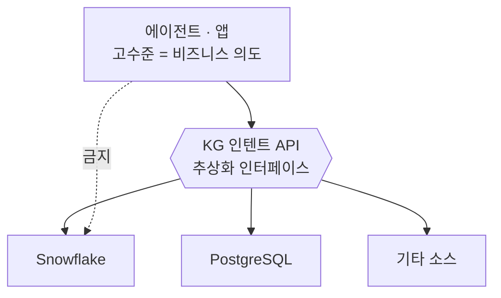
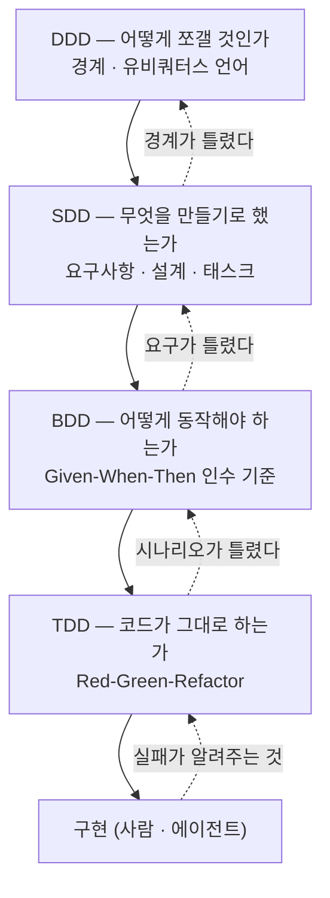

> **요약** — 방법론 이름 네 개를 나란히 놓으면 "뭘 골라야 하나" 같지만, 사실 고르는 문제가 아니다. **DDD는 무엇을 만들 것인가(경계·언어), SDD는 무엇을 만들기로 했는가(의도의 고정), BDD는 어떻게 동작해야 하는가(행위의 합의), TDD는 코드가 그대로 하는가(구현의 검증)** 를 맡는다. 네 층이 다르니 겹쳐 쓰는 게 정상이다. 다만 전부를 전 구간에 적용하면 그건 그냥 비용이다. 이 글은 각 방법론의 정의와 **손익분기점**(언제 이득이고 언제 낭비인지)을 정리하고, 마지막에 DCS AI의 실제 구성요소별로 어디에 무엇을 붙일지 매핑한다.

---

## 한눈에 보는 비교

| 구분 | TDD | BDD | DDD | SDD |
|---|---|---|---|---|
| **정식 명칭** | Test-Driven Development | Behaviour-Driven Development | Domain-Driven Design | Spec-Driven Development |
| **핵심 초점** | **테스트**가 코드 작성을 주도 | **행위(요구사항)** 를 자연어로 명세 | **도메인(비즈니스)** 모델 중심 설계 | **스펙**이 구현의 원본(source of truth) |
| **관점** | 개발자 관점(기술적) | 사용자·비즈니스 관점 | 도메인 전문가 + 개발자 협업 | 의도(intent)를 적는 사람의 관점 |
| **산출물** | 단위 테스트 코드 | 시나리오(Given-When-Then) | 도메인 모델 / 유비쿼터스 언어 | 요구사항·설계·태스크 문서 |
| **대상 범위** | 코드 단위(메서드/클래스) | 기능·행위 단위 | 시스템 아키텍처 전반 | 기능 단위 ~ 시스템 전반 |
| **답하는 질문** | "코드가 맞게 도나?" | "사용자에게 기대대로 보이나?" | "이 도메인을 어떻게 쪼개나?" | "우리가 뭘 만들기로 했더라?" |
| **관계** | 기반 방법론 | TDD의 확장 | 설계 철학(TDD/BDD와 병행) | 앞단 계약(BDD/TDD가 검증을 담당) |

---

# 1. TDD — Test-Driven Development

## 개념

구현 코드보다 **테스트 코드를 먼저** 쓰고, 그 테스트를 통과시키는 방향으로 실제 코드를 써 나가는 방식이다. 매우 짧은 사이클의 반복에 의존한다. 즉 테스트가 코드 작성을 **주도(drive)** 한다.

핵심은 "테스트를 많이 짜자"가 아니다. **테스트를 먼저 쓰면 요구사항을 먼저 확정하게 된다**는 강제력이 본질이다.

## Red-Green-Refactor 사이클

```
┌──────────────────────────────────────┐
│   Red  →  Green  →  Refactor  →  ↺   │
│  (실패)    (통과)      (개선)         │
└──────────────────────────────────────┘
```

**1단계 — Red (테스트 작성 및 실패)**
- 새 기능을 넣기 전에, 그 요구사항을 만족하는 **실패하는 테스트**를 먼저 쓴다.
- 구현이 없으니 당연히 실패한다. 이 실패를 눈으로 확인하는 게 중요하다 — 통과한 적 없는 테스트는 통과 여부를 믿을 수 없다.
- 이 과정에서 요구사항과 명세를 명확히 이해하도록 강제된다.

**2단계 — Green (테스트 통과)**
- 테스트를 통과시키는 **최소한의** 코드를 쓴다.
- 전체 테스트를 돌려 새 테스트가 통과하고 기존 기능이 안 깨졌는지 본다.

**3단계 — Refactor (리팩토링)**
- 통과한 코드를 개선한다(중복 제거, 구조 정리).
- 이미 있는 테스트가 리팩토링 중 안정성을 보장한다.

## 장점과 단점

**장점**
- 코드 품질 향상 — 테스트 가능한 구조를 강제하다 보니 결합도가 낮아진다
- 디버깅 시간 단축 — 문제 지점을 빠르게 특정
- 요구사항 명확화 — 테스트를 쓰는 과정이 곧 명세 정리
- 높은 커버리지와 리팩토링 안정성

**단점**
- 초기 생산성 저하 — 테스트 작성에 시간이 든다
- 학습 곡선이 가파르다
- 테스트 코드 자체가 관리 대상으로 늘어난다
- UI, 외부 연동, 비결정적 출력은 테스트하기 어렵다

> ⚠️ TDD는 테스트에 우선순위를 두되 **합리적인 범위 내에서** 적용해야 한다. 무조건적인 100% 커버리지가 목적이 아니다.

## 언제 좋은가 / 언제 낭비인가

**이득이 큰 조건 — 아래에 많이 해당할수록**

- **입력→출력이 결정적**이다 (같은 입력에 같은 결과)
- **규칙이 복잡**하다 (할인 계산, 재고 차감, 권한 판정, 파싱)
- **오래 살 코드**다 (한 번 쓰고 버릴 스크립트가 아니다)
- **회귀 비용이 크다** (깨지면 운영 장애로 이어진다)
- **여러 사람·에이전트가 같은 파일을 만진다**

**낭비가 되는 조건**

- 화면 레이아웃·시각 디자인처럼 **기대값을 글로 못 적는** 영역
- 요구사항이 아직 흐릿한 **탐색·프로토타입 단계** (테스트를 세 번 갈아엎게 된다)
- 외부 API를 **그대로 통과시키기만 하는** 얇은 래퍼 (모킹 테스트가 구현을 그대로 베낀 사본이 된다)
- LLM 응답처럼 **비결정적 출력** — 문자열 일치 단언은 곧 깨진다 (뒤에서 다룬다)

한 줄 기준: **"이 코드가 잘못 동작하면 어떻게 알아차릴 건가?"에 답이 없으면 TDD를 붙일 자리다.**

## DCS AI 적용

**① `dcs-ai-server` — 회귀 테스트를 실측 기준선으로 쓴다**

우리 서버의 OOM 이야기는 이미 한 편 썼다(「1GiB 안에서 OOM을 쫓다」). 거기서 가장 아팠던 건 **로깅 가드가 절반만 막혀 있었다**는 게 3주 뒤에야 드러난 대목이었다. 가드의 *존재*는 코드에 있었지만, 가드의 *경계*를 확인하는 테스트가 없었다.

TDD로 바꾸면 이렇게 된다.

```
Red   : "응답 본문 12MB를 프록시할 때 힙 증가가 N MB를 넘으면 실패" 테스트를 먼저 쓴다 → 실패 확인
Green : 스트리밍/절단 가드를 구현해 통과시킨다
Refactor : 가드를 미들웨어로 뽑고, 테스트는 그대로 둔다
```

포인트는 **테스트가 "가드가 있다"가 아니라 "가드가 이 크기에서 동작한다"를 검사**한다는 것이다. 반쪽 가드는 전자를 통과하고 후자에서 걸린다.

**② MCP 툴 스키마 계약 테스트**

`get_tool_schema` 로 노출되는 툴 정의는 외부(에이전트) 계약이다. 필드 하나가 조용히 바뀌면 에이전트 쪽에서 런타임에 터진다. 스키마 스냅샷 테스트를 걸어 **의도치 않은 계약 변경이 RED로 뜨게** 한다.

**③ 에이전트에게 위임할 때의 규율 — 테스트는 사람이 먼저**

이게 우리 상황에서 가장 중요한 변형이다. 에이전트에게 "테스트도 짜고 구현도 해줘"라고 하면, 에이전트는 **구현에 맞춘 테스트**를 쓴다. Red를 본 적 없는 Green이 나온다.

우리 규칙은 이렇게 두는 게 맞다.

- **Red는 사람이 쓴다** (또는 사람이 승인한다). 실패하는 것을 눈으로 확인한 뒤 위임한다.
- **Green만 에이전트에게 맡긴다.**
- 완료 판정은 에이전트의 자기보고가 아니라 **배포 게이트 명령의 exit code**로 한다 — 이건 「서브에이전트의 GREEN을 믿지 마라」에서 이미 정리한 결론이고, TDD와 정확히 같은 이야기다.

---

# 2. BDD — Behaviour-Driven Development

## 개념

비즈니스 요구사항(**행위**)에 집중해 테스트를 개발하는 방식이다. TDD에서 발전한 형태로, 테스트 케이스를 **자연어에 가깝게** 써서 개발자·기획자·QA 등 이해관계자 모두가 읽을 수 있게 한다.

TDD가 "코드가 올바르게 동작하는가(기술적 검증)"라면, BDD는 "시스템이 사용자에게 **기대되는 행위**를 하는가(비즈니스 검증)"에 집중한다.

## 구조 1 — User Story

```
As a    [역할]          — 누가
I want  [기능]          — 무엇을 원하는가
So that [비즈니스 가치]  — 왜 (어떤 가치를 위해)
```

`So that`이 진짜 핵심이다. 여기가 비어 있으면 그 요구사항은 아직 요구사항이 아니다.

## 구조 2 — Scenario (Given-When-Then)

```
Given [초기 상태 / 전제 조건]
When  [사용자의 행동 / 이벤트]
Then  [기대되는 결과]
```

예시:

```gherkin
Scenario: 장바구니에 상품 담기
  Given 사용자가 상품 상세 페이지에 있고
  When  "장바구니 담기" 버튼을 클릭하면
  Then  장바구니에 해당 상품이 1개 추가된다
```

## TDD와의 차이

| | TDD | BDD |
|---|---|---|
| 출발점 | 코드의 단위 | 사용자의 행위 |
| 언어 | 프로그래밍 언어 | 자연어에 가까운 DSL |
| 독자 | 개발자 | 개발자 + 기획 + QA + 현업 |
| 실패했을 때 알려주는 것 | "이 함수가 틀렸다" | "이 기능이 기대대로 안 된다" |
| 관계 | 기반 | TDD의 확장 |

> 💡 대표 도구: Cucumber, JBehave, SpecFlow 등이 Gherkin 문법(Given-When-Then)을 쓴다.

## 언제 좋은가 / 언제 낭비인가

**이득이 큰 조건**

- **요구사항을 주는 사람과 만드는 사람이 다르다** (현업 ↔ 개발)
- 그래서 **"이게 맞나요?"를 문서로 합의**해야 한다
- 도메인 규칙에 **예외 케이스가 많다** (권한, 등급, 기간, 브랜드별 분기)
- 인수 시점에 **"됐다/안 됐다"를 객관적으로 판정**해야 한다

**낭비가 되는 조건**

- 사용자가 곧 개발자인 **내부 도구·라이브러리** — Gherkin 층이 그냥 오버헤드다
- 시나리오를 **개발자만 쓰고 개발자만 읽는** 경우. 이러면 BDD가 아니라 "문장이 긴 TDD"다
- 시나리오 수가 수백 개로 불어나 **아무도 유지보수하지 않는** 상태

한 줄 기준: **Given-When-Then을 현업이 읽고 고칠 생각이 없다면 BDD를 도입할 이유가 없다.**

## DCS AI 적용

**① 요구사항 접수 양식을 곧 인수 기준으로 만든다**

우리에게 들어오는 요청은 대개 "매출 대시보드 하나 만들어줘" 한 줄이다. 이걸 그대로 받으면 세 번 다시 만든다. 접수 시점에 User Story + 시나리오를 같이 받는다.

```gherkin
Feature: 브랜드별 주간 매출 대시보드

  As a   브랜드 기획 담당자
  I want 브랜드·주차별 매출을 한 화면에서 비교하고
  So that 주간 회의 전에 이상 구간을 먼저 짚기 위해

  Scenario: 권한 없는 도메인 조회
    Given 손익 데이터 권한이 없는 사용자가 로그인해 있고
    When  손익 탭을 클릭하면
    Then  빈 화면이 아니라 "권한 신청 안내"가 보인다

  Scenario: 데이터 지연
    Given 어제자 매출이 아직 적재되지 않았고
    When  대시보드를 열면
    Then  최신 적재 시각이 함께 표시되고, 미적재 구간은 회색으로 구분된다
```

두 번째·세 번째 시나리오가 실제 가치다. **행복 경로는 누구나 상상하지만, 권한 실패와 데이터 지연은 물어봐야 나온다.** BDD 양식은 그 질문을 강제하는 장치다.

**② 이미 절반은 하고 있다 — QA 테스트리스트와 붙인다**

사내 `qa-testlist` 스킬이 만드는 **Phase → 항목 → "실패 시 근거"** 구조는 사실상 Given-When-Then의 사촌이다. 여기에 정식 GWT를 얹으면 **요구사항 문서 = QA 테스트리스트 = 인수 기준**이 한 벌로 합쳐진다. 지금은 요구사항과 QA 리스트를 사람이 두 번 쓰고 있다.

**③ 비결정적 출력을 위한 Then 쓰는 법**

LLM이 끼는 순간 `Then 응답이 "..."와 같다`는 못 쓴다. **Then을 값이 아니라 성질(property)로 쓴다.**

```gherkin
Scenario: 매출 질의 응답의 정합성
  Given 2026-07 브랜드 M 매출을 묻는 질문이 들어오고
  When  에이전트가 KG API로 답을 만들면
  Then  응답에 조회 기간과 데이터 기준일이 명시된다
  And   본문에 등장한 합계는 KG API 원본 합계와 오차 0이다
  And   권한 밖 도메인 수치는 포함되지 않는다
```

문자열 대신 **① 필수 필드 존재 ② 원본과의 수치 일치 ③ 금지 항목 부재** 로 단언한다. 이 세 가지는 비결정적 생성물에도 결정적으로 판정된다. 여기서 못 잡는 톤·설명 품질은 골든셋 + LLM 심사로 따로 본다.

---

# 3. DDD — Domain-Driven Design

## 개념

핵심 **비즈니스 도메인을 중심으로** 소프트웨어를 설계하는 방법론이다. 도메인 전문가와 개발자가 **유비쿼터스 언어(Ubiquitous Language, 공통 언어)** 를 공유하며 도메인 모델을 만들고, 그 모델이 코드에 그대로 반영되도록 한다. 구현 기술에 독립적인 도메인 모델링으로 **변경에 강건한 설계**를 지향한다.

TDD·BDD가 "만드는 방식"이라면 DDD는 "쪼개는 방식"이다. 유일하게 설계 철학 층에 있다.

## 아키텍처의 4가지 영역

| 영역 | 역할 |
|---|---|
| **표현(Presentation)** | 사용자의 요청을 받아 처리하고 응답을 제공 |
| **응용(Application)** | 사용자에게 제공할 기능을 구현하되, 로직은 도메인 모델에 위임 |
| **도메인(Domain)** | 핵심 비즈니스 로직을 담은 도메인 모델이 위치 |
| **인프라스트럭처(Infrastructure)** | DB, 메시징 등 외부 시스템 연동 담당 |

## 계층 구조와 DIP

- 계층은 **상위 → 하위 방향으로만** 의존한다. 하위 계층이 상위에 의존하지 않는다.
- **DIP(의존관계 역전 원칙)**: 고수준 모듈(도메인)이 저수준 모듈(인프라)에 직접 의존하지 않도록 **추상화 인터페이스**를 사이에 둔다.

**DIP의 장점**
- 기능 확장 시 고수준 모듈 수정 최소화
- 대역(Mock) 객체를 통한 테스트 용이성 향상
- 구현 기술 변경에 유연함

> ⚠️ 주의: 저수준 **기술** 관점이 아니라 고수준 **비즈니스** 관점에서 인터페이스를 설계해야 한다. `SnowflakeQueryExecutor`가 아니라 `매출조회` 여야 한다.

## 도메인 영역의 주요 구성 요소

| 요소 | 설명 |
|---|---|
| **엔티티(Entity)** | 고유 식별자를 가진 객체로, 데이터와 기능을 함께 제공 |
| **밸류(Value Object)** | 식별자 없이 **불변**으로 관리되는 개념적 값 |
| **애그리거트(Aggregate)** | 엔티티와 밸류를 개념적으로 하나로 묶은 상위 개념, **트랜잭션 경계** 형성 |
| **리포지터리(Repository)** | 애그리거트 단위로 영속성(저장/조회) 처리 |
| **도메인 서비스(Domain Service)** | 특정 엔티티에 속하지 않는 도메인 로직 처리 |
| **바운디드 컨텍스트(Bounded Context)** | 도메인 모델이 유효한 경계, 큰 도메인을 나누는 단위 |

**애그리거트의 특징**
- 루트 엔티티(Aggregate Root)를 통해서만 외부 접근 가능
- 함께 변경되고 함께 저장되는 객체들의 집합
- 하나의 원자적(atomic) 비즈니스 작업 단위

**모듈 구성 권장** — 하위 도메인별로 분리한 뒤 애그리거트 기준으로 패키지를 구성하고, 한 패키지당 15개 미만의 타입을 유지한다.

## 주요 이점

- 구현 기술에 독립적인 도메인 모델링 → 변경에 강건한 설계
- 비즈니스 로직이 명확히 분리되어 유지보수성 향상
- 유비쿼터스 언어로 도메인 전문가와 개발자 간 의사소통 원활화

## 언제 좋은가 / 언제 낭비인가

**이득이 큰 조건**

- **도메인 자체가 복잡**하다 (규칙이 코드보다 어렵다)
- **같은 단어를 팀마다 다르게 쓴다** — 이게 가장 강한 신호다
- 시스템이 **여러 팀·여러 서비스로 쪼개진다**
- **인프라를 갈아탈 가능성**이 있다 (DB, 데이터 소스, 외부 API)

**낭비가 되는 조건**

- 도메인 로직이 사실상 **CRUD** 다 — 엔티티·밸류·리포지터리 층이 순수 오버헤드
- **혼자 쓰는 도구**, 수명이 짧은 실험
- 팀에 **도메인 전문가와 이야기할 창구가 없다** — 유비쿼터스 언어는 상대가 있어야 성립한다

한 줄 기준: **"이 단어 무슨 뜻이에요?"가 회의에서 반복되면 DDD가 필요한 것이고, 안 나오면 아직 아니다.**

## DCS AI 적용

여기가 우리 시스템에서 DDD가 가장 잘 들어맞는 자리다. **지식그래프(KG)는 이미 DDD 구조를 하고 있는데, 그 사실을 명시적으로 안 다루고 있을 뿐이다.**

**① 바운디드 컨텍스트 = 분석 도메인**

매출·재고·손익·SCM·CS/VOC·마케팅성과·소셜리스닝·임직원정보·날씨·사업전략 — 이건 이미 바운디드 컨텍스트 목록이다. 각각이 **자기 안에서만 유효한 용어 체계**를 갖는다.

**② 유비쿼터스 언어가 진짜 문제다**

우리 조직에서 실제로 부딪히는 건 이런 것들이다.

- "매출"이 **정상가 기준인가 실판매가 기준인가**, 반품·취소를 뺀 값인가
- "재고"에 **매장 재고가 포함되나**, 이동 중 재고는 어디에 잡히나
- "시즌"이 **기획 시즌인가 판매 시즌인가**

사람이 물어보면 담당자가 알려준다. **에이전트는 안 물어보고 하나를 골라서 답한다.** 그러면 숫자가 맞는데 뜻이 틀린 답이 나오고, 이건 틀린 숫자보다 위험하다.

그래서 유비쿼터스 언어를 **문서가 아니라 실행 가능한 자산**으로 둬야 한다.

- 도메인별 **용어 사전**을 KG 메타에 붙이고, 인텐트 응답이 그 정의를 함께 반환한다
- 에이전트 스킬(`data-api` 등)이 그 정의를 컨텍스트로 읽는다
- 정의가 바뀌면 **한 곳만 고치면 모든 에이전트에 반영**된다

**③ DIP — 우리는 이미 이 결정을 내렸다**

`raw SQL proxy(data_from_snowflake_query 등) 금지, KG 정식 API 사용` 규칙은 대용량 응답 OOM 때문에 생긴 운영 규칙이었다. 그런데 이건 DDD 관점에서 보면 정확히 **DIP를 지키는 결정**이다.



- **금지된 경로**(에이전트 → Snowflake 직결)는 고수준이 저수준에 직접 의존하는 형태다. 소스가 바뀌면 전부 깨진다.
- **정식 경로**(에이전트 → 인텐트 API)는 비즈니스 관점 인터페이스에 의존한다. 저장소를 갈아도 위층은 그대로다.

즉 **OOM 때문에 생긴 규칙이 결과적으로 아키텍처를 지켜주고 있다.** 이 규칙을 "서버가 죽으니까 하지 마세요"가 아니라 **"고수준 모듈은 저장소를 몰라야 한다"** 로 설명하면 지켜질 확률이 훨씬 높아진다.

**④ 애그리거트 = 인텐트**

인텐트 하나가 **함께 조회되고 함께 의미를 갖는 데이터 묶음**이다. 애그리거트 루트를 통해서만 접근한다는 규칙은, **인텐트를 우회해 테이블을 직접 건드리지 않는다**로 번역된다. 새 API를 만들 때 "이건 기존 인텐트의 일부인가, 새 애그리거트인가"를 먼저 묻는 습관이 경계를 지켜준다.

---

# 4. SDD — Spec-Driven Development

## 개념

**스펙(명세)을 코드보다 상위의 산출물로 두고, 구현을 스펙에서 파생시키는** 개발 방식이다. 핵심 주장은 한 줄이다.

> 코드가 자산이 아니라 **스펙이 자산이다.** 코드는 스펙의 현재 구현체일 뿐이다.

SDD는 사실 두 갈래로 쓰인다.

- **좁은 의미 (API-first)** — OpenAPI·JSON Schema·Protobuf 같은 기계가 읽는 스펙을 먼저 확정하고, 서버·클라이언트·목·문서·검증기를 거기서 생성한다. 오래된 실무 관행이다.
- **넓은 의미 (AI 시대의 SDD)** — 자연어 스펙 문서를 원본으로 두고, 코딩 에이전트가 그 스펙으로부터 계획·태스크·구현을 생성한다. GitHub의 Spec Kit, AWS Kiro의 spec 모드 같은 도구들이 이 흐름이다.

이 글에서 무게를 두는 건 두 번째다. 첫 번째는 우리가 이미 하고 있고, 두 번째는 지금 정리가 필요하다.

## 왜 지금 부활했나

에이전트에게 일을 시키다 보면 이런 게 쌓인다.

- 잘 도는 결과를 만든 **프롬프트가 어디에도 안 남는다.** 스크롤을 올려서 찾는다.
- 다음 사람이(또는 다음 세션이) **왜 이렇게 짰는지 모른다.** 코드만 남았기 때문이다.
- 요구가 조금 바뀌면 **처음부터 다시 설명**한다.

프롬프트는 휘발성이고 코드는 결과물이다. **그 사이에 남아야 할 게 스펙이다.** SDD는 "대화로 시키던 걸 문서로 시키자"에 가깝다.

## 전형적인 흐름

```
① Constitution  프로젝트 불변 원칙 (기술 스택, 금지 사항, 코드 규약)
      ↓
② Specify       무엇을 만들 것인가 — 사용자 관점 요구사항. 어떻게는 아직 안 씀
      ↓
③ Clarify       모호한 지점을 질문으로 뽑아 확정 (여기를 건너뛰면 뒤가 다 흔들림)
      ↓
④ Plan          어떻게 만들 것인가 — 아키텍처·데이터 모델·인터페이스
      ↓
⑤ Tasks         검증 가능한 작은 단위로 분해
      ↓
⑥ Implement     에이전트가 태스크 단위로 구현, 각 단위마다 검증
```

②와 ④를 분리하는 게 핵심이다. **"무엇"과 "어떻게"를 한 문서에 섞으면, 구현 제약이 요구사항인 척 굳어버린다.**

요구사항을 쓸 때 EARS 같은 정형 문형을 쓰기도 한다.

```
WHEN  <트리거 조건>
THE SYSTEM SHALL  <해야 할 일>
```

`~하면 좋겠다` 같은 문장이 스펙에 들어오는 걸 막아준다.

## 장점과 단점

**장점**
- **의도가 자산으로 남는다** — 사람이 바뀌어도, 세션이 끊겨도 살아남는다
- **리뷰 지점이 앞으로 당겨진다** — 500줄 PR이 아니라 30줄 스펙을 리뷰한다. 훨씬 싸다
- **에이전트 입력 품질이 안정된다** — 매번 다른 프롬프트가 아니라 같은 스펙을 준다
- **재생성 가능** — 스택을 바꿀 때 스펙에서 다시 뽑는 선택지가 생긴다

**단점 — 이쪽이 더 중요하다**
- **스펙 드리프트.** 코드는 고쳤는데 스펙은 안 고치면, 스펙이 *틀린 지도*가 된다. 없는 것보다 나쁘다
- **스펙 비대화.** 스펙 쓰는 시간이 구현보다 길어지는 순간 손해다
- **거짓 안전감.** 스펙이 있다고 구현이 맞다는 보장은 전혀 없다 — **검증은 여전히 TDD/BDD의 일이다**
- 작은 변경(오타, 스타일)에 이 절차를 태우면 그냥 관료제다

## 언제 좋은가 / 언제 낭비인가

**이득이 큰 조건**

- **에이전트에게 위임할 분량이 크다** (여러 파일, 여러 단계)
- **같은 종류의 산출물을 반복 생산**한다 (대시보드, 리포트, 인텐트 API)
- 만드는 사람과 **검수하는 사람이 다르다**
- 결과물이 **오래 유지·재사용**된다

**낭비가 되는 조건**

- 한 파일 안의 **국소 수정**
- **한 번 쓰고 버릴** 분석 스크립트
- 요구가 대화 중에 계속 바뀌는 **탐색 단계** (스펙을 세 번 다시 쓴다)

한 줄 기준: **"이 작업을 3개월 뒤 다른 사람이 다시 해야 한다면?"에 '곤란하다'면 스펙을 남길 자리다.**

## DCS AI 적용

**① 우리는 이미 SDD를 하고 있다 — 다만 검증 없이**

`CLAUDE.md`, `.claude/rules/*.md`, `dcs-ai-common` 플러그인의 `SKILL.md` — 이건 전부 **스펙**이다. 에이전트가 코드를 만들 때 읽는 원본 문서다. 구조상 이미 SDD다.

문제는 딱 하나다. **이 스펙들이 맞는지 아무도 검사하지 않는다.** 규칙이 바뀌었는데 문서가 안 바뀌면, 에이전트는 계속 옛날 규칙대로 만든다. 사람은 눈치라도 채지만 에이전트는 문서를 100% 믿는다.

그래서 SDD 도입의 실질적 1순위는 새 프로세스가 아니라 **스펙 드리프트 검사**다.

- 룰·스킬 문서에 적힌 **명령어와 경로가 실제로 존재하는지** 주기적으로 확인 (없는 CLI 플래그를 안내하는 문서가 제일 위험하다)
- 문서에 적힌 **API 엔드포인트가 살아 있는지** 확인
- 스펙 문서를 고치는 PR과 코드를 고치는 PR을 **같은 PR로 묶는** 규약

**② 반복 산출물에 스펙 템플릿을 둔다**

우리가 반복해서 만드는 것들이 있다 — 인텐트 API, 퀵 대시보드, 임베디드 앱, 매트릭스 보드. 각각에 대해 **채워 넣기식 스펙 템플릿**을 두면 요청 접수부터 산출물까지가 한 줄로 이어진다.

예를 들어 새 인텐트 API 스펙은 이렇게 생긴다.

```markdown
## 인텐트: 브랜드별 주간 매출

### 용어 (유비쿼터스 언어)          ← DDD
- 매출: 실판매가 기준, 반품·취소 제외
- 주차: 월요일 시작, ISO 주차

### 요구사항                        ← SDD
WHEN 브랜드코드와 기간이 주어지면
THE SYSTEM SHALL 주차별 매출 합계와 데이터 기준일을 반환한다

### 인수 시나리오                    ← BDD
Given 권한 없는 브랜드를 요청하면
Then  403과 권한 신청 안내를 반환한다

### 비기능 요건
- 응답 최대 크기 N MB (초과 시 페이지네이션)  ← 이게 곧 TDD 테스트가 된다
```

네 방법론이 한 문서 안에서 각자 자기 칸을 맡는다. **이게 이 글이 하고 싶은 말의 요약이기도 하다.**

**③ 대화가 아니라 파일로 시킨다**

에이전트에게 큰 작업을 맡길 때, 지시를 채팅에 쓰지 말고 **저장소 안 스펙 파일**에 쓴다. 그러면
- 리뷰가 된다 (PR로 올라온다)
- 다음에 재사용된다
- 결과가 이상할 때 **프롬프트가 아니라 스펙을 고친다** — 고친 게 남는다

---

# 네 방법론의 관계

네 개는 경쟁하지 않는다. **서로 다른 층을 맡는다.**



- **DDD** 로 도메인 경계와 언어를 잡고,
- **SDD** 로 그 안에서 무엇을 만들지 스펙으로 고정하고,
- **BDD** 로 그 스펙이 요구하는 행위를 시나리오로 명세하고,
- **TDD** 로 각 단위가 명세대로 도는지 검증하며 구현한다.

중요한 건 **화살표가 양방향**이라는 점이다. 테스트가 자꾸 깨지면 코드가 아니라 시나리오가 틀린 것일 수 있고, 시나리오가 계속 바뀌면 요구가 안 정해진 것이고, 요구가 계속 경계를 넘나들면 도메인을 잘못 쪼갠 것이다. **아래층의 고통은 위층의 오류 신호다.**

---

# 무엇부터 고를 것인가

전부 도입하는 건 답이 아니다. 지금 겪는 증상에서 출발한다.

| 지금 겪는 증상 | 먼저 쓸 것 |
|---|---|
| 고치면 다른 데가 깨진다 | **TDD** |
| 만들었는데 "이게 아닌데요" 소리를 듣는다 | **BDD** |
| 회의에서 같은 단어를 다르게 쓴다 | **DDD** |
| 에이전트에게 매번 같은 설명을 다시 한다 | **SDD** |
| 3개월 전 결정의 이유를 아무도 모른다 | **SDD** |
| 데이터 소스를 갈아탈 때 전부 뜯어야 한다 | **DDD (DIP)** |
| 배포 후에야 문제를 안다 | **TDD + BDD** |

그리고 **작업의 성격**으로 한 번 더 거른다.

| 작업 | DDD | SDD | BDD | TDD |
|---|:---:|:---:|:---:|:---:|
| KG 인텐트 API 신규 | ● | ● | ● | ● |
| `dcs-ai-server` 코어·프록시 | ◐ | ◐ | ○ | ● |
| 임베디드 앱 (현업 사용) | ○ | ● | ● | ◐ |
| 퀵 대시보드 (조회 전용) | ○ | ◐ | ◐ | ○ |
| 에이전트 스킬·룰 | ○ | ● | ◐ | ◐ |
| 일회성 분석 스크립트 | ○ | ○ | ○ | ○ |

●필수 ◐권장 ○불필요

일회성 분석 스크립트 줄이 전부 ○인 게 이 표의 핵심이다. **방법론은 수명이 긴 것에만 값을 한다.**

---

# 마지막으로 — 안 되는 것도 적어둔다

**① LLM이 끼면 TDD의 절반이 안 통한다.** 같은 입력에 같은 출력이 안 나온다. 그래서 우리 쪽 검증은 두 층으로 나뉜다.

- **결정적인 부분** — 데이터 조회, 권한 판정, 수치 계산, 스키마 형식 → 여기는 정상적으로 TDD가 먹힌다. 그리고 사고는 대부분 여기서 난다.
- **비결정적인 부분** — 서술, 요약, 판단 → 골든셋 + 성질 기반 단언 + 사람 샘플 검수. 통과/실패가 아니라 **분포**로 본다.

이 둘을 구분하지 않고 "AI라 테스트가 안 돼요"라고 하면, 테스트 가능한 절반까지 같이 포기하게 된다.

**② 에이전트가 방법론을 무력화하는 방식이 따로 있다.** 테스트를 구현에 맞춰 쓰고, 스펙을 코드에 맞춰 고치고, 시나리오를 통과하는 쪽으로 좁힌다. 악의가 아니라 목표 함수가 그렇게 생겼다. 그래서 **RED와 스펙만큼은 사람이 쥐고 있어야 한다.** Green과 구현은 넘겨도 된다.

**③ 그리고 이 글 자체가 아직 제안이다.** DDD와 SDD 항목 중 상당수는 우리 시스템에 이미 절반쯤 존재하는 구조를 이름 붙여 정리한 것이고, 나머지는 아직 안 해본 것이다. 실제로 붙여보고 안 맞은 부분은 되돌린 기록으로 다시 쓰겠다.

---

## 참고 자료

- DDD 아키텍처 정리 — `assu10.github.io/dev/2024/04/01/ddd-architecture`
- BDD와 TDD의 차이 — `blog.aliencube.org/ko/2014/04/02/differences-between-bdd-and-tdd`
- TDD 개념 정리 — `asfirstalways.tistory.com/296`
- 사내 문서 「TDD, BDD, DDD」 (2026-07-23) — 이 글의 1~3장 원본
- SDD 관련 — GitHub Spec Kit, AWS Kiro의 spec 모드(EARS 문형), API-first 계열의 OpenAPI 관행
