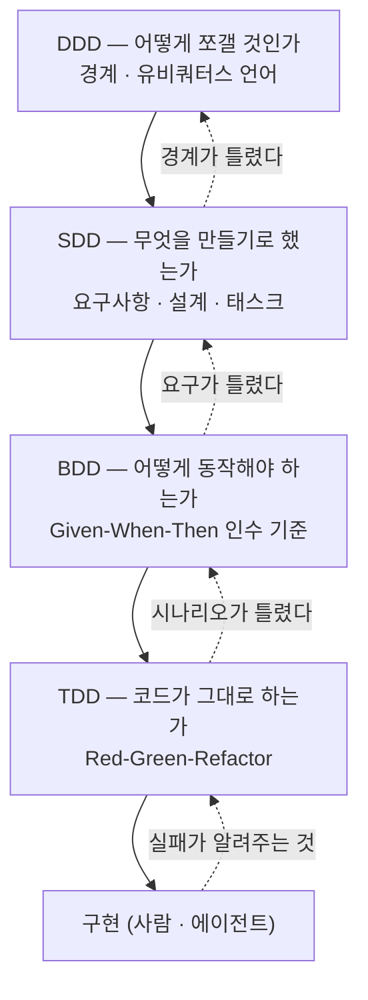

> **요약** — 이름 네 개를 나란히 놓으면 "뭘 골라야 하나" 같지만 고르는 문제가 아니다. **나누고(DDD) → 적고(SDD) → 합의하고(BDD) → 확인하는(TDD)** 서로 다른 층이라 겹쳐 쓰는 게 정상이다. 다만 전부를 전 구간에 붙이면 그건 그냥 비용이다. 그래서 각 방법론마다 개념과 함께 **"보통 어떤 상황에서 쓰는지"** 를 같이 정리했다.
>
> 마지막에 더한 SDD는 요즘 AI 코딩 도구와 함께 다시 올라온 쪽이라, GitHub **spec-kit**의 실제 7단계와 **이걸 적용해 본 팀의 후기**를 같이 붙였다. 좋은 점보다 걸린 점이 더 쓸모 있었다 — 문서를 직접 고치면 안 되는 이유, 간단한 작업엔 애매하다는 것, 그리고 문서와 토큰으로 청구되는 비용.

---

## 한눈에 보는 비교

이름이 넷이라 골라야 할 것 같지만, 넷은 **적용하는 층이 다르다.** 쉬운 말로 하면 이렇다.

| | 하는 일 | 비유 |
|---|---|---|
| **DDD** | 업무를 **구역으로 나누고 용어를 통일**한다 | 조직도 + 부서별 용어집 |
| **SDD** | 만들 걸 **문서로 먼저 못 박는다** | 공사 전 설계도 |
| **BDD** | "이러면 완성"을 **관계자끼리 같은 문장으로 합의**한다 | 준공 검사 체크리스트 |
| **TDD** | 코드가 제대로 도는지 **자동으로 계속 확인**한다 | 공장 라인의 자동 검사기 |

**나누고 → 적고 → 합의하고 → 확인하는** 흐름이다. 그래서 겹쳐 쓰는 게 정상이고, 도입 여부도 각각 따로 판단한다.

좀 더 자세히 놓으면 이렇다.

| 구분 | TDD | BDD | DDD | SDD |
|---|---|---|---|---|
| **정식 명칭** | Test-Driven Development | Behaviour-Driven Development | Domain-Driven Design | Spec-Driven Development |
| **핵심 초점** | **테스트**가 코드 작성을 주도 | **행위(요구사항)** 를 자연어로 명세 | **도메인(비즈니스)** 모델 중심 설계 | **스펙**이 구현의 원본(source of truth) |
| **관점** | 개발자 관점(기술적) | 사용자·비즈니스 관점 | 도메인 전문가 + 개발자 협업 | 의도(intent)를 적는 사람의 관점 |
| **산출물** | 단위 테스트 코드 | 시나리오(Given-When-Then) | 도메인 모델 / 유비쿼터스 언어 | 요구사항·설계·태스크 문서 |
| **대상 범위** | 코드 단위(메서드/클래스) | 기능·행위 단위 | 시스템 아키텍처 전반 | 기능 단위 ~ 시스템 전반 |
| **답하는 질문** | "코드가 맞게 도나?" | "사용자에게 기대대로 보이나?" | "이 도메인을 어떻게 쪼개나?" | "우리가 뭘 만들기로 했더라?" |
| **관계** | 기반 방법론 | TDD의 확장 | 설계 철학(TDD/BDD와 병행) | 앞단 계약(BDD/TDD가 검증을 담당) |

---

# 1. TDD — Test-Driven Development

## 개념

구현 코드보다 **테스트 코드를 먼저** 쓰고, 그 테스트를 통과시키는 방향으로 실제 코드를 써 나가는 방식이다. 매우 짧은 사이클의 반복에 의존한다. 즉 테스트가 코드 작성을 **주도(drive)** 한다.

핵심은 "테스트를 많이 짜자"가 아니다. **테스트를 먼저 쓰면 요구사항을 먼저 확정하게 된다**는 강제력이 본질이다.

## Red-Green-Refactor 사이클


**1단계 — Red (테스트 작성 및 실패)**
- 새 기능을 넣기 전에, 그 요구사항을 만족하는 **실패하는 테스트**를 먼저 쓴다.
- 구현이 없으니 당연히 실패한다. 이 실패를 눈으로 확인하는 게 중요하다 — 통과한 적 없는 테스트는 통과 여부를 믿을 수 없다.
- 이 과정에서 요구사항과 명세를 명확히 이해하도록 강제된다.

**2단계 — Green (테스트 통과)**
- 테스트를 통과시키는 **최소한의** 코드를 쓴다.
- 전체 테스트를 돌려 새 테스트가 통과하고 기존 기능이 안 깨졌는지 본다.

**3단계 — Refactor (리팩토링)**
- 통과한 코드를 개선한다(중복 제거, 구조 정리).
- 이미 있는 테스트가 리팩토링 중 안정성을 보장한다.

## 장점과 단점

**장점**
- 코드 품질 향상 — 테스트 가능한 구조를 강제하다 보니 결합도가 낮아진다
- 디버깅 시간 단축 — 문제 지점을 빠르게 특정
- 요구사항 명확화 — 테스트를 쓰는 과정이 곧 명세 정리
- 높은 커버리지와 리팩토링 안정성

**단점**
- 초기 생산성 저하 — 테스트 작성에 시간이 든다
- 학습 곡선이 가파르다
- 테스트 코드 자체가 관리 대상으로 늘어난다
- UI, 외부 연동, 비결정적 출력은 테스트하기 어렵다

> ⚠️ TDD는 테스트에 우선순위를 두되 **합리적인 범위 내에서** 적용해야 한다. 무조건적인 100% 커버리지가 목적이 아니다.

## 언제 쓰나 — "고치면 다른 데가 깨져요"

**이럴 때 씁니다**

- **계산이 까다로운 것** — 돈 계산, 할인, 세금, 정산처럼 경우의 수가 많은 것
- **남들이 갖다 쓰는 부품** — 내가 잘못 고치면 남의 코드가 깨지는 것
- **버그를 고칠 때** — 그 버그를 재현하는 확인 절차를 먼저 만들고 고친다. 실무에서 제일 흔한 형태고, 같은 버그가 다시 나는 걸 막아준다
- **오래된 코드를 손볼 때** — 지금 동작을 먼저 확인 절차로 붙들어 두고 손댄다. 안 그러면 뭘 망가뜨렸는지 알 방법이 없다
- **몇 년 갈 코드** — 여러 사람이 오래 만질 것

한 줄 기준: **"이게 잘못 돌면 어떻게 알아차릴 건가?"에 답이 없으면 TDD를 붙일 자리다.**

---

# 2. BDD — Behaviour-Driven Development

## 개념

비즈니스 요구사항(**행위**)에 집중해 테스트를 개발하는 방식이다. TDD에서 발전한 형태로, 테스트 케이스를 **자연어에 가깝게** 써서 개발자·기획자·QA 등 이해관계자 모두가 읽을 수 있게 한다.

TDD가 "코드가 올바르게 동작하는가(기술적 검증)"라면, BDD는 "시스템이 사용자에게 **기대되는 행위**를 하는가(비즈니스 검증)"에 집중한다.

## 구조 1 — User Story

```
As a    [역할]          — 누가
I want  [기능]          — 무엇을 원하는가
So that [비즈니스 가치]  — 왜 (어떤 가치를 위해)
```

`So that`이 진짜 핵심이다. 여기가 비어 있으면 그 요구사항은 아직 요구사항이 아니다.

## 구조 2 — Scenario (Given-When-Then)

```
Given [초기 상태 / 전제 조건]
When  [사용자의 행동 / 이벤트]
Then  [기대되는 결과]
```

예시:

```gherkin
Scenario: 장바구니에 상품 담기
  Given 사용자가 상품 상세 페이지에 있고
  When  "장바구니 담기" 버튼을 클릭하면
  Then  장바구니에 해당 상품이 1개 추가된다
```

## TDD와의 차이

| | TDD | BDD |
|---|---|---|
| 출발점 | 코드의 단위 | 사용자의 행위 |
| 언어 | 프로그래밍 언어 | 자연어에 가까운 DSL |
| 독자 | 개발자 | 개발자 + 기획 + QA + 현업 |
| 실패했을 때 알려주는 것 | "이 함수가 틀렸다" | "이 기능이 기대대로 안 된다" |
| 관계 | 기반 | TDD의 확장 |

> 💡 대표 도구: Cucumber, JBehave, SpecFlow 등이 Gherkin 문법(Given-When-Then)을 쓴다.

## 언제 쓰나 — "만들었는데 이게 아니라는데요"

**이럴 때 씁니다**

- **요청하는 사람과 만드는 사람이 다를 때** — 사실상 유일한 필수 조건이다
- **예외가 많은 업무** — 정상적인 경우는 하나인데 "이럴 땐 어떡하죠?"가 열 개 넘게 나오는 일
- **"됐다/안 됐다"를 따져야 할 때** — 검수나 인수 절차가 있는 경우
- **확인 절차를 개발자가 아닌 사람이 관리할 때** — QA가 직접 읽고 고쳐야 할 때

한 줄 기준: **그 문장을 현업이 읽고 고칠 생각이 없다면 BDD를 도입할 이유가 없다.**

---

# 3. DDD — Domain-Driven Design

## 개념

핵심 **비즈니스 도메인을 중심으로** 소프트웨어를 설계하는 방법론이다. 도메인 전문가와 개발자가 **유비쿼터스 언어(Ubiquitous Language, 공통 언어)** 를 공유하며 도메인 모델을 만들고, 그 모델이 코드에 그대로 반영되도록 한다. 구현 기술에 독립적인 도메인 모델링으로 **변경에 강건한 설계**를 지향한다.

TDD·BDD가 "만드는 방식"이라면 DDD는 "쪼개는 방식"이다. 유일하게 설계 철학 층에 있다.

## 아키텍처의 4가지 영역

| 영역 | 역할 |
|---|---|
| **표현(Presentation)** | 사용자의 요청을 받아 처리하고 응답을 제공 |
| **응용(Application)** | 사용자에게 제공할 기능을 구현하되, 로직은 도메인 모델에 위임 |
| **도메인(Domain)** | 핵심 비즈니스 로직을 담은 도메인 모델이 위치 |
| **인프라스트럭처(Infrastructure)** | DB, 메시징 등 외부 시스템 연동 담당 |

## 계층 구조와 DIP

- 계층은 **상위 → 하위 방향으로만** 의존한다. 하위 계층이 상위에 의존하지 않는다.
- **DIP(의존관계 역전 원칙)**: 고수준 모듈(도메인)이 저수준 모듈(인프라)에 직접 의존하지 않도록 **추상화 인터페이스**를 사이에 둔다.

**DIP의 장점**
- 기능 확장 시 고수준 모듈 수정 최소화
- 대역(Mock) 객체를 통한 테스트 용이성 향상
- 구현 기술 변경에 유연함

> ⚠️ 주의: 저수준 **기술** 관점이 아니라 고수준 **비즈니스** 관점에서 인터페이스를 설계해야 한다. `MySqlOrderQueryExecutor`가 아니라 `주문조회` 여야 한다.

## 도메인 영역의 주요 구성 요소

| 요소 | 설명 |
|---|---|
| **엔티티(Entity)** | 고유 식별자를 가진 객체로, 데이터와 기능을 함께 제공 |
| **밸류(Value Object)** | 식별자 없이 **불변**으로 관리되는 개념적 값 |
| **애그리거트(Aggregate)** | 엔티티와 밸류를 개념적으로 하나로 묶은 상위 개념, **트랜잭션 경계** 형성 |
| **리포지터리(Repository)** | 애그리거트 단위로 영속성(저장/조회) 처리 |
| **도메인 서비스(Domain Service)** | 특정 엔티티에 속하지 않는 도메인 로직 처리 |
| **바운디드 컨텍스트(Bounded Context)** | 도메인 모델이 유효한 경계, 큰 도메인을 나누는 단위 |

**애그리거트의 특징**
- 루트 엔티티(Aggregate Root)를 통해서만 외부 접근 가능
- 함께 변경되고 함께 저장되는 객체들의 집합
- 하나의 원자적(atomic) 비즈니스 작업 단위

**모듈 구성 권장** — 하위 도메인별로 분리한 뒤 애그리거트 기준으로 패키지를 구성하고, 한 패키지당 15개 미만의 타입을 유지한다.

## 주요 이점

- 구현 기술에 독립적인 도메인 모델링 → 변경에 강건한 설계
- 비즈니스 로직이 명확히 분리되어 유지보수성 향상
- 유비쿼터스 언어로 도메인 전문가와 개발자 간 의사소통 원활화

## 언제 쓰나 — "같은 단어를 서로 다른 뜻으로 쓰고 있었어요"

**이럴 때 씁니다**

- **어려운 게 기술이 아니라 업무일 때** — 규칙 자체가 복잡한 일(정산, 보험, 회계, 물류)
- **부서마다 같은 말을 다르게 쓸 때** — 가장 확실한 신호다. 회의에서 "그 단어 무슨 뜻이에요?"가 반복되면 해당된다
- **큰 시스템을 여러 개로 쪼갤 때** — 어디를 기준으로 자를지 정하는 도구가 된다
- **저장소나 외부 연동을 갈아탈 가능성**이 있을 때
- 오래 가면서 계속 바뀔 시스템

한 줄 기준: **"이 단어 무슨 뜻이에요?"가 회의에서 반복되면 DDD가 필요한 것이고, 안 나오면 아직 아니다.** 실무에서 DDD는 대개 구조 흉내만 내다 실패한다 — 값을 하는 건 폴더 구조가 아니라 **구역 나누기와 용어 통일**이다.

---

# 4. SDD — Spec-Driven Development

## 개념

**스펙(명세)을 코드보다 상위의 산출물로 두고, 구현을 스펙에서 파생시키는** 개발 방식이다. 핵심 주장은 한 줄이다.

> 코드가 자산이 아니라 **스펙이 자산이다.** 코드는 스펙의 현재 구현체일 뿐이다.

SDD는 사실 두 갈래로 쓰인다.

- **좁은 의미 (API-first)** — OpenAPI·JSON Schema·Protobuf 같은 기계가 읽는 스펙을 먼저 확정하고, 서버·클라이언트·목·문서·검증기를 거기서 생성한다. 오래된 실무 관행이다.
- **넓은 의미 (AI 시대의 SDD)** — 자연어 스펙 문서를 원본으로 두고, 코딩 에이전트가 그 스펙으로부터 계획·태스크·구현을 생성한다. GitHub의 Spec Kit, AWS Kiro의 spec 모드 같은 도구들이 이 흐름이다.

이 글에서 무게를 두는 건 두 번째다. 첫 번째는 우리가 이미 하고 있고, 두 번째는 지금 정리가 필요하다.

## 왜 지금 부활했나

에이전트에게 일을 시키다 보면 이런 게 쌓인다.

- 잘 도는 결과를 만든 **프롬프트가 어디에도 안 남는다.** 스크롤을 올려서 찾는다.
- 다음 사람이(또는 다음 세션이) **왜 이렇게 짰는지 모른다.** 코드만 남았기 때문이다.
- 요구가 조금 바뀌면 **처음부터 다시 설명**한다.

프롬프트는 휘발성이고 코드는 결과물이다. **그 사이에 남아야 할 게 스펙이다.** SDD는 "대화로 시키던 걸 문서로 시키자"에 가깝다.

## 전형적인 흐름 — GitHub spec-kit

말로만 하면 추상적이니 실제 도구를 놓고 보는 게 빠르다. GitHub이 낸 **spec-kit**이 이 방식을 그대로 구현했다. 바뀌는 건 딱 한 칸이다.

```
기존      개발자 → 프롬프트 → AI → 코드
spec-kit  개발자 → 스펙 정의 → spec-kit(프롬프트 자동 생성) → AI → 코드
```

사람이 프롬프트를 쓰는 대신 **스펙을 쓰고, 프롬프트는 도구가 만든다.** 흐름은 일곱 단계다.

```
① /speckit.constitution   프로젝트 대원칙 — 코드 스타일, 테스트 기준, 문서화 요구
      ↓
② /speckit.specify        무엇을 만들 것인가 — 요구사항. 어떻게는 아직 안 씀
      ↕
③ /speckit.clarify        모호한 곳을 질문으로 뽑아 확정 (선택, 최대 5개)
      ↓
④ /speckit.plan           어떻게 만들 것인가 — 구조·데이터 모델
      ↓
⑤ /speckit.tasks          작업 단위로 분해 (각 작업의 완료 기준 포함)
      ↓
⑥ /speckit.analyze        ①을 기준으로 ②④⑤이 서로 모순되지 않는지 검증
      ↓
⑦ /speckit.implement      코드 생성
```

②와 ④를 분리하는 게 핵심이다. **"무엇"과 "어떻게"를 한 문서에 섞으면, 구현 제약이 요구사항인 척 굳어버린다.** ⑥이 따로 있는 것도 눈에 띈다 — 문서가 네 개로 늘어나면 **문서끼리 어긋나는 게 새 문제**가 되기 때문이다.

요구사항을 쓸 때는 정형 문형을 쓰기도 한다.

```
WHEN  <트리거 조건>
THE SYSTEM SHALL  <해야 할 일>
```

`~하면 좋겠다` 같은 문장이 스펙에 들어오는 걸 막아준다.

## 써본 팀의 후기 — 카카오페이

카카오페이 기술블로그에 [spec-kit을 실제로 적용한 기록](https://tech.kakaopay.com/post/ifkakao-agentic-coding/)이 있다. 남의 실전 후기라 그대로 옮길 값어치가 있다.

**왜 필요했나.** 프롬프트로만 시키다 보니 *"AI가 맥락을 잃어버리기 쉽고, 대화가 길어질수록 이전에 어떤 패턴으로 코드를 작성했는지 기억하지 못해 여기저기 다른 스타일의 코드가 생성되는 문제"* 가 있었고, 결국 *"AI가 생성한 코드를 검토하고 수정하는 시간이 점점 더 길어졌다"* 고 한다. 코드를 빨리 얻은 대가를 리뷰에서 치른 것이다.

**의외로 유용했던 규칙 — 문서를 직접 고치지 마라.** plan이나 tasks 결과가 마음에 안 들 때 **그 파일을 직접 손보지 말고 specify로 돌아가 스펙을 다시 쓰라**는 것이다. 직접 고치면 *"스펙 문서와 실제 코드·계획이 불일치하여 일관성 유지 원칙에 어긋나며, 나중에 스펙 문서를 보고 개발자들이 혼란스러워할 수 있"* 기 때문이다. 앞에서 말한 **틀린 지도**가 만들어지는 가장 흔한 경로가 이거다.

**솔직하게 적힌 단점 셋.**

- 단계가 많아 처음 접하면 복잡하다
- **"간단한 개발은 어떻게 해야 할지 애매하다"**
- **"개발 문서가 굉장히 많이 만들어지고, 이에 따른 토큰도 많이 소모한다"**

두 번째·세 번째가 중요하다. 앞에서 "작은 수정에 이 절차를 태우면 관료제"라고 썼는데, 실제로 써본 사람도 같은 지점에서 걸렸다. **SDD는 공짜가 아니고, 비용이 문서 분량과 토큰으로 청구된다.**

**그리고 constitution을 항상 지키지도 않는다.** 구현 단계에서 AI가 *"tasks에 중점을 두는 것처럼 느꼈"* 고, 대원칙은 *"가끔 안 들을 때도 있"* 었다고 한다. 그래서 tasks가 constitution대로 만들어졌는지 사람이 다시 봐야 한다 — ⑥ analyze 단계가 있는 이유이기도 하고, **스펙이 있다고 구현이 맞다는 보장은 없다**는 앞의 이야기와 같다.

**결론은 이렇게 맺는다.** 값어치는 개인 생산성이 아니라 *"팀 단위 프로젝트에서 가장 중요한 '일관성'과 '체계적인 협업'"* 에 있고, 앞으로 개발자의 역할은 *"'코드를 작성하는 사람'에서 '스펙을 검증하고 테스트를 설계하는 사람'으로 점점 변화할 것"* 이라고.

마지막 문장이 이 글의 네 방법론을 한 줄로 묶는다 — **스펙을 쓰는 일(SDD·BDD)과 검증을 설계하는 일(TDD)이 남는다.**

## 장점과 단점

**장점**
- **의도가 자산으로 남는다** — 사람이 바뀌어도, 세션이 끊겨도 살아남는다
- **리뷰 지점이 앞으로 당겨진다** — 500줄 PR이 아니라 30줄 스펙을 리뷰한다. 훨씬 싸다
- **에이전트 입력 품질이 안정된다** — 매번 다른 프롬프트가 아니라 같은 스펙을 준다
- **재생성 가능** — 스택을 바꿀 때 스펙에서 다시 뽑는 선택지가 생긴다

**단점 — 이쪽이 더 중요하다**
- **스펙 드리프트.** 코드는 고쳤는데 스펙은 안 고치면, 스펙이 *틀린 지도*가 된다. 없는 것보다 나쁘다
- **스펙 비대화.** 스펙 쓰는 시간이 구현보다 길어지는 순간 손해다
- **거짓 안전감.** 스펙이 있다고 구현이 맞다는 보장은 전혀 없다 — **검증은 여전히 TDD/BDD의 일이다**
- 작은 변경(오타, 스타일)에 이 절차를 태우면 그냥 관료제다

## 언제 쓰나 — "3개월 전에 왜 이렇게 했는지 아무도 몰라요"

**이럴 때 씁니다**

- **AI에게 덩어리로 일을 맡길 때** — 채팅은 사라지고 문서는 남는다
- **여러 팀이 동시에 붙을 때** — 주고받을 규격을 먼저 정해두면 서로 안 기다리고 각자 만들 수 있다
- **비슷한 걸 반복해서 만들 때** — 양식을 만들어두면 매번 처음부터 설명하지 않아도 된다
- **만드는 사람과 검수하는 사람이 다를 때** — 500줄짜리 코드 대신 30줄짜리 문서를 검토하는 게 훨씬 싸다
- 담당자가 바뀌어도 결과물이 계속 쓰일 때

한 줄 기준: **"이 작업을 3개월 뒤 다른 사람이 다시 해야 한다면?"에 '곤란하다'면 문서를 남길 자리다.**

---

# 네 방법론의 관계

네 개는 경쟁하지 않는다. **서로 다른 층을 맡는다.**



- **DDD** 로 도메인 경계와 언어를 잡고,
- **SDD** 로 그 안에서 무엇을 만들지 스펙으로 고정하고,
- **BDD** 로 그 스펙이 요구하는 행위를 시나리오로 명세하고,
- **TDD** 로 각 단위가 명세대로 도는지 검증하며 구현한다.

중요한 건 **화살표가 양방향**이라는 점이다. 테스트가 자꾸 깨지면 코드가 아니라 시나리오가 틀린 것일 수 있고, 시나리오가 계속 바뀌면 요구가 안 정해진 것이고, 요구가 계속 경계를 넘나들면 도메인을 잘못 쪼갠 것이다. **아래층의 고통은 위층의 오류 신호다.**

실무에서 가장 흔한 조합은 **바깥은 BDD, 안은 TDD**다.

```
[BDD] "이러면 완성" 기준을 적는다      ← 관계자와 합의
   ↓
[TDD] 작은 단위로 확인하며 만든다       ← 여러 바퀴 반복
   ↓
[BDD] 처음 적은 기준을 통과하면 끝
```

나머지도 자연스럽게 붙는다. **DDD로 용어를 정해두면** BDD 문장이 저절로 읽히고(같은 말을 쓰니까), **SDD 문서 안에서는** "이러면 완성" 절이 곧 BDD고 "응답은 몇 초 안에" 같은 조건이 곧 TDD 확인 항목이 된다.

---

# 무엇부터 고를 것인가

전부 도입하는 건 답이 아니다. 지금 겪는 증상에서 출발한다.

| 지금 겪는 일 | 필요한 것 |
|---|---|
| 고치면 다른 데가 깨진다 | **TDD** |
| 만들었는데 "이게 아닌데요" 소리를 듣는다 | **BDD** |
| 회의에서 같은 단어를 다르게 쓴다 | **DDD** |
| 매번 같은 설명을 처음부터 다시 한다 | **SDD** |
| 예전에 왜 그렇게 정했는지 아무도 모른다 | **SDD** |
| 저장소나 외부 연동을 갈아탈 때 전부 뜯어야 한다 | **DDD** |
| 배포하고 나서야 문제를 안다 | **TDD + BDD** |

그리고 **만드는 것의 성격**으로 한 번 더 거른다.

| 어떤 걸 만드나 | DDD | SDD | BDD | TDD |
|---|:---:|:---:|:---:|:---:|
| 업무 시스템 (정산·보험·재고 관리) | ● | ◐ | ● | ● |
| 남들이 갖다 쓰는 서비스·창구 | ◐ | ● | ○ | ● |
| 부품·라이브러리 | ○ | ◐ | ○ | ● |
| 사내에서만 쓰는 도구 | ○ | ◐ | ◐ | ◐ |
| 데이터 뽑아서 보고서 만들기 | ○ | ○ | ○ | ○ |
| 일단 만들어보는 시제품 | ○ | ○ | ○ | ○ |

●꼭 ◐있으면 좋음 ○필요 없음

마지막 두 줄이 전부 ○인 게 중요하다. **이 방법론들은 오래 쓸 것에만 값을 한다.**

---

# 마지막으로 — 안 되는 것도 적어둔다

**① LLM이 끼면 TDD의 절반이 안 통한다.** 같은 입력에 같은 출력이 안 나온다. 그래서 검증을 두 층으로 나눠야 한다.

- **결과가 정해진 부분** — 데이터 조회, 권한 판정, 수치 계산, 형식 검사 → 여기는 정상적으로 TDD가 먹힌다. 그리고 사고는 대부분 여기서 난다.
- **결과가 매번 다른 부분** — 서술, 요약, 판단 → 정답 묶음을 만들어두고 성질로 단언한 뒤 사람이 표본을 본다. 통과/실패가 아니라 **분포**로 본다.

이 둘을 구분하지 않고 "AI라 테스트가 안 돼요"라고 하면, 테스트할 수 있는 절반까지 같이 포기하게 된다.

**② AI가 방법론을 무력화하는 방식이 따로 있다.** 테스트를 구현에 맞춰 쓰고, 스펙을 코드에 맞춰 고치고, 시나리오를 통과하는 쪽으로 좁힌다. 악의가 아니라 목표가 그렇게 생겼다. 그래서 **실패하는 테스트와 스펙만큼은 사람이 쥐고 있어야 한다.** 통과시키는 일과 구현은 넘겨도 된다.

**③ 그리고 넷 다 "도입했다"가 목적이 아니다.** 폴더 구조를 DDD처럼 만들고, 시나리오 파일을 만들고, 커버리지 숫자를 올리고, 스펙 문서를 쌓는 건 전부 겉모습이다. 각각이 답하기로 한 질문 — 어떻게 나눌지, 무엇을 만들기로 했는지, 어떻게 동작해야 하는지, 제대로 도는지 — 에 답이 나오고 있는지로 판단하는 게 맞다.

---

## 참고 자료

- DDD 아키텍처 정리 — `assu10.github.io/dev/2024/04/01/ddd-architecture`
- BDD와 TDD의 차이 — `blog.aliencube.org/ko/2014/04/02/differences-between-bdd-and-tdd`
- TDD 개념 정리 — `asfirstalways.tistory.com/296`
- 사내 문서 「TDD, BDD, DDD」 (2026-07-23) — 이 글의 1~3장 원본
- **spec-kit 적용 후기 — 카카오페이 기술블로그** [「if(kakao) 에이전틱 코딩」](https://tech.kakaopay.com/post/ifkakao-agentic-coding/) (4장의 후기 절 출처)
- GitHub **spec-kit** — `github.com/github/spec-kit`
- 그 외 SDD 계열 — AWS Kiro의 spec 모드(정형 요구사항 문형), API-first 계열의 OpenAPI 관행
